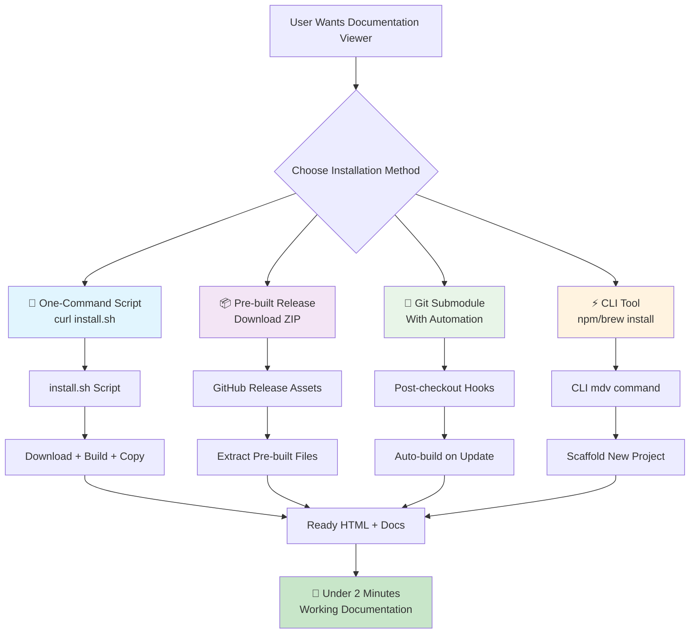

# Design Document

## Overview

The Simplified Git Installation system will provide multiple streamlined installation methods that reduce setup time from 5-10 minutes to under 2 minutes. The design leverages existing build infrastructure while adding new distribution mechanisms: one-command installation scripts, pre-built GitHub releases, automated git submodule integration, optional CLI tools, and restructured documentation.

## Steering Document Alignment

### Technical Standards (tech.md)
- **Build System**: Extends existing Vite configuration and npm scripts for automated asset generation
- **Distribution Strategy**: Enhances "Git-based Distribution" with automation while maintaining git-first approach
- **Bundle Outputs**: Leverages existing `zero-config.umd.cjs` and ES module builds
- **Browser Compatibility**: Maintains existing browser support requirements and UMD compatibility

### Project Structure (structure.md)
- **Build Process**: Extends existing build workflow with new distribution assets
- **Scripts Directory**: Follows existing `scripts/` organization for new installation utilities
- **GitHub Workflows**: Integrates with existing `.github/workflows/` structure
- **Documentation**: Follows existing `docs/` organization with enhanced quick-start guidance

## Code Reuse Analysis

### Existing Components to Leverage
- **`scripts/create-distribution.js`**: Already implements distribution package creation logic
- **`vite.zero-config.ts`**: Provides zero-config bundle build configuration
- **`.github/workflows/release.yml`**: Existing release automation workflow
- **GitHub Actions CI/CD**: Established build and test infrastructure
- **Zero-config API**: Existing `init()` function and auto-discovery system

### Integration Points
- **Build System**: Extends `npm run build` workflow for additional asset generation
- **Release Process**: Integrates with existing version management and changelog automation
- **Documentation**: Enhances existing quick-start guides and README structure
- **Error Handling**: Leverages existing `MarkdownDocsError` system for installation failures

## Architecture

The installation system provides multiple pathways with increasing complexity, all targeting the sub-2-minute setup goal.



## Components and Interfaces

### Component 1: Installation Script (`install.sh`)
- **Purpose:** Provides one-command installation with automatic build and setup
- **Interfaces:** 
  - `curl -fsSL URL | bash` (basic installation)
  - `curl -fsSL URL | bash -s -- --help` (show options)
  - `curl -fsSL URL | bash -s -- --dir=custom-path` (custom directory)
- **Dependencies:** git, Node.js (downloaded if missing), curl/wget
- **Reuses:** Existing build scripts, `scripts/create-distribution.js`, error handling patterns

### Component 2: Release Automation (`release-assets.yml`)
- **Purpose:** Automatically creates pre-built assets on GitHub releases
- **Interfaces:** 
  - Triggered on git tag creation
  - Uploads ZIP files with pre-built assets
  - Creates release notes with installation instructions
- **Dependencies:** GitHub Actions, existing build pipeline
- **Reuses:** `.github/workflows/release.yml`, `vite.zero-config.ts`, distribution script

### Component 3: Git Submodule Automation
- **Purpose:** Enables automated building when submodule is added or updated
- **Interfaces:**
  - `.gitmodules` configuration templates
  - Post-checkout hooks for automatic builds
  - Status checking and error reporting
- **Dependencies:** git hooks, existing build system
- **Reuses:** Existing npm scripts, error handling, build validation

### Component 4: CLI Tool (`mdv-cli`)
- **Purpose:** Provides package manager installation and project scaffolding
- **Interfaces:**
  - `npm install -g markdown-docs-viewer-cli`
  - `mdv init [project-name]` (create new project)
  - `mdv upgrade` (update existing project)
- **Dependencies:** Node.js runtime, npm registry
- **Reuses:** Zero-config initialization, distribution creation, example templates

### Component 5: Documentation Restructure
- **Purpose:** Provides clear installation guidance with progressive complexity
- **Interfaces:**
  - Enhanced README with installation decision tree
  - Quick-start guide with copy-paste examples
  - Troubleshooting section with common solutions
- **Dependencies:** Existing documentation structure
- **Reuses:** Current examples, zero-config patterns, browser usage guides

## Data Models

### Installation Configuration
```typescript
interface InstallationConfig {
  method: 'script' | 'release' | 'submodule' | 'cli';
  targetDirectory: string;
  skipDependencies?: boolean;
  includeExamples?: boolean;
  customConfig?: object;
}
```

### Build Manifest
```typescript
interface BuildManifest {
  version: string;
  assets: {
    'zero-config.umd.cjs': AssetInfo;
    'zero-config.es.js': AssetInfo;
    'example.html': AssetInfo;
    'docs-config.json': AssetInfo;
  };
  checksums: Record<string, string>;
  buildDate: string;
}
```

### CLI Project Template
```typescript
interface ProjectTemplate {
  name: string;
  structure: {
    'index.html': string;
    'docs/': {
      'README.md': string;
      'getting-started.md': string;
    };
    'docs-config.json': object;
  };
  postInstall: string[];
}
```

## Error Handling

### Error Scenarios
1. **Network Failures During Download**
   - **Handling:** Retry with exponential backoff, fallback to different mirrors
   - **User Impact:** Progress indication, clear error message with manual alternatives

2. **Build Dependencies Missing**
   - **Handling:** Attempt to install Node.js/npm, provide manual installation instructions
   - **User Impact:** Guided installation steps, option to use pre-built assets instead

3. **Permission Errors**
   - **Handling:** Detect permission issues, suggest sudo usage or alternative directories
   - **User Impact:** Clear explanation of permission requirements, alternative solutions

4. **Existing Installation Conflicts**
   - **Handling:** Detect existing files, offer backup/overwrite options
   - **User Impact:** Safe handling of existing work, clear conflict resolution choices

## Testing Strategy

### Unit Testing
- Installation script components (download, extract, validate functions)
- CLI tool commands and project scaffolding
- Release asset generation and manifest creation
- Error handling for various failure scenarios

### Integration Testing
- End-to-end installation flows for each method
- GitHub Actions workflow testing with actual releases
- Cross-platform testing (macOS, Linux, Windows)
- Network failure simulation and recovery testing

### End-to-End Testing
- Complete user journeys from installation to working documentation
- Performance testing to ensure sub-2-minute setup times
- Documentation accuracy testing with fresh environments
- Upgrade path testing from existing installations

## Implementation Details

### Installation Script Architecture
```bash
#!/bin/bash
# install.sh - One-command installation

set -e  # Exit on any error

# Configuration
REPO_URL="https://github.com/AustinOrphan/markdown-docs-viewer.git"
TEMP_DIR="/tmp/mdv-install-$$"
TARGET_DIR="${1:-$(pwd)/markdown-docs-viewer}"

# Functions
detect_platform() { ... }
check_dependencies() { ... }
install_nodejs() { ... }
download_and_build() { ... }
create_example() { ... }
cleanup() { ... }

# Main execution
main() {
  echo "🚀 Installing Markdown Docs Viewer..."
  detect_platform
  check_dependencies
  download_and_build
  create_example
  cleanup
  echo "✨ Installation complete! Open example.html to get started."
}

trap cleanup EXIT
main "$@"
```

### GitHub Actions Enhancement
```yaml
# New workflow: .github/workflows/release-assets.yml
name: Create Release Assets
on:
  release:
    types: [published]

jobs:
  build-assets:
    runs-on: ubuntu-latest
    steps:
      - uses: actions/checkout@v4
      - uses: actions/setup-node@v4
      - run: npm ci
      - run: npm run build
      - run: npm run dist:create
      - name: Upload Release Assets
        uses: softprops/action-gh-release@v2
        with:
          files: |
            distribution/markdown-docs-viewer-*.zip
            distribution/install.sh
```

### CLI Tool Structure
```typescript
// cli/src/commands/init.ts
export async function initCommand(projectName?: string) {
  const targetDir = projectName || 'my-docs';
  
  // Create project structure
  await fs.ensureDir(targetDir);
  await fs.ensureDir(`${targetDir}/docs`);
  
  // Copy templates
  await copyTemplate('example.html', `${targetDir}/index.html`);
  await copyTemplate('docs-config.json', `${targetDir}/docs-config.json`);
  await copyTemplate('README.md', `${targetDir}/docs/README.md`);
  
  // Download latest viewer
  await downloadLatestViewer(`${targetDir}/viewer`);
  
  console.log(`✨ Created ${targetDir} with example documentation!`);
  console.log(`📂 Next steps:`);
  console.log(`   cd ${targetDir}`);
  console.log(`   open index.html`);
}
```

## Performance Considerations

- **Installation Script**: Parallel downloads, cached builds, minimal file operations
- **Pre-built Assets**: Compressed bundles, CDN distribution, integrity checking
- **Git Submodules**: Shallow clones, incremental builds, build caching
- **CLI Tool**: Lazy loading, progress indication, background updates

## Security Measures

- **Script Validation**: Checksum verification, signed releases, HTTPS-only downloads
- **Sandboxing**: Temporary directories, permission validation, cleanup guarantees
- **Dependency Security**: Lock file validation, known vulnerability checking
- **Input Sanitization**: Path validation, command injection prevention

This design provides a comprehensive solution that maintains the git-based distribution philosophy while dramatically reducing installation friction through automation and pre-built alternatives.