# 10 Why's Architectural Analysis: CI Hanging Crisis

**Date**: July 31, 2025  
**Analysis Type**: Extended Root Cause Analysis  
**Confidence Level**: 95%  
**Issue**: CI tests hanging indefinitely but passing locally

---

## Executive Summary

**KEY INSIGHT**: This wasn't a bug - it was an **architectural debt payment due**.

The CI hanging represents a **cascading architectural failure** where design philosophy choices prioritizing "convenience over control" created a system vulnerable to environmental differences. The 10 Why's analysis reveals how small violations of SOLID principles compounded into a crisis that brought down CI/CD pipelines.

---

## The Complete 10 Why's Analysis

### **TECHNICAL LAYER (Why #1-5)** - _What Happened_

#### Why #1: Why were CI tests hanging?

**Answer**: Zero-config auto-initialization was triggering in test environments.

#### Why #2: Why was auto-initialization triggering in test environments?

**Answer**: Test environment detection was insufficient - the `onDOMReady` callback executed auto-init logic even in CI.

#### Why #3: Why was test environment detection insufficient?

**Answer**: Only checked basic `NODE_ENV`, didn't account for CI-specific flags (VITEST, GITHUB_ACTIONS, etc.).

#### Why #4: Why did auto-initialization cause hanging instead of failing gracefully?

**Answer**: Auto-discovery and config loading processes involved network operations and DOM manipulation that created infinite loops when combined with test mocking.

#### Why #5: Why did network operations and DOM manipulation create infinite loops?

**Answer**: The combination of vi.mock() circular dependencies, Proxy-based error handling, and async operations created race conditions where promises never resolved and recursive operations never terminated.

---

### **ARCHITECTURAL LAYER (Why #6-10)** - _Why It Was Possible_

#### Why #6: Why was zero-config auto-initialization designed with DOM-ready hooks and global state?

**Answer**: The system was designed with a "magical" developer experience in mind - users just include a script and it works automatically.

**Problematic Design Patterns**:

- **Global Singleton Pattern**: `globalViewer` creates shared mutable state across all instances
- **DOM-Ready Auto-Initialization**: Automatic initialization triggers on DOM ready via `onDOMReady()` callback
- **Imperative Side Effects on Module Load**: Auto-initialization runs immediately when module loads
- **Mixed Concerns**: Single module handles configuration, file discovery, DOM manipulation, error handling, and lifecycle management

**Root Architectural Flaw**: **Convenience Over Control**

> _The system prioritizes implicit "magic" behavior over explicit, predictable control, making it untestable and unpredictable in different environments._

---

#### Why #7: Why were module dependencies structured to allow circular references and tight coupling?

**Answer**: The dependency structure violated separation of concerns with network operations mixed into business logic.

**Dependency Chain Problems**:

```
zero-config.ts → factory.ts + config-loader.ts + auto-discovery.ts
                    ↓              ↓                ↓
                fetch()        fetch()          fetch()
```

**Architectural Anti-Patterns**:

- **Network + DOM + Business Logic mixing** in single modules
- **Static imports for dynamic behavior**
- **Concrete dependencies instead of interfaces**
- **Shared global mocks** affecting all imports simultaneously

**Root Architectural Flaw**: **Violation of Separation of Concerns**

> _The system lacks clear architectural layers and uses static imports for inherently dynamic, environment-dependent behavior._

---

#### Why #8: Why was the testing architecture set up in a way that created global mock conflicts?

**Answer**: The testing strategy used blanket global mocking that violated test isolation principles.

**Testing Strategy Problems**:

- **Blanket Global Mocking**: `tests/setup.ts` applies mocks globally to ALL tests simultaneously
- **Module-Level Mock Conflicts**: `vi.mock()` calls create unpredictable mock application order
- **Shared Test State**: Global mocks violate test isolation principles
- **Over-Mocking**: Mocking internal implementation details rather than external dependencies

**Testing Philosophy Issues**:

- Tests written to accommodate existing architecture rather than driving better design
- Focus on mocking implementation rather than testing behavior
- Brittle tests that break on implementation changes but not behavior changes

**Root Architectural Flaw**: **Mocking Implementation Rather Than Isolating Behavior**

> _The testing approach tried to control everything through mocks instead of designing testable interfaces._

---

#### Why #9: What fundamental design principles were violated that allowed this issue to exist?

**Answer**: Multiple SOLID principle violations created a fragile, tightly-coupled system.

**SOLID Principles Violations**:

1. **Single Responsibility Principle**:
   - `zero-config.ts` handles: configuration, file discovery, DOM manipulation, error handling, global state, lifecycle, theme management, auto-initialization
   - **Impact**: Changes ripple across multiple concerns

2. **Open/Closed Principle**:
   - Tight coupling prevents extension without modification
   - **Impact**: Adding features requires changing existing code

3. **Liskov Substitution Principle**:
   - No interfaces, can't substitute implementations
   - **Impact**: Testing requires complex mocking

4. **Interface Segregation Principle**:
   - Modules depend on concrete implementations, not interfaces
   - **Impact**: Changes in one module break others

5. **Dependency Inversion Principle**:
   - High-level modules directly depend on low-level modules
   - **Impact**: Environmental changes (CI vs local) break high-level logic

**Root Architectural Flaw**: **Framework Mindset vs. Library Mindset**

> _The system acts like a framework (controlling application flow) rather than a library (being controlled by applications)._

---

#### Why #10: Why weren't these architectural issues caught earlier in the development process?

**Answer**: Missing architectural governance allowed design debt to accumulate undetected.

**Process Failures**:

1. **Missing Architectural Reviews**:
   - No design documents, ADRs, or separation of concerns analysis
   - **Impact**: No forcing function to consider design implications

2. **Test-After Development**:
   - Complex mocking suggests tests accommodated existing architecture
   - **Impact**: Tests validate implementation, not behavior

3. **Missing Integration Testing**:
   - Focus on heavily-mocked unit tests missed real-world scenarios
   - **Impact**: Environmental differences (CI vs local) not caught

4. **No Continuous Integration Feedback**:
   - CI hanging suggests inconsistent CI usage during development
   - **Impact**: Environmental issues compound before detection

5. **Development Anti-Patterns**:
   - **Feature-Driven Development**: Adding features without considering architectural impact
   - **Monkey Patching**: Fixing symptoms rather than root causes
   - **Technical Debt Accumulation**: Each fix adds complexity rather than simplifying

**Root Process Failure**: **Lack of Architectural Governance**

> _No process to review design decisions, no forcing functions for testability, and no feedback loops to catch environment-specific issues early._

---

## The Cascading Architectural Failure Chain

```mermaid
graph TD
    A[Convenience-driven design<br/>Why #6] --> B[Unpredictable auto-initialization]
    B --> C[Tight coupling<br/>Why #7]
    C --> D[Circular dependency vulnerabilities]
    D --> E[Over-mocking testing<br/>Why #8]
    E --> F[Masked environmental issues]
    F --> G[SOLID principle violations<br/>Why #9]
    G --> H[Fragile, uncontrollable system]
    H --> I[Missing architectural governance<br/>Why #10]
    I --> J[Issues compound undetected]
    J --> K[🚨 CI HANGING CRISIS 🚨]

    style A fill:#ffcccc
    style C fill:#ffcccc
    style E fill:#ffcccc
    style G fill:#ffcccc
    style I fill:#ffcccc
    style K fill:#ff6666
```



## Architectural Debt Accumulation

Each design decision created **compound interest on technical debt**:

### **Level 1: Convenience Choices**

- Auto-initialization for "magic" experience
- Global state for simplicity
- Mixed concerns for rapid development

### **Level 2: Coupling Issues**

- Static imports create dependencies
- Network operations mixed with business logic
- No interfaces or dependency injection

### **Level 3: Testing Compromises**

- Tests accommodate bad architecture
- Global mocks violate isolation
- Implementation details become test contracts

### **Level 4: SOLID Violations**

- Single module does everything
- No extension points
- High-level depends on low-level

### **Level 5: Process Failures**

- No architectural review
- No integration testing
- No CI feedback during development

### **CRISIS: Environmental Failure**

All architectural debt comes due when environment changes (local → CI).

---

## Key Architectural Lessons

### **1. Convenience vs. Control Trade-off**

**Principle**: Developer convenience should never come at the expense of system control and predictability.

**Example**: Auto-initialization feels "magical" but creates unpredictable behavior in different environments.

### **2. Separation of Concerns is Non-Negotiable**

**Principle**: Network operations, DOM manipulation, and business logic must be in separate, testable layers.

**Example**: `zero-config.ts` mixing file discovery, network requests, DOM manipulation, and error handling created untestable complexity.

### **3. Static Imports for Dynamic Behavior is an Anti-Pattern**

**Principle**: Environment-dependent behavior needs runtime configuration, not build-time imports.

**Example**: CI vs local differences should be handled through dependency injection, not import-time mocking.

### **4. Tests Should Drive Architecture, Not Accommodate It**

**Principle**: If tests require complex mocking, the architecture is wrong.

**Example**: Global vi.mock() calls indicate tight coupling that should be fixed with better design.

### **5. SOLID Principles Compound**

**Principle**: Violating one SOLID principle makes it easier to violate others, creating cascading failures.

**Example**: Single Responsibility violation led to tight coupling, which prevented proper interfaces, which made testing impossible.

---

## Recommended Architectural Improvements

### **Immediate: Debt Reduction**

1. **Extract Network Layer**: Separate `fetch()` operations into injectable network services
2. **Remove Global State**: Replace singleton pattern with explicit instance management
3. **Eliminate Auto-Initialization**: Make initialization explicit and controllable

### **Medium-term: Architecture Refactoring**

1. **Implement Dependency Injection**: Use interfaces for all external dependencies
2. **Layer Separation**: Clear boundaries between network, business logic, and presentation
3. **Configuration-Based Behavior**: Runtime configuration instead of build-time decisions

### **Long-term: Process Improvements**

1. **Architectural Decision Records (ADRs)**: Document design decisions and trade-offs
2. **Design Reviews**: Mandatory review process for architectural changes
3. **Integration Testing Strategy**: Real environment testing, not just mocked units

---

## Conclusion: The Architectural Debt Payment

**This CI hanging crisis was inevitable given the architectural choices made.**

The system accumulated **compound architectural debt** through a series of convenience-driven decisions that violated fundamental design principles. Each shortcut made the next shortcut easier, creating a cascade of tight coupling, mixed concerns, and environmental brittleness.

**The fundamental insight**: You can't optimize for developer convenience at the architectural layer without paying the price in system reliability and maintainability. The CI hanging was not a bug to be fixed, but a **symptom of deeper architectural problems** that required systematic refactoring.

**Technical debt is like financial debt - it compounds.** Small violations of SOLID principles and separation of concerns create exponential complexity that eventually manifests as production failures in unexpected environments.

The resolution (commit 909bccb) fixed the symptom through better test environment detection, but the underlying architectural patterns remain vulnerable to similar failures in different environmental conditions.

---

## Confidence Assessment: 95%

**Why 95% confidence?**

- **90%**: Technical root cause clearly identified and resolved
- **5%**: Architectural patterns could create similar issues in different environments

**The 5% uncertainty represents**: Future environmental differences (browser environments, different CI systems, mobile contexts) that could trigger similar cascading failures through the same architectural vulnerabilities.

This analysis demonstrates that **systematic architectural investigation using extended Why's methodology can reveal deeper systemic issues** that traditional bug fixing approaches miss.
