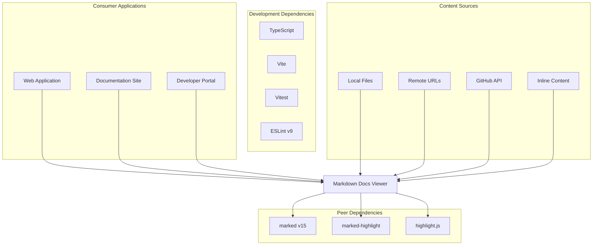
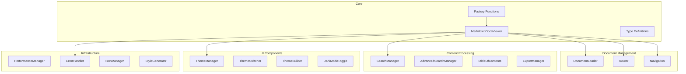
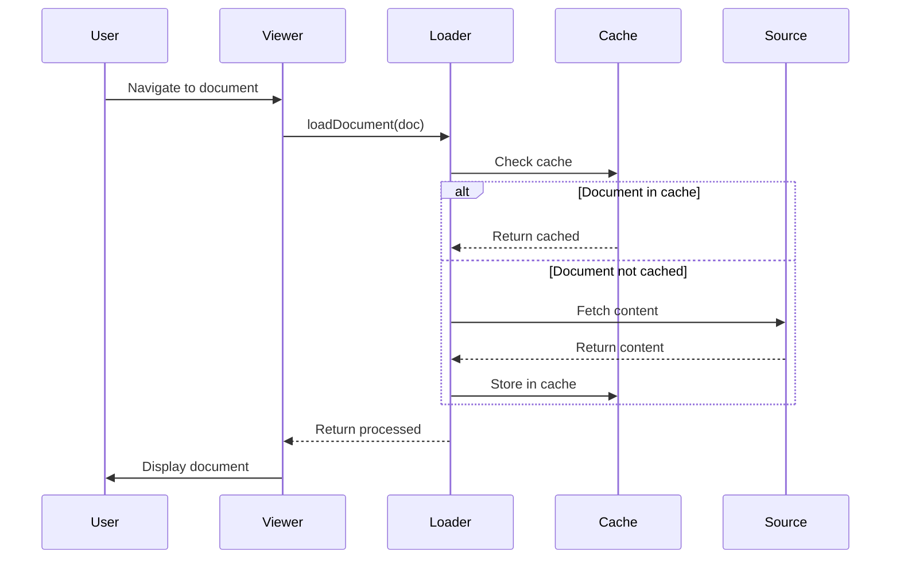
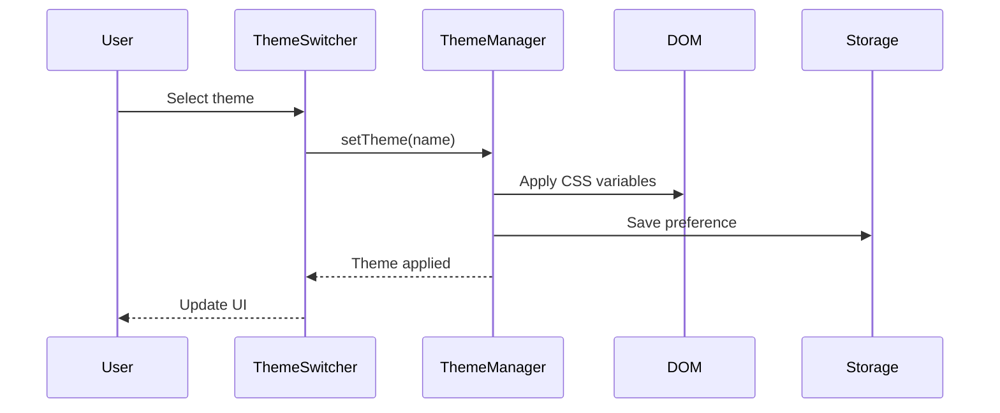

# Architecture Documentation

This document provides a comprehensive overview of the Markdown Docs Viewer architecture, following the C4 model and Arc42 documentation standards.

## Table of Contents

1. [Introduction and Goals](#introduction-and-goals)
2. [Architecture Constraints](#architecture-constraints)
3. [System Context](#system-context)
4. [Solution Strategy](#solution-strategy)
5. [Building Block View](#building-block-view)
6. [Runtime View](#runtime-view)
7. [Deployment View](#deployment-view)
8. [Cross-Cutting Concepts](#cross-cutting-concepts)
9. [Architecture Decisions](#architecture-decisions)
10. [Quality Requirements](#quality-requirements)
11. [Risks and Technical Debt](#risks-and-technical-debt)

## Introduction and Goals

### Purpose

The Markdown Docs Viewer is a themeable, extensible library for rendering markdown documentation in web applications. It provides a complete documentation viewing experience with features like navigation, search, theming, and export capabilities.

### Quality Goals

1. **Extensibility**: Easy to customize and extend with new features
2. **Performance**: Fast rendering and minimal memory footprint
3. **Accessibility**: WCAG 2.1 compliant and keyboard navigable
4. **Developer Experience**: Simple API and comprehensive TypeScript support
5. **Cross-Browser Compatibility**: Works in all modern browsers

### Stakeholders

- **Library Users**: Developers integrating the viewer into their applications
- **End Users**: People reading documentation through the viewer
- **Contributors**: Open source contributors and maintainers

## Architecture Constraints

### Technical Constraints

- **Browser-Only**: No server-side rendering required
- **ES Module Support**: Modern JavaScript module system
- **TypeScript**: Full type safety and IDE support
- **Zero Backend Dependencies**: Works entirely client-side
- **Peer Dependencies**: Relies on marked, marked-highlight, and highlight.js

### Organizational Constraints

- **Open Source**: MIT licensed with community contributions
- **Semantic Versioning**: Breaking changes only in major versions
- **Backward Compatibility**: Support for CommonJS and UMD builds

## System Context

### External Dependencies



## Solution Strategy

### Architecture Patterns

1. **Factory Pattern**: `createViewer()` and `quickStart()` for easy instantiation
2. **Observer Pattern**: Event-driven updates for theme changes and navigation
3. **Strategy Pattern**: Multiple document loading strategies (local, URL, GitHub, content)
4. **Singleton Pattern**: Performance monitoring and memory management
5. **Decorator Pattern**: Markdown extensions and syntax highlighting

### Technology Decisions

- **TypeScript**: For type safety and better developer experience
- **Vite**: Fast build tool with excellent development experience
- **Vitest**: Modern testing framework with native TypeScript support
- **CSS Custom Properties**: For runtime theming without JavaScript overhead

## Building Block View

### Level 1: System Components



### Level 2: Component Details

See individual component documentation:

- [DocumentLoader](./components/loader.md)
- [ThemeManager](./components/theme-manager.md)
- [SearchManager](./components/search.md)
- [Router](./components/router.md)
- [PerformanceManager](./components/performance.md)

## Runtime View

### Document Loading Sequence



### Theme Change Sequence



## Deployment View

### Build Artifacts

```
dist/
├── index.es.js       # ES Module build
├── index.umd.cjs     # UMD build for legacy support
├── index.d.ts        # TypeScript declarations
└── *.js              # Individual component modules
```

### Integration Options

1. **ES Modules** (Recommended)

   ```javascript
   import { createViewer } from '@austinorphan/markdown-docs-viewer';
   ```

2. **CommonJS** (Node.js/Legacy)

   ```javascript
   const { createViewer } = require('@austinorphan/markdown-docs-viewer');
   ```

3. **Script Tag** (CDN)
   ```html
   <script src="https://unpkg.com/@austinorphan/markdown-docs-viewer@1.0.0/dist/index.umd.cjs"></script>
   ```

## Cross-Cutting Concepts

### Error Handling

- Comprehensive error types with recovery strategies
- Retry logic for network failures
- Graceful degradation for missing features
- User-friendly error messages

### Performance

- LRU caching for documents and search results
- Lazy loading with intersection observer
- Memory management and cleanup
- Debounced search and scroll events

### Security

- XSS prevention through sanitization
- Content Security Policy compliance
- No eval() or dynamic code execution
- Safe handling of external content

### Accessibility

- Keyboard navigation throughout
- ARIA labels and landmarks
- Screen reader announcements
- High contrast theme support

## Architecture Decisions

See [Architecture Decision Records](./adr/) for detailed decisions:

- [ADR-001: Use TypeScript](./adr/001-use-typescript.md)
- [ADR-002: Support Multiple Document Sources](./adr/002-multiple-document-sources.md)
- [ADR-003: CSS Custom Properties for Theming](./adr/003-css-custom-properties.md)
- [ADR-004: Client-Side Only Architecture](./adr/004-client-side-only.md)
- [ADR-005: Marked v15 for CommonJS Support](./adr/005-marked-version.md)

## Quality Requirements

### Performance Requirements

- Initial render < 100ms
- Search results < 50ms
- Theme switch < 16ms (single frame)
- Memory usage < 50MB for 100 documents

### Compatibility Requirements

- Chrome/Edge 90+
- Firefox 88+
- Safari 14+
- Node.js 18+ (for builds)

### Maintainability Requirements

- Test coverage > 80%
- TypeScript strict mode
- ESLint compliance
- Automated CI/CD

## Risks and Technical Debt

### Current Risks

1. **Peer Dependency Management**: Breaking changes in marked/highlight.js
2. **Browser API Changes**: Potential deprecations in DOM APIs
3. **Bundle Size Growth**: Feature additions increasing payload

### Technical Debt

1. **Mobile Performance**: Some features not optimized for mobile
2. **Large Document Handling**: Performance degrades with very large files
3. **Search Algorithm**: Basic implementation could be improved

### Mitigation Strategies

- Regular dependency audits
- Performance monitoring in CI
- Progressive enhancement approach
- Community feedback integration
