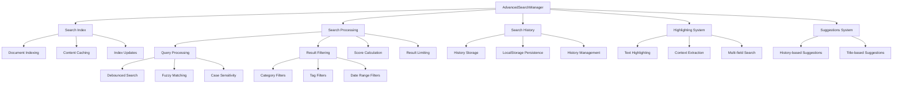

# Advanced Search Component

## Overview

The `AdvancedSearchManager` class provides comprehensive search functionality for the Markdown Docs Viewer, including text highlighting, filtering, search history, and suggestions. It builds upon the basic search system to offer a full-featured search experience.

## Architecture



## Class Structure

### Constructor

```typescript
constructor(documents: Document[], options: Partial<AdvancedSearchOptions> = {})
```

**Dependencies:**

- `SearchIndex`: Core search functionality
- `debounce`: Performance optimization utility
- Document collection for searching

### Configuration Options

```typescript
interface AdvancedSearchOptions {
  enabled: boolean;
  caseSensitive: boolean;
  fuzzySearch: boolean;
  searchInTags: boolean;
  maxResults: number;
  highlighting: boolean;
  searchHistory: boolean;
  maxHistoryItems: number;
  filters?: {
    categories: string[];
    tags: string[];
    dateRange: {
      from: Date;
      to: Date;
    };
  };
}
```

**Default Values:**

- `enabled`: `true`
- `caseSensitive`: `false`
- `fuzzySearch`: `false`
- `searchInTags`: `true`
- `maxResults`: `10`
- `highlighting`: `true`
- `searchHistory`: `true`
- `maxHistoryItems`: `10`

## Core Features

### 1. Enhanced Search Processing

**Multi-field Search:**

- Document title searching
- Content full-text search
- Description text search
- Tag-based searching
- Category-aware filtering

**Search Processing Pipeline:**

```typescript
search(query: string): SearchResult[] {
  // 1. Get base results from search index
  const indexResults = this.searchIndex.search(query);

  // 2. Convert to SearchResult format with scoring
  let results = indexResults.map((doc, index) => ({
    document: doc,
    score: 1.0 - index * 0.1,
    highlights: this.generateHighlights(doc, query)
  }));

  // 3. Apply filters
  results = this.applyFilters(results);

  // 4. Sort by relevance score
  results.sort((a, b) => b.score - a.score);

  // 5. Limit results
  return results.slice(0, this.options.maxResults);
}
```

### 2. Search Result Highlighting

**Highlight Generation:**

```typescript
private generateHighlights(doc: Document, query: string): SearchHighlight[] {
  const highlights: SearchHighlight[] = [];
  const searchTerms = query.toLowerCase().split(/\s+/);

  // Search across multiple fields
  findHighlights(doc.title, 'title');
  findHighlights(doc.description, 'description');
  findHighlights(doc.content, 'content');
  findHighlights(doc.tags.join(' '), 'tags');

  return highlights.slice(0, 5); // Limit highlights
}
```

**Highlighting Features:**

- Context-aware text extraction
- Multiple field highlighting
- Position tracking for accurate display
- Configurable highlight count limits
- Smart context window sizing

### 3. Advanced Filtering System

**Filter Types:**

- **Category Filtering**: Filter by document categories
- **Tag Filtering**: Filter by document tags
- **Date Range Filtering**: Filter by document dates
- **Custom Filters**: Extensible filter system

**Filter Implementation:**

```typescript
private applyFilters(results: SearchResult[]): SearchResult[] {
  return results.filter(result => {
    const doc = result.document;

    // Category filter
    if (categories?.length && !categories.includes(doc.category)) {
      return false;
    }

    // Tag filter
    if (tags?.length && !doc.tags?.some(tag => tags.includes(tag))) {
      return false;
    }

    // Date range filter
    if (dateRange && !isWithinDateRange(doc.date, dateRange)) {
      return false;
    }

    return true;
  });
}
```

### 4. Search History Management

**History Features:**

- Automatic query storage
- Result count tracking
- Timestamp recording
- Duplicate prevention
- Size limit enforcement

**Persistence System:**

```typescript
private saveSearchHistory(): void {
  try {
    localStorage.setItem('mdv-search-history', JSON.stringify(this.searchHistory));
  } catch (error) {
    console.warn('Failed to save search history:', error);
  }
}

private loadSearchHistory(): void {
  try {
    const saved = localStorage.getItem('mdv-search-history');
    if (saved) {
      this.searchHistory = JSON.parse(saved).map(item => ({
        ...item,
        timestamp: new Date(item.timestamp)
      }));
    }
  } catch (error) {
    console.warn('Failed to load search history:', error);
  }
}
```

### 5. Search Suggestions

**Suggestion Sources:**

- Search history matching
- Document title matching
- Tag-based suggestions
- Content-based suggestions

**Suggestion Algorithm:**

```typescript
getSuggestions(query: string): string[] {
  const suggestions: string[] = [];
  const lowerQuery = query.toLowerCase();

  // History-based suggestions
  this.searchHistory.forEach(item => {
    if (item.query.toLowerCase().includes(lowerQuery)) {
      suggestions.push(item.query);
    }
  });

  // Title-based suggestions
  this.documents.forEach(doc => {
    if (doc.title.toLowerCase().includes(lowerQuery)) {
      suggestions.push(doc.title);
    }
  });

  return suggestions.slice(0, 5);
}
```

## Data Structures

### Search Result Interface

```typescript
interface SearchResult {
  document: Document;
  score: number;
  highlights: SearchHighlight[];
}

interface SearchHighlight {
  field: 'title' | 'content' | 'description' | 'tags';
  text: string;
  position: number;
}
```

### Search History Interface

```typescript
interface SearchHistory {
  query: string;
  timestamp: Date;
  resultCount: number;
}
```

## Performance Optimizations

### 1. Debounced Search

```typescript
// Create debounced search function
this.debouncedSearch = debounce((query: string) => this.performSearch(query), 300);

searchDebounced(query: string, callback: (results: SearchResult[]) => void): void {
  this.debouncedSearch = debounce(() => {
    const results = this.search(query);
    callback(results);
  }, 300);

  this.debouncedSearch(query);
}
```

**Benefits:**

- Reduces API calls during typing
- Improves UI responsiveness
- Prevents search spam
- Configurable delay timing

### 2. Index Management

**Efficient Indexing:**

- Single index build on initialization
- Incremental updates for document changes
- Content caching for fast retrieval
- Memory-efficient storage

**Index Update Process:**

```typescript
updateDocuments(documents: Document[]): void {
  this.documents = documents;
  this.searchIndex = new SearchIndex();
  this.buildIndex();
}

private buildIndex(): void {
  const contentCache = new Map<string, string>();
  this.documents.forEach(doc => {
    if (doc.content) {
      contentCache.set(doc.id, doc.content);
    }
  });

  this.searchIndex.updateIndex(this.documents, contentCache);
}
```

## UI Components

### 1. Search Interface

**Static UI Renderer:**

```typescript
static renderSearchUI(options: AdvancedSearchOptions): string {
  return `
    <div class="mdv-advanced-search">
      <div class="mdv-search-input-wrapper">
        <input type="search" class="mdv-search-input"
               placeholder="${options.placeholder}">
        <button class="mdv-search-clear">×</button>
        <div class="mdv-search-suggestions"></div>
      </div>

      <!-- Filter panel if enabled -->
      <div class="mdv-search-filters">
        <!-- Category and tag filters -->
      </div>

      <div class="mdv-search-results"></div>
    </div>
  `;
}
```

### 2. Result Rendering

**Search Result Display:**

```typescript
static renderSearchResult(result: SearchResult): string {
  const doc = result.document;

  return `
    <div class="mdv-search-result" data-doc-id="${doc.id}">
      <h3 class="mdv-search-result-title">
        ${highlightedTitle}
      </h3>

      <p class="mdv-search-result-description">
        ${highlightedDescription}
      </p>

      <!-- Content excerpts with highlights -->
      ${contentHighlights}

      <div class="mdv-search-result-meta">
        ${categoryTags}
      </div>
    </div>
  `;
}
```

## Usage Examples

### Basic Advanced Search

```typescript
import { AdvancedSearchManager } from './advanced-search';

const searchManager = new AdvancedSearchManager(documents, {
  highlighting: true,
  searchHistory: true,
  maxResults: 15,
  searchInTags: true,
});

// Perform search
const results = searchManager.search('API reference');

// Display results
results.forEach(result => {
  console.log(`${result.document.title} (score: ${result.score})`);
  result.highlights.forEach(highlight => {
    console.log(`  ${highlight.field}: ${highlight.text}`);
  });
});
```

### Filtered Search

```typescript
const filteredSearchManager = new AdvancedSearchManager(documents, {
  filters: {
    categories: ['Documentation', 'API'],
    tags: ['javascript', 'typescript'],
    dateRange: {
      from: new Date('2024-01-01'),
      to: new Date(),
    },
  },
});

const filteredResults = filteredSearchManager.search('components');
```

### Debounced Search with Suggestions

```typescript
// Setup debounced search
searchManager.searchDebounced('react', results => {
  displayResults(results);
});

// Get suggestions
const suggestions = searchManager.getSuggestions('rea');
displaySuggestions(suggestions);

// Access search history
const history = searchManager.getSearchHistory();
displaySearchHistory(history);
```

## Integration with Viewer

### Search Component Integration

```typescript
class MarkdownDocsViewer {
  private advancedSearchManager: AdvancedSearchManager;

  private initializeAdvancedSearch(): void {
    this.advancedSearchManager = new AdvancedSearchManager(
      this.documents,
      this.config.search || {}
    );

    // Setup search UI
    const searchContainer = this.container.querySelector('.mdv-search');
    if (searchContainer) {
      searchContainer.innerHTML = AdvancedSearchManager.renderSearchUI(this.config.search || {});

      this.setupSearchEvents();
    }
  }

  private setupSearchEvents(): void {
    const searchInput = this.container.querySelector('.mdv-search-input');

    searchInput?.addEventListener('input', e => {
      const query = (e.target as HTMLInputElement).value;

      this.advancedSearchManager.searchDebounced(query, results => {
        this.displaySearchResults(results);
      });
    });
  }
}
```

## Error Handling

### Graceful Degradation

```typescript
// Safe search execution
search(query: string): SearchResult[] {
  try {
    if (!query.trim()) {
      return [];
    }

    const results = this.performSearch(query);
    return results;
  } catch (error) {
    console.warn('Search failed:', error);
    return [];
  }
}

// Safe history operations
private saveSearchHistory(): void {
  if (typeof window === 'undefined' || !this.options.searchHistory) {
    return;
  }

  try {
    localStorage.setItem('mdv-search-history', JSON.stringify(this.searchHistory));
  } catch (error) {
    console.warn('Failed to save search history:', error);
    // Continue without history
  }
}
```

### Input Validation

```typescript
// Query sanitization
private sanitizeQuery(query: string): string {
  return query
    .trim()
    .replace(/[<>]/g, '') // Remove HTML tags
    .substring(0, 100);   // Limit length
}

// Filter validation
private validateFilters(filters: any): boolean {
  return filters &&
         typeof filters === 'object' &&
         !Array.isArray(filters);
}
```

## Testing Considerations

### Unit Tests

- Search algorithm accuracy
- Filtering logic correctness
- Highlighting generation
- History management
- Suggestion algorithms

### Integration Tests

- Search index integration
- UI component rendering
- Event handling
- LocalStorage operations
- Performance benchmarks

### Performance Tests

- Large document set handling
- Search response times
- Memory usage optimization
- Debouncing effectiveness
- Index build performance

## Security Considerations

### XSS Prevention

- HTML escaping in search results
- Safe highlighting markup
- Input sanitization
- Content filtering

### Data Privacy

- Local storage only for history
- No external search API calls
- User control over history
- Data retention limits
