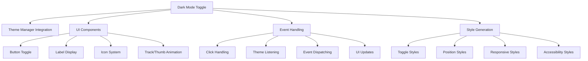

# Dark Mode Toggle Component

## Overview

The Dark Mode Toggle component provides an intuitive interface for switching between light and dark themes in the Markdown Documentation Viewer. It features accessibility compliance, smooth animations, and flexible positioning options.

## Architecture



## Class Structure

### DarkModeToggle Class

**Purpose**: Standalone toggle component for dark/light mode switching

**Constructor**:

```typescript
constructor(themeManager: ThemeManager, options: DarkModeToggleOptions = {})
```

**Configuration Options**:

```typescript
interface DarkModeToggleOptions {
  position?: 'header' | 'footer' | 'floating';
  showLabel?: boolean;
  compact?: boolean;
  lightThemeName?: string;
  darkThemeName?: string;
  onToggle?: (isDark: boolean, theme: Theme) => void;
}
```

**Key Methods**:

- `render()` - Generate HTML structure
- `attachTo(container)` - Attach to DOM element
- `toggle()` - Switch between themes
- `setDarkMode(isDark)` - Programmatically set mode
- `isDarkMode()` - Get current mode state
- `getStyles()` - Generate CSS styles

## Core Features

### 1. Visual Toggle Design

**Switch-Style Interface**:

- Track and thumb animation
- Smooth 0.2s transitions
- Icon-based state indication
- Visual feedback on interaction

### 2. Icon System

**Sun Icon (Light Mode)**:

```typescript
private getSunIcon(): string {
  return `
    <svg width="14" height="14" viewBox="0 0 24 24" fill="currentColor">
      <circle cx="12" cy="12" r="5"></circle>
      <path d="m12 1v6m0 14v6M4.22 4.22l4.24 4.24..."></path>
    </svg>
  `;
}
```

**Moon Icon (Dark Mode)**:

```typescript
private getMoonIcon(): string {
  return `
    <svg width="14" height="14" viewBox="0 0 24 24" fill="currentColor">
      <path d="M21 12.79A9 9 0 1 1 11.21 3 7 7 0 0 0 21 12.79z"></path>
    </svg>
  `;
}
```

### 3. Positioning Options

**Header Position (Default)**:

- Integrated into document header
- Aligned with other header controls
- Responsive spacing

**Floating Position**:

```css
.mdv-dark-toggle-floating {
  position: fixed;
  bottom: 80px;
  right: 20px;
  z-index: var(--mdv-z-fixed, 1030);
}
```

### 4. Size Variants

**Standard Size**:

- 52px × 28px toggle button
- 24px thumb diameter
- Full label display

**Compact Size**:

```css
.mdv-dark-toggle-compact .mdv-dark-toggle-btn {
  width: 44px;
  height: 24px;
}
```

## Accessibility Features

### ARIA Compliance

**Switch Role Implementation**:

```html
<button
  role="switch"
  aria-checked="true"
  aria-label="Switch to light mode"
  title="Switch to light mode"
></button>
```

### Keyboard Navigation

**Focus Management**:

```css
.mdv-dark-toggle-btn:focus-visible {
  box-shadow: 0 0 0 2px var(--mdv-color-primary);
}
```

### High Contrast Support

```css
@media (prefers-contrast: high) {
  .mdv-dark-toggle-track {
    border: 2px solid var(--mdv-color-text);
  }
}
```

### Reduced Motion Support

```css
@media (prefers-reduced-motion: reduce) {
  .mdv-dark-toggle-btn,
  .mdv-dark-toggle-track,
  .mdv-dark-toggle-thumb {
    transition: none;
  }
}
```

## Event System

### Event Listening

**Theme Change Detection**:

```typescript
document.addEventListener('mdv-theme-changed', (e: Event) => {
  const customEvent = e as CustomEvent;
  const themeName = customEvent.detail?.theme?.name;
  const isDark = themeName === this.options.darkThemeName;
  if (isDark !== this.isDark) {
    this.isDark = isDark;
    this.updateUI();
  }
});
```

### Event Dispatching

**Toggle Event**:

```typescript
document.dispatchEvent(
  new CustomEvent('mdv-dark-mode-toggled', {
    detail: { isDark: this.isDark, theme },
  })
);
```

## Animation System

### Track Animation

```css
.mdv-dark-toggle-track {
  background: var(--mdv-color-border);
  transition: background-color 0.2s ease;
}

.mdv-dark-toggle-btn.dark .mdv-dark-toggle-track {
  background: var(--mdv-color-primary);
}
```

### Thumb Movement

```css
.mdv-dark-toggle-thumb {
  transform: translateX(0);
  transition: all 0.2s ease;
}

.mdv-dark-toggle-btn.dark .mdv-dark-toggle-thumb {
  transform: translateX(24px);
}
```

## Integration Patterns

### Basic Setup

```typescript
import { DarkModeToggle } from './dark-mode-toggle';
import { ThemeManager } from './theme-manager';

const themeManager = new ThemeManager();
const darkToggle = new DarkModeToggle(themeManager, {
  position: 'header',
  showLabel: true,
  onToggle: (isDark, theme) => {
    console.log(`Switched to ${isDark ? 'dark' : 'light'} mode`);
  },
});

// Render and attach
container.innerHTML = darkToggle.render();
darkToggle.attachTo(container);
```

### Floating Toggle

```typescript
const floatingToggle = new DarkModeToggle(themeManager, {
  position: 'floating',
  showLabel: false,
  compact: true,
});
```

## Responsive Design

### Mobile Optimization

```css
@media (max-width: 768px) {
  .mdv-dark-toggle-floating {
    bottom: 20px;
    right: 16px;
  }

  .mdv-dark-mode-toggle {
    gap: 8px;
  }
}
```

## Testing Considerations

### Unit Testing

**Component Testing**:

- Render output validation
- Event handling verification
- State management testing
- Accessibility compliance

### Integration Testing

**Theme Integration**:

- Theme switching workflow
- State synchronization testing
- Event propagation verification

### Accessibility Testing

**Screen Reader Testing**:

- ARIA attribute validation
- Role implementation testing
- Keyboard navigation verification
