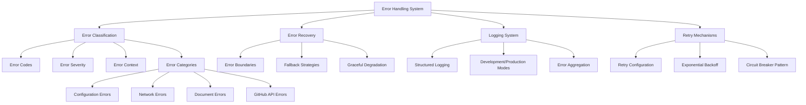

# Error Handling System

## Overview

The error handling system provides comprehensive error management for the Markdown Docs Viewer, featuring categorized error types, retry mechanisms, structured logging, and graceful error recovery patterns.

## Architecture



## Core Components

### 1. Error Classification System

**Error Codes Enumeration:**

```typescript
export enum ErrorCode {
  // Configuration errors
  INVALID_CONFIG = 'INVALID_CONFIG',
  CONTAINER_NOT_FOUND = 'CONTAINER_NOT_FOUND',
  INVALID_SOURCE = 'INVALID_SOURCE',

  // Document loading errors
  DOCUMENT_NOT_FOUND = 'DOCUMENT_NOT_FOUND',
  DOCUMENT_LOAD_FAILED = 'DOCUMENT_LOAD_FAILED',
  DOCUMENT_PARSE_FAILED = 'DOCUMENT_PARSE_FAILED',

  // Network errors
  NETWORK_ERROR = 'NETWORK_ERROR',
  NETWORK_TIMEOUT = 'NETWORK_TIMEOUT',
  UNAUTHORIZED_ACCESS = 'UNAUTHORIZED_ACCESS',
  RATE_LIMITED = 'RATE_LIMITED',

  // GitHub API errors
  GITHUB_API_ERROR = 'GITHUB_API_ERROR',
  GITHUB_RATE_LIMIT = 'GITHUB_RATE_LIMIT',
  GITHUB_NOT_FOUND = 'GITHUB_NOT_FOUND',
}
```

**Error Severity Levels:**

```typescript
export enum ErrorSeverity {
  LOW = 'low', // Minor issues, non-blocking
  MEDIUM = 'medium', // Notable issues, some functionality affected
  HIGH = 'high', // Major issues, significant functionality lost
  CRITICAL = 'critical', // System-breaking issues
}
```

### 2. Enhanced Error Context

**Comprehensive Error Context:**

```typescript
export interface ErrorContext {
  timestamp: Date;
  userAgent?: string;
  url?: string;
  documentId?: string;
  operation?: string;
  retryCount?: number;
  originalError?: unknown;
  stackTrace?: string;
  additionalData?: Record<string, unknown>;
  missingDependencies?: string[];
  warnings?: string[];
}
```

**Context Features:**

- **Automatic Capture**: Browser and environment information
- **Operation Tracking**: What operation caused the error
- **Retry Information**: Number of retry attempts
- **Dependency Tracking**: Missing or failed dependencies
- **Custom Data**: Operation-specific error details

### 3. MarkdownDocsError Class

**Base Error Class:**

```typescript
export class MarkdownDocsError extends Error {
  public readonly code: ErrorCode;
  public readonly severity: ErrorSeverity;
  public readonly context: ErrorContext;
  public readonly isRetryable: boolean;
  public readonly userMessage: string;

  constructor(
    code: ErrorCode,
    message: string,
    userMessage: string,
    severity: ErrorSeverity = ErrorSeverity.MEDIUM,
    isRetryable: boolean = false,
    context: Partial<ErrorContext> = {}
  ) {
    super(message);
    this.name = 'MarkdownDocsError';
    this.code = code;
    this.severity = severity;
    this.userMessage = userMessage;
    this.isRetryable = isRetryable;
    this.context = {
      timestamp: new Date(),
      userAgent: typeof navigator !== 'undefined' ? navigator.userAgent : undefined,
      url: typeof window !== 'undefined' && window.location ? window.location.href : undefined,
      stackTrace: this.stack,
      ...context,
    };
  }
}
```

**Error Features:**

- **Dual Messages**: Technical and user-friendly messages
- **Retry Logic**: Built-in retry capability indication
- **JSON Serialization**: Structured error data export
- **Context Preservation**: Comprehensive error context

### 4. Specialized Error Classes

**Configuration Errors:**

```typescript
export class ConfigurationError extends MarkdownDocsError {
  constructor(message: string, userMessage: string, context?: Partial<ErrorContext>) {
    super(ErrorCode.INVALID_CONFIG, message, userMessage, ErrorSeverity.HIGH, false, context);
    this.name = 'ConfigurationError';
  }
}
```

**Network Errors:**

```typescript
export class NetworkError extends MarkdownDocsError {
  constructor(
    code: ErrorCode,
    message: string,
    userMessage: string,
    isRetryable: boolean = true,
    context?: Partial<ErrorContext>
  ) {
    super(code, message, userMessage, ErrorSeverity.MEDIUM, isRetryable, context);
    this.name = 'NetworkError';
  }
}
```

**Document Errors:**

```typescript
export class DocumentError extends MarkdownDocsError {
  constructor(
    code: ErrorCode,
    message: string,
    userMessage: string,
    isRetryable: boolean = false,
    context?: Partial<ErrorContext>
  ) {
    super(code, message, userMessage, ErrorSeverity.MEDIUM, isRetryable, context);
    this.name = 'DocumentError';
  }
}
```

### 5. Error Factory System

**Standardized Error Creation:**

```typescript
export const ErrorFactory = {
  containerNotFound(selector: string): ConfigurationError {
    return new ConfigurationError(
      `Container element not found: ${selector}`,
      'Unable to find the container element. Please check your configuration.',
      { operation: 'initialization', additionalData: { selector } }
    );
  },

  documentNotFound(docId: string): DocumentError {
    return new DocumentError(
      ErrorCode.DOCUMENT_NOT_FOUND,
      `Document not found: ${docId}`,
      'The requested document could not be found.',
      false,
      { operation: 'loadDocument', documentId: docId }
    );
  },

  networkError(url: string, status?: number, statusText?: string): NetworkError {
    const message = status
      ? `Network request failed: ${status} ${statusText}`
      : 'Network request failed';

    return new NetworkError(
      ErrorCode.NETWORK_ERROR,
      message,
      'Unable to load content due to a network error. Please check your connection and try again.',
      true,
      { operation: 'networkRequest', additionalData: { url, status, statusText } }
    );
  },

  githubApiError(path: string, status: number, message: string): GitHubError {
    const code =
      status === 404
        ? ErrorCode.GITHUB_NOT_FOUND
        : status === 403
          ? ErrorCode.GITHUB_RATE_LIMIT
          : ErrorCode.GITHUB_API_ERROR;

    const userMessage =
      status === 404
        ? 'The requested GitHub file was not found.'
        : status === 403
          ? 'GitHub API rate limit reached. Please try again later.'
          : 'Unable to load content from GitHub. Please try again later.';

    return new GitHubError(code, `GitHub API error: ${message}`, userMessage, status === 403, {
      operation: 'githubRequest',
      additionalData: { path, status, responseMessage: message },
    });
  },
};
```

### 6. Retry Mechanism

**Retry Configuration:**

```typescript
export interface RetryConfig {
  maxAttempts: number;
  baseDelay: number;
  maxDelay: number;
  exponentialBackoff: boolean;
  retryableErrorCodes: ErrorCode[];
}

export const DEFAULT_RETRY_CONFIG: RetryConfig = {
  maxAttempts: 3,
  baseDelay: 1000,
  maxDelay: 10000,
  exponentialBackoff: true,
  retryableErrorCodes: [
    ErrorCode.NETWORK_ERROR,
    ErrorCode.NETWORK_TIMEOUT,
    ErrorCode.RATE_LIMITED,
    ErrorCode.GITHUB_RATE_LIMIT,
  ],
};
```

**Retry Implementation:**

```typescript
export async function withRetry<T>(
  operation: () => Promise<T>,
  config: Partial<RetryConfig> = {}
): Promise<T> {
  const retryConfig = { ...DEFAULT_RETRY_CONFIG, ...config };
  let lastError: unknown;

  for (let attempt = 1; attempt <= retryConfig.maxAttempts; attempt++) {
    try {
      return await operation();
    } catch (error) {
      lastError = error;

      // Don't retry on last attempt
      if (attempt === retryConfig.maxAttempts) break;

      // Only retry retryable MarkdownDocsErrors
      if (error instanceof MarkdownDocsError) {
        if (!error.isRetryable || !retryConfig.retryableErrorCodes.includes(error.code)) {
          break;
        }
      } else {
        break; // Don't retry non-MarkdownDocsError exceptions
      }

      // Calculate delay with exponential backoff
      const delay = retryConfig.exponentialBackoff
        ? Math.min(retryConfig.baseDelay * Math.pow(2, attempt - 1), retryConfig.maxDelay)
        : retryConfig.baseDelay;

      await new Promise(resolve => setTimeout(resolve, delay));
    }
  }

  throw lastError;
}
```

### 7. Error Boundary System

**Error Boundary Implementation:**

```typescript
export class ErrorBoundary {
  private errorHandler?: (error: MarkdownDocsError) => void;

  constructor(errorHandler?: (error: MarkdownDocsError) => void) {
    this.errorHandler = errorHandler;
  }

  async execute<T>(
    operation: () => Promise<T>,
    fallback: () => T,
    context: Partial<ErrorContext> = {}
  ): Promise<T> {
    try {
      return await operation();
    } catch (error) {
      const wrappedError = this.wrapError(error, context);

      if (this.errorHandler) {
        this.errorHandler(wrappedError);
      }

      return fallback();
    }
  }

  private wrapError(error: unknown, context: Partial<ErrorContext>): MarkdownDocsError {
    if (error instanceof MarkdownDocsError) {
      return error;
    }

    if (error instanceof Error) {
      return new MarkdownDocsError(
        ErrorCode.UNKNOWN_ERROR,
        error.message,
        'An unexpected error occurred. Please try again.',
        ErrorSeverity.MEDIUM,
        false,
        { ...context, originalError: error }
      );
    }

    return new MarkdownDocsError(
      ErrorCode.UNKNOWN_ERROR,
      'Unknown error occurred',
      'An unexpected error occurred. Please try again.',
      ErrorSeverity.MEDIUM,
      false,
      { ...context, originalError: error }
    );
  }
}
```

### 8. Logging System

**Logger Interface:**

```typescript
export interface ErrorLogger {
  log(error: MarkdownDocsError): void;
  debug(message: string, context?: Record<string, unknown>): void;
  warn(message: string, context?: Record<string, unknown>): void;
  error(message: string, context?: Record<string, unknown>): void;
}
```

**Console Logger Implementation:**

```typescript
export class ConsoleErrorLogger implements ErrorLogger {
  private isDevelopment: boolean;

  constructor(isDevelopment: boolean = false) {
    this.isDevelopment = isDevelopment;
  }

  log(error: MarkdownDocsError): void {
    const logMethod = this.getLogMethod(error.severity);

    if (this.isDevelopment) {
      logMethod('MarkdownDocsViewer Error:', {
        code: error.code,
        message: error.message,
        userMessage: error.userMessage,
        severity: error.severity,
        context: error.context,
        stack: error.stack,
      });
    } else {
      logMethod(`[${error.code}] ${error.userMessage}`);
    }
  }

  private getLogMethod(severity: ErrorSeverity): typeof console.log {
    switch (severity) {
      case ErrorSeverity.LOW:
        return console.info;
      case ErrorSeverity.MEDIUM:
        return console.warn;
      case ErrorSeverity.HIGH:
      case ErrorSeverity.CRITICAL:
        return console.error;
      default:
        return console.log;
    }
  }
}
```

## Usage Examples

### Basic Error Handling

```typescript
import { ErrorFactory, withRetry } from './errors';

// Create specific errors
const configError = ErrorFactory.containerNotFound('#my-container');
const networkError = ErrorFactory.networkError('https://api.example.com', 404, 'Not Found');

// Throw with context
throw new MarkdownDocsError(
  ErrorCode.DOCUMENT_PARSE_FAILED,
  'Failed to parse markdown syntax',
  'The document contains invalid formatting and cannot be displayed.',
  ErrorSeverity.MEDIUM,
  false,
  { documentId: 'doc-123', operation: 'parseDocument' }
);
```

### Retry Mechanism Usage

```typescript
import { withRetry } from './errors';

// Retry network requests with exponential backoff
const fetchWithRetry = async (url: string) => {
  return await withRetry(
    async () => {
      const response = await fetch(url);
      if (!response.ok) {
        throw ErrorFactory.networkError(url, response.status, response.statusText);
      }
      return response.json();
    },
    {
      maxAttempts: 3,
      baseDelay: 1000,
      exponentialBackoff: true,
    }
  );
};

// Custom retry configuration
const loadDocumentWithRetry = async (docId: string) => {
  return await withRetry(() => loadDocument(docId), {
    maxAttempts: 5,
    baseDelay: 500,
    retryableErrorCodes: [ErrorCode.NETWORK_ERROR, ErrorCode.DOCUMENT_LOAD_FAILED],
  });
};
```

### Error Boundary Usage

```typescript
import { ErrorBoundary, ConsoleErrorLogger } from './errors';

const logger = new ConsoleErrorLogger(true);
const errorBoundary = new ErrorBoundary(error => {
  logger.log(error);
  // Send to error reporting service
  reportError(error);
});

// Safe operation execution
const result = await errorBoundary.execute(
  async () => {
    return await riskyOperation();
  },
  () => {
    return fallbackValue;
  },
  { operation: 'riskyOperation', documentId: 'doc-123' }
);
```

### Error Context Enrichment

```typescript
// Add operation-specific context
const loadDocument = async (docId: string) => {
  try {
    const content = await fetchDocument(docId);
    return parseDocument(content);
  } catch (error) {
    if (error instanceof MarkdownDocsError) {
      // Error already has context
      throw error;
    }

    // Wrap unknown error with context
    throw new MarkdownDocsError(
      ErrorCode.DOCUMENT_LOAD_FAILED,
      `Failed to load document: ${error.message}`,
      'Unable to load the requested document. Please try again.',
      ErrorSeverity.MEDIUM,
      true,
      {
        documentId: docId,
        operation: 'loadDocument',
        originalError: error,
        additionalData: {
          timestamp: new Date().toISOString(),
          userAgent: navigator.userAgent,
        },
      }
    );
  }
};
```

### Comprehensive Error Handling Strategy

```typescript
class MarkdownDocsViewer {
  private errorBoundary: ErrorBoundary;
  private logger: ErrorLogger;

  constructor(config: DocumentationConfig) {
    this.logger = new ConsoleErrorLogger(config.development);
    this.errorBoundary = new ErrorBoundary(error => {
      this.handleError(error);
    });

    this.setupGlobalErrorHandling();
  }

  private setupGlobalErrorHandling(): void {
    // Handle unhandled promise rejections
    window.addEventListener('unhandledrejection', event => {
      const error = this.wrapUnknownError(event.reason, {
        operation: 'unhandledPromiseRejection',
      });
      this.handleError(error);
      event.preventDefault();
    });

    // Handle global errors
    window.addEventListener('error', event => {
      const error = this.wrapUnknownError(event.error, {
        operation: 'globalError',
        additionalData: {
          filename: event.filename,
          lineno: event.lineno,
          colno: event.colno,
        },
      });
      this.handleError(error);
    });
  }

  private handleError(error: MarkdownDocsError): void {
    // Log the error
    this.logger.log(error);

    // Show user notification for high/critical errors
    if (error.severity === ErrorSeverity.HIGH || error.severity === ErrorSeverity.CRITICAL) {
      this.showErrorNotification(error.userMessage);
    }

    // Send to error reporting service
    if (this.config.errorReporting?.enabled) {
      this.reportError(error);
    }

    // Trigger recovery mechanisms
    this.attemptRecovery(error);
  }

  private attemptRecovery(error: MarkdownDocsError): void {
    switch (error.code) {
      case ErrorCode.DOCUMENT_NOT_FOUND:
        this.redirectToHomePage();
        break;
      case ErrorCode.NETWORK_ERROR:
        this.enableOfflineMode();
        break;
      case ErrorCode.GITHUB_RATE_LIMIT:
        this.scheduleRetry(300000); // 5 minutes
        break;
    }
  }
}
```

## Error Recovery Patterns

### 1. Graceful Degradation

```typescript
// Content loading with fallbacks
const loadContentWithFallback = async (docId: string) => {
  return await errorBoundary.execute(
    async () => {
      // Try primary content source
      return await loadFromPrimary(docId);
    },
    () => {
      // Fallback to cached content
      return getCachedContent(docId) || getDefaultContent();
    },
    { operation: 'loadContent', documentId: docId }
  );
};
```

### 2. Circuit Breaker Pattern

```typescript
class CircuitBreaker {
  private failures = 0;
  private lastFailureTime = 0;
  private state: 'closed' | 'open' | 'half-open' = 'closed';

  async execute<T>(operation: () => Promise<T>): Promise<T> {
    if (this.state === 'open') {
      if (Date.now() - this.lastFailureTime < this.timeout) {
        throw new MarkdownDocsError(
          ErrorCode.OPERATION_CANCELLED,
          'Circuit breaker is open',
          'Service temporarily unavailable. Please try again later.',
          ErrorSeverity.MEDIUM,
          true
        );
      }
      this.state = 'half-open';
    }

    try {
      const result = await operation();
      this.onSuccess();
      return result;
    } catch (error) {
      this.onFailure();
      throw error;
    }
  }
}
```

### 3. Progressive Enhancement

```typescript
// Feature detection with error handling
const initializeAdvancedFeatures = () => {
  const features = ['search', 'themes', 'export'];

  features.forEach(feature => {
    errorBoundary.execute(
      async () => {
        await initializeFeature(feature);
      },
      () => {
        logger.warn(`Feature ${feature} initialization failed, continuing without it`);
      },
      { operation: 'featureInitialization', additionalData: { feature } }
    );
  });
};
```

## Integration with Viewer

### Error Handling Integration

```typescript
class MarkdownDocsViewer {
  async loadDocument(docId: string): Promise<void> {
    try {
      const endTiming = this.performanceMonitor.startTiming('document-load');

      const content = await withRetry(
        async () => {
          const document = this.getDocument(docId);
          if (!document) {
            throw ErrorFactory.documentNotFound(docId);
          }

          return await this.loader.load(document);
        },
        {
          maxAttempts: 3,
          baseDelay: 1000,
        }
      );

      await this.renderDocument(content);
      endTiming();
    } catch (error) {
      const wrappedError =
        error instanceof MarkdownDocsError
          ? error
          : this.wrapUnknownError(error, {
              operation: 'loadDocument',
              documentId: docId,
            });

      this.handleError(wrappedError);
    }
  }
}
```

## Testing Error Handling

### Unit Tests

```typescript
describe('Error Handling', () => {
  it('should create proper error context', () => {
    const error = ErrorFactory.networkError('https://api.test.com', 404, 'Not Found');

    expect(error.code).toBe(ErrorCode.NETWORK_ERROR);
    expect(error.isRetryable).toBe(true);
    expect(error.context.additionalData.status).toBe(404);
  });

  it('should retry retryable errors', async () => {
    let attempts = 0;
    const operation = () => {
      attempts++;
      if (attempts < 3) {
        throw ErrorFactory.networkError('https://api.test.com');
      }
      return 'success';
    };

    const result = await withRetry(operation, { maxAttempts: 3 });
    expect(result).toBe('success');
    expect(attempts).toBe(3);
  });
});
```

### Integration Tests

```typescript
describe('Error Integration', () => {
  it('should handle document loading failures gracefully', async () => {
    const viewer = new MarkdownDocsViewer(config);
    const consoleSpy = jest.spyOn(console, 'warn');

    // Mock network failure
    fetchMock.mockReject(new Error('Network error'));

    await viewer.loadDocument('non-existent-doc');

    expect(consoleSpy).toHaveBeenCalledWith(expect.stringContaining('DOCUMENT_NOT_FOUND'));
  });
});
```
