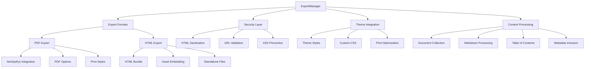

# Export Component

## Overview

The `ExportManager` class provides comprehensive document export functionality for the Markdown Docs Viewer, supporting both PDF and HTML formats. It includes security features, theming integration, and optional asset embedding capabilities.

## Architecture



## Class Structure

### Constructor

```typescript
constructor(viewer: MarkdownDocsViewer)
```

**Dependencies:**

- `MarkdownDocsViewer`: Access to documents and theme system
- `marked`: Markdown processing
- `html2pdf.js`: Optional PDF generation (external dependency)

### Export Options Interface

```typescript
interface ExportOptions {
  format: ExportFormat; // 'pdf' | 'html'
  title?: string; // Export title
  filename?: string; // Output filename
  documentIds?: string[]; // Specific documents to export
  includeTheme?: boolean; // Include viewer theme styles
  includeTOC?: boolean; // Include table of contents
  embedAssets?: boolean; // Embed images and assets
  locale?: string; // Language for export
  pdfOptions?: {
    format?: 'a4' | 'letter'; // Page format
    orientation?: 'portrait' | 'landscape';
    margin?: number; // Page margins
  };
}
```

## Core Features

### 1. Multi-Format Export

**Supported Formats:**

- **PDF**: High-quality PDF generation with print optimization
- **HTML**: Standalone HTML bundles with embedded styles

**Format Detection:**

```typescript
async export(options: ExportOptions): Promise<Blob | string> {
  switch (options.format) {
    case 'pdf':
      return this.exportPDF(options);
    case 'html':
      return this.exportHTML(options);
    default:
      throw new MarkdownDocsError(/*...*/);
  }
}
```

### 2. PDF Export System

**PDF Generation Pipeline:**

```typescript
private async exportPDF(options: ExportOptions): Promise<Blob> {
  // 1. Check html2pdf.js availability
  if (!this.html2pdfAvailable) {
    throw new MarkdownDocsError(/*...*/);
  }

  // 2. Generate HTML content
  const html = await this.generateExportHTML(options);

  // 3. Create temporary DOM container
  const container = document.createElement('div');
  container.innerHTML = html;

  // 4. Configure PDF options
  const pdfOptions = {
    margin: options.pdfOptions?.margin || 10,
    filename: options.filename || 'documentation.pdf',
    // ... other options
  };

  // 5. Generate and return PDF blob
  return await html2pdf().set(pdfOptions).from(container).outputPdf('blob');
}
```

**PDF Features:**

- A4 and Letter page formats
- Portrait and landscape orientations
- Configurable margins and spacing
- Page break optimization
- Print-friendly styling

### 3. HTML Export System

**HTML Bundle Generation:**

```typescript
private async exportHTML(options: ExportOptions): Promise<string> {
  const html = await this.generateExportHTML(options);

  if (options.embedAssets) {
    return this.embedAssets(html);
  }

  return html;
}
```

**HTML Features:**

- Complete standalone HTML files
- Embedded CSS styles
- Theme integration
- Asset embedding capability
- Mobile-responsive design

### 4. Security Framework

**HTML Sanitization:**

```typescript
function sanitizeHtml(html: string): string {
  // 1. Parse HTML safely using DOM
  const tempDiv = document.createElement('div');
  tempDiv.innerHTML = html;

  // 2. Define allowed elements and attributes
  const allowedElements = new Set(['p', 'br', 'strong' /*...*/]);
  const allowedAttributes = new Map([
    /*...*/
  ]);

  // 3. Recursively sanitize all elements
  function sanitizeElement(element: Element): Element | null {
    // Remove disallowed elements
    // Filter attributes
    // Process children
  }

  // 4. Return sanitized HTML
  return sanitizedContainer.innerHTML;
}
```

**Security Features:**

- Allowlist-based element filtering
- Attribute sanitization
- URL validation and filtering
- XSS prevention
- Event handler removal

**URL Security:**

```typescript
function sanitizeUrl(url: string): string {
  const dangerousProtocols = ['javascript:', 'data:', 'vbscript:', 'file:' /*...*/];

  // Block dangerous protocols
  for (const protocol of dangerousProtocols) {
    if (url.toLowerCase().startsWith(protocol)) {
      return '';
    }
  }

  // Allow safe protocols only
  return url.trim();
}
```

### 5. Theme Integration

**Style Generation:**

```typescript
private getExportStyles(theme: any): string {
  return `
    body {
      font-family: ${theme.fonts.body};
      color: ${theme.colors.textPrimary};
      background: ${theme.colors.background};
    }

    h1, h2, h3, h4, h5, h6 {
      font-family: ${theme.fonts.heading};
      color: ${theme.colors.textPrimary};
    }

    code {
      font-family: ${theme.fonts.code};
      background: ${theme.colors.codeBackground};
    }

    /* Print-specific styles */
    @media print {
      .page-break { page-break-before: always; }
      .no-print { display: none !important; }
    }
  `;
}
```

**Theme Features:**

- Complete theme style integration
- Print-optimized styles
- Font family preservation
- Color scheme application
- Custom CSS support

## Content Processing

### 1. Document Collection

**Document Selection:**

```typescript
private async getDocumentsToExport(options: ExportOptions): Promise<Document[]> {
  const allDocs = this.viewer.getDocuments();

  if (!options.documentIds || options.documentIds.length === 0) {
    return allDocs; // Export all documents
  }

  return allDocs.filter(doc => options.documentIds!.includes(doc.id));
}
```

### 2. Markdown Processing

**Content Generation:**

```typescript
private async generateExportHTML(options: ExportOptions): Promise<string> {
  const documents = await this.getDocumentsToExport(options);

  // Process each document
  for (const doc of documents) {
    const content = await this.viewer.getDocumentContent(doc);
    const processedContent = await marked(content);
    const sanitizedContent = sanitizeHtml(processedContent);

    // Add to export HTML
  }
}
```

### 3. Table of Contents

**TOC Generation:**

```typescript
private generateTableOfContents(documents: Document[]): string {
  let toc = `
    <nav class="export-toc page-break">
      <h1>Table of Contents</h1>
      <ol>`;

  for (const doc of documents) {
    toc += `
      <li><a href="#doc-${escapeHtml(doc.id)}">${escapeHtml(doc.title)}</a></li>`;
  }

  return toc + `</ol></nav>`;
}
```

## Usage Examples

### Basic HTML Export

```typescript
import { ExportManager, createExportOptions } from './export';

const exportManager = new ExportManager(viewer);

// Export all documents as HTML
const htmlOptions = createExportOptions({
  format: 'html',
  includeTheme: true,
  includeTOC: true,
});

const htmlContent = await exportManager.export(htmlOptions);
```

### PDF Export with Custom Options

```typescript
// Export specific documents as PDF
const pdfOptions = createExportOptions({
  format: 'pdf',
  title: 'API Documentation',
  filename: 'api-docs.pdf',
  documentIds: ['api-overview', 'endpoints', 'examples'],
  includeTheme: true,
  includeTOC: true,
  pdfOptions: {
    format: 'a4',
    orientation: 'portrait',
    margin: 15,
  },
});

const pdfBlob = await exportManager.export(pdfOptions);

// Download the PDF
const url = URL.createObjectURL(pdfBlob);
const a = document.createElement('a');
a.href = url;
a.download = 'api-docs.pdf';
a.click();
```

### HTML Bundle with Assets

```typescript
// Export with embedded assets
const bundleOptions = createExportOptions({
  format: 'html',
  embedAssets: true,
  includeTheme: true,
  title: 'Complete Documentation Bundle',
});

const htmlBundle = await exportManager.export(bundleOptions);
```

## Dependency Management

### Optional Dependencies

**PDF Export Dependency:**

```typescript
private checkDependencies(): void {
  // Check for html2pdf.js availability
  if (typeof window !== 'undefined' && (window as any).html2pdf) {
    this.html2pdfAvailable = true;
  }
}

isPDFExportAvailable(): boolean {
  return this.html2pdfAvailable;
}
```

**Capability Detection:**

```typescript
getExportCapabilities(): {
  pdf: boolean;
  html: boolean;
  formats: ExportFormat[];
} {
  return {
    pdf: this.html2pdfAvailable,
    html: true,
    formats: ['html', ...(this.html2pdfAvailable ? ['pdf'] : [])]
  };
}
```

## Error Handling

### Export Errors

```typescript
// Format validation
if (!['pdf', 'html'].includes(options.format)) {
  throw new MarkdownDocsError(
    ErrorCode.INVALID_CONFIG,
    `Unsupported export format: ${options.format}`,
    'The specified export format is not supported.',
    ErrorSeverity.HIGH
  );
}

// Dependency validation
if (options.format === 'pdf' && !this.html2pdfAvailable) {
  throw new MarkdownDocsError(
    ErrorCode.MISSING_DEPENDENCY,
    'html2pdf.js is required for PDF export',
    'PDF export requires the html2pdf.js library',
    ErrorSeverity.HIGH
  );
}
```

### Content Processing Errors

```typescript
// Safe content processing
try {
  const processedContent = await marked(content);
  const sanitizedContent = sanitizeHtml(processedContent);
  return sanitizedContent;
} catch (error) {
  console.warn('Content processing failed:', error);
  return escapeHtml(content); // Fallback to escaped text
}
```

## Performance Considerations

### Memory Management

```typescript
// Temporary DOM cleanup
try {
  const pdf = await html2pdf().set(pdfOptions).from(container).outputPdf('blob');
  return pdf;
} finally {
  document.body.removeChild(container); // Always clean up
}
```

### Large Document Handling

```typescript
// Process documents in chunks for large exports
const CHUNK_SIZE = 10;
const chunks = [];

for (let i = 0; i < documents.length; i += CHUNK_SIZE) {
  const chunk = documents.slice(i, i + CHUNK_SIZE);
  const processedChunk = await this.processDocumentChunk(chunk);
  chunks.push(processedChunk);
}
```

## Integration with Viewer

### Viewer Integration

```typescript
class MarkdownDocsViewer {
  private exportManager: ExportManager;

  constructor(config: DocumentationConfig) {
    this.exportManager = new ExportManager(this);
  }

  async exportDocumentation(options: ExportOptions): Promise<Blob | string> {
    return await this.exportManager.export(options);
  }

  getExportCapabilities() {
    return this.exportManager.getExportCapabilities();
  }
}
```

## Testing Considerations

### Unit Tests

- HTML sanitization effectiveness
- URL validation security
- Export format handling
- Error handling coverage
- Dependency detection

### Integration Tests

- End-to-end export workflows
- Theme integration accuracy
- Document selection logic
- TOC generation correctness
- Asset embedding functionality

### Security Tests

- XSS prevention validation
- HTML injection attempts
- URL sanitization testing
- Content filtering verification
- Dangerous protocol blocking

## Browser Compatibility

### PDF Export

- Requires html2pdf.js library
- Modern browser support for Blob APIs
- Canvas and HTML5 support needed
- Memory limitations for large documents

### HTML Export

- Universal browser support
- No external dependencies
- Works in all environments
- Offline capability

## Future Enhancements

### Planned Features

- Custom export templates
- Multi-format batch export
- Export progress tracking
- Background export processing
- Cloud export integration
- Export scheduling
- Custom page layouts
- Advanced PDF options
