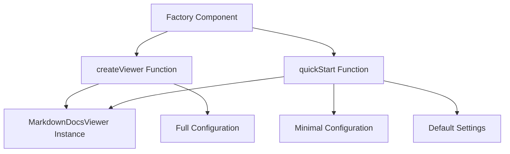

# Factory Component

## Overview

The Factory component provides convenient factory functions for creating and initializing MarkdownDocsViewer instances with simplified API patterns and quick-start functionality.

## Architecture



## Core Functions

### 1. createViewer Function

**Purpose**: Primary factory function for creating viewer instances

**Signature**:

```typescript
function createViewer(config: DocumentationConfig): MarkdownDocsViewer;
```

**Parameters**:

- `config: DocumentationConfig` - Complete configuration object

**Returns**: Configured MarkdownDocsViewer instance

**Usage Example**:

```typescript
import { createViewer } from './factory';

const viewer = createViewer({
  container: '#docs-container',
  title: 'My Documentation',
  source: {
    type: 'local',
    basePath: '/docs',
    documents: [
      { id: 'intro', title: 'Introduction', file: 'intro.md' },
      { id: 'guide', title: 'User Guide', file: 'guide.md' },
    ],
  },
  theme: 'default',
  search: { enabled: true },
  navigation: {
    showCategories: true,
    collapsible: true,
  },
});
```

### 2. quickStart Function

**Purpose**: Simplified initialization for basic use cases

**Signature**:

```typescript
function quickStart(container: string | HTMLElement, documents: any[]): MarkdownDocsViewer;
```

**Parameters**:

- `container: string | HTMLElement` - Target container selector or element
- `documents: any[]` - Array of document objects

**Returns**: MarkdownDocsViewer instance with default configuration

**Usage Example**:

```typescript
import { quickStart } from './factory';

const viewer = quickStart('#docs', [
  { id: 'readme', title: 'README', content: '# Welcome\n\nThis is the documentation.' },
  { id: 'api', title: 'API Reference', content: '# API\n\nAPI documentation here.' },
]);
```

## Factory Patterns

### 1. Full Configuration Pattern

**Use Case**: Complete control over viewer configuration

```typescript
const viewer = createViewer({
  container: document.getElementById('docs'),
  title: 'Product Documentation',
  logo: '/assets/logo.svg',
  source: {
    type: 'github',
    owner: 'company',
    repo: 'docs',
    branch: 'main',
    path: 'documentation',
    documents: [], // Will be loaded from GitHub
  },
  theme: {
    name: 'corporate',
    colors: {
      primary: '#007acc',
      secondary: '#0099ff',
      // ... complete theme configuration
    },
  },
  search: {
    enabled: true,
    fuzzySearch: true,
    maxResults: 20,
  },
  navigation: {
    showCategories: true,
    showTags: true,
    collapsible: true,
    sortBy: 'order',
  },
  render: {
    syntaxHighlighting: true,
    copyCodeButton: true,
    linkTarget: '_blank',
  },
  mobile: {
    enabled: true,
    gestures: {
      swipeToNavigate: true,
    },
  },
  onDocumentLoad: doc => {
    console.log(`Loaded: ${doc.title}`);
  },
  onError: error => {
    console.error('Viewer error:', error);
  },
});
```

### 2. Quick Start Pattern

**Use Case**: Rapid prototyping and simple documentation

```typescript
// Inline content
const viewer = quickStart('#docs', [
  {
    id: 'intro',
    title: 'Introduction',
    content: `
# Getting Started

Welcome to our documentation. This guide will help you get started quickly.

## Installation

\`\`\`bash
npm install our-package
\`\`\`

## Basic Usage

\`\`\`javascript
import { Package } from 'our-package';
const instance = new Package();
\`\`\`
    `,
  },
  {
    id: 'advanced',
    title: 'Advanced Topics',
    category: 'Advanced',
    tags: ['configuration', 'customization'],
    content: `
# Advanced Configuration

Learn about advanced configuration options and customization.
    `,
  },
]);
```

### 3. Configuration Builder Pattern

**Use Case**: Progressive configuration building

```typescript
function createDocumentationSite(baseConfig: Partial<DocumentationConfig>) {
  const config: DocumentationConfig = {
    container: '#docs',
    source: {
      type: 'content',
      documents: [],
    },
    theme: 'default',
    search: { enabled: true },
    navigation: {
      showCategories: true,
      collapsible: true,
      showDescription: true,
    },
    ...baseConfig,
  };

  return createViewer(config);
}

// Usage
const viewer = createDocumentationSite({
  title: 'My Custom Docs',
  source: {
    type: 'local',
    basePath: '/documentation',
    documents: loadDocumentList(),
  },
});
```

## Integration Patterns

### 1. Framework Integration

**React Integration**:

```typescript
import React, { useEffect, useRef } from 'react';
import { createViewer } from './factory';

function DocumentationViewer({ config }) {
  const containerRef = useRef<HTMLDivElement>(null);
  const viewerRef = useRef<MarkdownDocsViewer | null>(null);

  useEffect(() => {
    if (containerRef.current && !viewerRef.current) {
      viewerRef.current = createViewer({
        ...config,
        container: containerRef.current
      });
    }

    return () => {
      if (viewerRef.current) {
        viewerRef.current.destroy();
        viewerRef.current = null;
      }
    };
  }, [config]);

  return <div ref={containerRef} className="documentation-viewer" />;
}
```

**Vue Integration**:

```typescript
import { defineComponent, ref, onMounted, onUnmounted } from 'vue';
import { createViewer } from './factory';

export default defineComponent({
  props: {
    config: {
      type: Object,
      required: true,
    },
  },
  setup(props) {
    const containerRef = ref<HTMLElement>();
    let viewer: MarkdownDocsViewer | null = null;

    onMounted(() => {
      if (containerRef.value) {
        viewer = createViewer({
          ...props.config,
          container: containerRef.value,
        });
      }
    });

    onUnmounted(() => {
      if (viewer) {
        viewer.destroy();
      }
    });

    return {
      containerRef,
    };
  },
  template: '<div ref="containerRef" class="documentation-viewer"></div>',
});
```

### 2. Plugin System Integration

**Plugin-Based Factory**:

```typescript
interface ViewerPlugin {
  name: string;
  configure: (config: DocumentationConfig) => DocumentationConfig;
}

class ViewerFactory {
  private plugins: ViewerPlugin[] = [];

  addPlugin(plugin: ViewerPlugin): this {
    this.plugins.push(plugin);
    return this;
  }

  create(baseConfig: DocumentationConfig): MarkdownDocsViewer {
    let config = { ...baseConfig };

    // Apply all plugins
    for (const plugin of this.plugins) {
      config = plugin.configure(config);
    }

    return createViewer(config);
  }
}

// Usage
const factory = new ViewerFactory()
  .addPlugin({
    name: 'analytics',
    configure: config => ({
      ...config,
      onDocumentLoad: doc => {
        analytics.track('document_viewed', { title: doc.title });
        config.onDocumentLoad?.(doc);
      },
    }),
  })
  .addPlugin({
    name: 'theming',
    configure: config => ({
      ...config,
      theme: {
        ...config.theme,
        colors: {
          ...config.theme?.colors,
          primary: getCompanyBrandColor(),
        },
      },
    }),
  });

const viewer = factory.create({
  container: '#docs',
  source: { type: 'content', documents: docs },
});
```

### 3. Environment-Specific Factories

**Development Factory**:

```typescript
export function createDevelopmentViewer(
  container: string | HTMLElement,
  documents: any[]
): MarkdownDocsViewer {
  return createViewer({
    container,
    source: {
      type: 'content',
      documents,
    },
    errorHandling: {
      showErrorDetails: true,
      enableErrorLogging: true,
      gracefulDegradation: false,
    },
    performance: {
      enablePerformanceMonitoring: true,
    },
    onError: error => {
      console.error('Development Error:', error);
      // Show detailed error overlay in development
    },
  });
}
```

**Production Factory**:

```typescript
export function createProductionViewer(
  container: string | HTMLElement,
  config: Partial<DocumentationConfig>
): MarkdownDocsViewer {
  return createViewer({
    container,
    errorHandling: {
      showErrorDetails: false,
      gracefulDegradation: true,
      enableErrorLogging: true,
    },
    performance: {
      enablePerformanceMonitoring: true,
      enableMemoryManagement: true,
    },
    ...config,
    onError: error => {
      // Send to error reporting service
      errorReporting.captureException(error);
      config.onError?.(error);
    },
  });
}
```

## Factory Benefits

### 1. Simplified API

**Before (Direct Instantiation)**:

```typescript
const viewer = new MarkdownDocsViewer({
  container: '#docs',
  source: { type: 'content', documents: docs },
});
```

**After (Factory Function)**:

```typescript
const viewer = createViewer({
  container: '#docs',
  source: { type: 'content', documents: docs },
});
```

### 2. Configuration Validation

**Built-in Validation**:

```typescript
export function createViewer(config: DocumentationConfig): MarkdownDocsViewer {
  // Validate configuration before instantiation
  if (!config.container) {
    throw new Error('Container is required');
  }

  if (!config.source) {
    throw new Error('Document source is required');
  }

  return new MarkdownDocsViewer(config);
}
```

### 3. Quick Prototyping

**Rapid Development**:

```typescript
// Single line initialization for testing
const viewer = quickStart('#test', [{ id: '1', title: 'Test', content: '# Test' }]);
```

### 4. Consistent Defaults

**Default Configuration Management**:

```typescript
const DEFAULT_CONFIG: Partial<DocumentationConfig> = {
  theme: 'default',
  search: { enabled: true },
  navigation: {
    showCategories: true,
    collapsible: true,
  },
  render: {
    syntaxHighlighting: true,
    copyCodeButton: true,
  },
  responsive: true,
};

export function createViewer(config: DocumentationConfig): MarkdownDocsViewer {
  const mergedConfig = {
    ...DEFAULT_CONFIG,
    ...config,
  };

  return new MarkdownDocsViewer(mergedConfig);
}
```

## Testing Support

### Mock Factory

```typescript
export function createMockViewer(overrides: Partial<DocumentationConfig> = {}): MarkdownDocsViewer {
  return createViewer({
    container: '#mock-container',
    source: {
      type: 'content',
      documents: [{ id: 'mock-1', title: 'Mock Document', content: '# Mock Content' }],
    },
    ...overrides,
  });
}
```

### Test Utilities

```typescript
export function createTestViewer(testId: string): MarkdownDocsViewer {
  const container = document.createElement('div');
  container.id = testId;
  document.body.appendChild(container);

  return quickStart(`#${testId}`, [{ id: 'test', title: 'Test Document', content: '# Test' }]);
}
```

## Error Handling

### Factory Error Management

```typescript
export function createViewer(config: DocumentationConfig): MarkdownDocsViewer {
  try {
    return new MarkdownDocsViewer(config);
  } catch (error) {
    console.error('Failed to create viewer:', error);

    // Provide fallback with minimal configuration
    if (config.errorHandling?.gracefulDegradation) {
      return new MarkdownDocsViewer({
        container: config.container,
        source: {
          type: 'content',
          documents: [
            {
              id: 'error',
              title: 'Error',
              content:
                '# Configuration Error\n\nFailed to initialize viewer with provided configuration.',
            },
          ],
        },
      });
    }

    throw error;
  }
}
```

## Performance Considerations

### Lazy Initialization

```typescript
export function createLazyViewer(config: DocumentationConfig): Promise<MarkdownDocsViewer> {
  return new Promise(resolve => {
    // Use requestIdleCallback for non-blocking initialization
    if ('requestIdleCallback' in window) {
      requestIdleCallback(() => {
        resolve(createViewer(config));
      });
    } else {
      setTimeout(() => {
        resolve(createViewer(config));
      }, 0);
    }
  });
}
```

### Memory-Efficient Factory

```typescript
export function createEfficientViewer(config: DocumentationConfig): MarkdownDocsViewer {
  // Enable memory management and performance optimizations
  const optimizedConfig: DocumentationConfig = {
    ...config,
    performance: {
      enableMemoryManagement: true,
      cacheSize: 50,
      lazyLoading: { enabled: true },
      ...config.performance,
    },
  };

  return createViewer(optimizedConfig);
}
```
