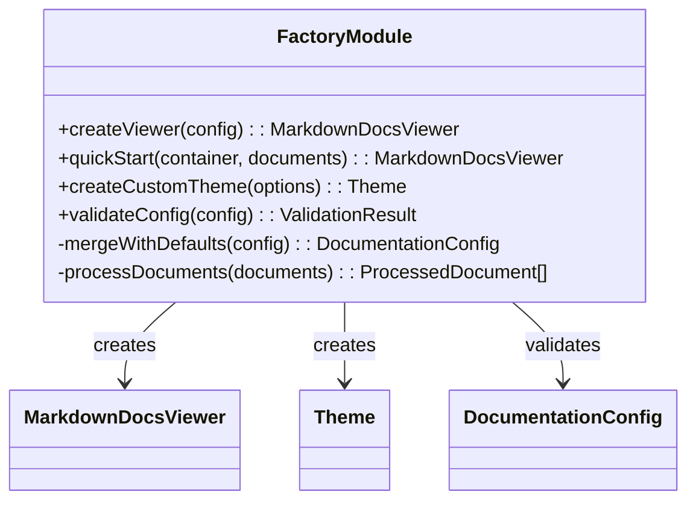
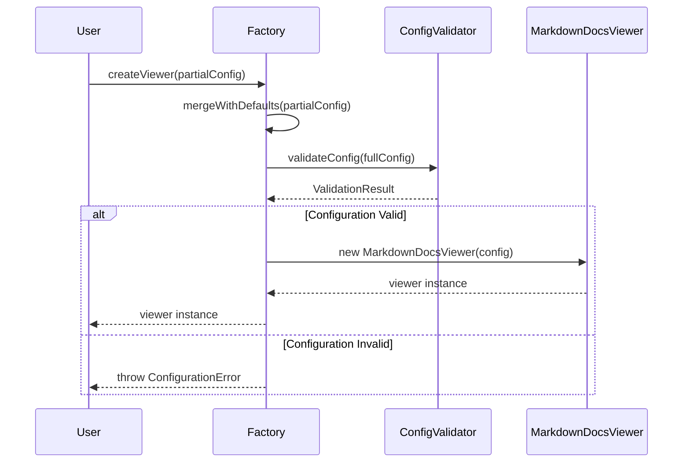

# Component: Factory Functions

## Overview

The factory module provides convenient functions for creating `MarkdownDocsViewer` instances with sensible defaults and simplified configuration. It includes `createViewer()` for standard usage and `quickStart()` for rapid prototyping.

## Architecture



## Responsibilities

- **Simplified API**: Provides easy-to-use functions for common use cases
- **Configuration Defaults**: Applies sensible defaults to reduce boilerplate
- **Validation**: Validates user configuration before creating viewer instances
- **Theme Creation**: Helps create custom themes with partial configurations
- **Error Prevention**: Catches common configuration errors early

## Key Functions

### createViewer()

```typescript
function createViewer(config: Partial<DocumentationConfig>): MarkdownDocsViewer;
```

Creates a new `MarkdownDocsViewer` instance with the provided configuration, applying defaults for missing options.

**Default Configuration:**

- Theme: `defaultTheme`
- Search: enabled with basic options
- Navigation: categories enabled, collapsible
- Mobile: responsive design enabled

### quickStart()

```typescript
function quickStart(
  container: string | HTMLElement,
  documents: QuickStartDocument[]
): MarkdownDocsViewer;
```

Rapid setup function for prototyping and simple use cases. Automatically configures:

- Basic theme and styling
- Simple navigation
- Local document source
- Essential features only

### createCustomTheme()

```typescript
function createCustomTheme(options: Partial<ThemeOptions>): Theme;
```

Helper for creating custom themes by extending the default theme with user overrides.

## Data Flow



## Integration Examples

### Standard Usage

```typescript
import { createViewer, defaultTheme } from '@austinorphan/markdown-docs-viewer';

const viewer = createViewer({
  container: '#documentation',
  theme: defaultTheme,
  source: {
    type: 'github',
    documents: [
      {
        id: 'readme',
        title: 'README',
        file: 'microsoft/vscode/main/README.md',
      },
    ],
  },
});

await viewer.init();
```

### Quick Start

```typescript
import { quickStart } from '@austinorphan/markdown-docs-viewer';

const viewer = quickStart('#docs', [
  { id: 'intro', title: 'Introduction', content: '# Welcome\n\nThis is an introduction.' },
  { id: 'guide', title: 'Guide', content: '# User Guide\n\nHow to use the system.' },
]);

await viewer.init();
```

### Custom Theme Creation

```typescript
import { createViewer, createCustomTheme } from '@austinorphan/markdown-docs-viewer';

const customTheme = createCustomTheme({
  colors: {
    primary: '#007acc',
    background: '#1e1e1e',
    text: '#d4d4d4',
  },
  typography: {
    bodyFont: '"Segoe UI", system-ui, sans-serif',
    codeFont: '"Cascadia Code", "Fira Code", monospace',
  },
});

const viewer = createViewer({
  container: '#docs',
  theme: customTheme,
  source: {
    /* ... */
  },
});
```

## Configuration Validation

```typescript
interface ValidationResult {
  valid: boolean;
  errors: string[];
  warnings: string[];
}

// Example validation logic
function validateConfig(config: DocumentationConfig): ValidationResult {
  const errors: string[] = [];
  const warnings: string[] = [];

  // Required fields
  if (!config.container) {
    errors.push('Container element is required');
  }

  if (!config.source || !config.source.documents?.length) {
    errors.push('At least one document must be specified');
  }

  // Warnings for common issues
  if (config.source?.type === 'url' && !config.source.headers) {
    warnings.push('Consider adding authentication headers for private URLs');
  }

  return {
    valid: errors.length === 0,
    errors,
    warnings,
  };
}
```

## Default Configuration

```typescript
const DEFAULT_CONFIG: Partial<DocumentationConfig> = {
  theme: defaultTheme,
  navigation: {
    showCategories: true,
    showTags: true,
    collapsible: true,
    showDescription: true,
    sortBy: 'order',
  },
  search: {
    enabled: true,
    placeholder: 'Search documentation...',
    caseSensitive: false,
    fuzzySearch: false,
    searchInTags: true,
    maxResults: 10,
  },
  render: {
    syntaxHighlighting: true,
    highlightTheme: 'github-dark',
    copyCodeButton: true,
    linkTarget: '_blank',
    sanitizeHtml: true,
  },
  mobile: {
    enabled: true,
    breakpoint: 768,
    collapseSidebar: true,
  },
};
```

## Testing Considerations

- **Configuration Merging**: Test that user config properly overrides defaults
- **Validation Logic**: Verify all validation rules work correctly
- **Error Messages**: Ensure error messages are helpful and actionable
- **Theme Creation**: Test custom theme generation with various inputs
- **Edge Cases**: Handle null/undefined configurations gracefully

## Performance Optimizations

- **Config Caching**: Cache validated configurations to avoid re-validation
- **Lazy Defaults**: Only compute default values when needed
- **Shallow Merging**: Use efficient object merging for configuration
- **Validation Memoization**: Cache validation results for identical configs

## Error Handling

```typescript
export class ConfigurationError extends Error {
  constructor(
    message: string,
    public errors: string[],
    public warnings: string[] = []
  ) {
    super(message);
    this.name = 'ConfigurationError';
  }
}

// Usage in factory functions
function createViewer(config: Partial<DocumentationConfig>): MarkdownDocsViewer {
  const fullConfig = mergeWithDefaults(config);
  const validation = validateConfig(fullConfig);

  if (!validation.valid) {
    throw new ConfigurationError(
      'Invalid configuration provided',
      validation.errors,
      validation.warnings
    );
  }

  return new MarkdownDocsViewer(fullConfig);
}
```

## Future Enhancements

- **Configuration Presets**: Pre-defined configurations for common use cases
- **Auto-Detection**: Automatically detect optimal configuration from document structure
- **Schema Validation**: JSON Schema-based configuration validation
- **Migration Helpers**: Functions to migrate between configuration versions
- **Configuration Builder**: Fluent API for building configurations step by step
