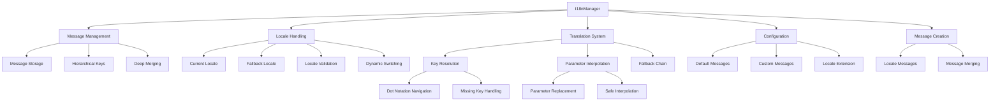

# Internationalization (i18n) Component

## Overview

The `I18nManager` class provides comprehensive internationalization support for the Markdown Docs Viewer, enabling multi-language interfaces with parameter interpolation, fallback mechanisms, and dynamic locale switching.

## Architecture



## Class Structure

### Constructor

```typescript
constructor(config: I18nConfig)
```

### Configuration Interface

```typescript
interface I18nConfig {
  locale: string; // Current locale
  fallbackLocale?: string; // Fallback for missing translations
  messages: Record<string, I18nMessages>; // Translation messages by locale
}

interface I18nMessages {
  [key: string]: string | I18nMessages; // Nested message structure
}
```

## Core Features

### 1. Message Resolution System

**Translation Function:**

```typescript
t(key: string, params?: Record<string, any>): string {
  const message = this.getMessage(key);

  if (!message) {
    console.warn(`Missing translation for key: ${key}`);
    return key; // Return key as fallback
  }

  // Apply parameter interpolation if needed
  if (params) {
    return this.interpolate(message, params);
  }

  return message;
}
```

**Hierarchical Key Resolution:**

```typescript
private getMessage(key: string): string | undefined {
  const keys = key.split('.');
  let current: any = this.messages[this.currentLocale];

  // Try current locale first
  for (const k of keys) {
    if (current && typeof current === 'object' && k in current) {
      current = current[k];
    } else {
      current = undefined;
      break;
    }
  }

  // Fallback to fallback locale if not found
  if (current === undefined && this.fallbackLocale !== this.currentLocale) {
    current = this.messages[this.fallbackLocale];
    for (const k of keys) {
      if (current && typeof current === 'object' && k in current) {
        current = current[k];
      } else {
        return undefined;
      }
    }
  }

  return typeof current === 'string' ? current : undefined;
}
```

### 2. Parameter Interpolation

**Safe Parameter Replacement:**

```typescript
private interpolate(message: string, params: Record<string, any>): string {
  return message.replace(/\{(\w+)\}/g, (match, key) => {
    return params[key] !== undefined ? String(params[key]) : match;
  });
}
```

**Usage Examples:**

```typescript
// Message: "Welcome {name}, you have {count} messages"
i18n.t('app.welcome', { name: 'John', count: 5 });
// Result: "Welcome John, you have 5 messages"

// Missing parameter handling
i18n.t('app.welcome', { name: 'John' });
// Result: "Welcome John, you have {count} messages"
```

### 3. Dynamic Locale Management

**Locale Switching:**

```typescript
setLocale(locale: string): void {
  if (!this.messages[locale]) {
    throw new MarkdownDocsError(
      ErrorCode.INVALID_CONFIG,
      `No messages found for locale "${locale}"`,
      'The specified locale is not available.',
      ErrorSeverity.HIGH
    );
  }
  this.currentLocale = locale;
}
```

**Locale Information:**

```typescript
getLocale(): string {
  return this.currentLocale;
}

getAvailableLocales(): string[] {
  return Object.keys(this.messages);
}

hasLocale(locale: string): boolean {
  return locale in this.messages;
}
```

### 4. Message Management

**Adding New Locales:**

```typescript
addLocale(locale: string, messages: I18nMessages): void {
  this.messages[locale] = messages;
}
```

**Extending Existing Locales:**

```typescript
extendLocale(locale: string, messages: I18nMessages): void {
  if (!this.messages[locale]) {
    this.messages[locale] = {};
  }
  this.messages[locale] = this.deepMerge(this.messages[locale], messages);
}
```

**Deep Merge Implementation:**

```typescript
private deepMerge(target: any, source: any): any {
  const output = { ...target };

  for (const key in source) {
    if (Object.prototype.hasOwnProperty.call(source, key)) {
      if (
        typeof source[key] === 'object' &&
        source[key] !== null &&
        !Array.isArray(source[key])
      ) {
        output[key] = this.deepMerge(target[key] || {}, source[key]);
      } else {
        output[key] = source[key];
      }
    }
  }

  return output;
}
```

## Default Message System

### English Default Messages

```typescript
export const defaultMessages: I18nMessages = {
  app: {
    title: 'Documentation',
    loading: 'Loading documentation...',
    error: 'An error occurred',
    retry: 'Try Again',
    welcome: 'Welcome to the Documentation',
    selectDocument: 'Select a document from the sidebar to begin reading.',
  },
  navigation: {
    toggleMenu: 'Toggle navigation',
    search: 'Search',
    searchPlaceholder: 'Search documentation...',
    categories: 'Categories',
    tags: 'Tags',
    noResults: 'No results found',
  },
  document: {
    copyCode: 'Copy',
    codeCopied: 'Copied!',
    copyFailed: 'Copy failed',
    tableOfContents: 'Table of Contents',
    backToTop: 'Back to top',
  },
  export: {
    title: 'Export Documentation',
    format: 'Format',
    pdf: 'PDF',
    html: 'HTML',
    exportButton: 'Export',
    exporting: 'Exporting...',
    exportSuccess: 'Export completed successfully',
    exportError: 'Export failed',
  },
  errors: {
    documentNotFound: 'Document not found',
    loadError: 'Failed to load document',
    networkError: 'Network error occurred',
    unknown: 'An unexpected error occurred',
  },
};
```

### Configuration Factory

```typescript
export function createI18nConfig(overrides: Partial<I18nConfig> = {}): I18nConfig {
  const messages = overrides.messages || {};

  // Ensure English messages exist
  if (!messages.en) {
    messages.en = defaultMessages;
  } else {
    // Merge with default messages
    messages.en = mergeMessages(defaultMessages, messages.en);
  }

  return {
    locale: 'en',
    fallbackLocale: 'en',
    ...overrides,
    messages,
  };
}
```

## Usage Examples

### Basic Setup

```typescript
import { I18nManager, createI18nConfig } from './i18n';

// Create i18n configuration
const i18nConfig = createI18nConfig({
  locale: 'en',
  fallbackLocale: 'en',
  messages: {
    en: {
      app: {
        title: 'Documentation',
      },
    },
  },
});

// Initialize manager
const i18n = new I18nManager(i18nConfig);

// Use translations
const title = i18n.t('app.title'); // "Documentation"
```

### Multi-language Setup

```typescript
// Spanish translations
const spanishMessages = {
  app: {
    title: 'Documentación',
    loading: 'Cargando documentación...',
    error: 'Ocurrió un error',
    welcome: 'Bienvenido a la Documentación',
  },
  navigation: {
    search: 'Buscar',
    searchPlaceholder: 'Buscar documentación...',
    noResults: 'No se encontraron resultados',
  },
};

// French translations
const frenchMessages = {
  app: {
    title: 'Documentation',
    loading: 'Chargement de la documentation...',
    error: "Une erreur s'est produite",
    welcome: 'Bienvenue dans la Documentation',
  },
  navigation: {
    search: 'Rechercher',
    searchPlaceholder: 'Rechercher dans la documentation...',
    noResults: 'Aucun résultat trouvé',
  },
};

// Multi-language configuration
const multiLangConfig = createI18nConfig({
  locale: 'es',
  fallbackLocale: 'en',
  messages: {
    en: defaultMessages,
    es: spanishMessages,
    fr: frenchMessages,
  },
});

const i18n = new I18nManager(multiLangConfig);
```

### Dynamic Locale Switching

```typescript
// Check available locales
const locales = i18n.getAvailableLocales(); // ['en', 'es', 'fr']

// Switch to Spanish
i18n.setLocale('es');
console.log(i18n.t('app.title')); // "Documentación"

// Switch to French
i18n.setLocale('fr');
console.log(i18n.t('app.title')); // "Documentation"

// Get current locale
const current = i18n.getLocale(); // "fr"
```

### Parameter Interpolation

```typescript
// Messages with parameters
const messagesWithParams = {
  user: {
    greeting: 'Hello {name}!',
    notifications: 'You have {count} new {type}',
    profile: '{name} joined {date} and has {points} points',
  },
};

// Usage with parameters
i18n.t('user.greeting', { name: 'Alice' });
// Result: "Hello Alice!"

i18n.t('user.notifications', { count: 3, type: 'messages' });
// Result: "You have 3 new messages"

i18n.t('user.profile', {
  name: 'Bob',
  date: '2024-01-15',
  points: 1250,
});
// Result: "Bob joined 2024-01-15 and has 1250 points"
```

### Runtime Locale Extension

```typescript
// Add new locale at runtime
i18n.addLocale('de', {
  app: {
    title: 'Dokumentation',
    loading: 'Dokumentation wird geladen...',
  },
});

// Extend existing locale
i18n.extendLocale('de', {
  navigation: {
    search: 'Suchen',
    searchPlaceholder: 'Dokumentation durchsuchen...',
  },
});
```

## Integration with Viewer

### Viewer Integration

```typescript
class MarkdownDocsViewer {
  private i18n: I18nManager;

  constructor(config: DocumentationConfig) {
    // Initialize i18n with config or defaults
    this.i18n = new I18nManager(config.i18n || createI18nConfig());

    this.setupI18nIntegration();
  }

  private setupI18nIntegration(): void {
    // Update UI text based on current locale
    this.updateUIText();

    // Listen for locale changes
    this.on('localeChange', () => {
      this.updateUIText();
    });
  }

  private updateUIText(): void {
    // Update navigation text
    const searchInput = this.container.querySelector('.mdv-search-input');
    if (searchInput) {
      searchInput.setAttribute('placeholder', this.i18n.t('navigation.searchPlaceholder'));
    }

    // Update button text
    const buttons = {
      '.mdv-copy-btn': 'document.copyCode',
      '.mdv-export-btn': 'export.exportButton',
      '.mdv-retry-btn': 'app.retry',
    };

    Object.entries(buttons).forEach(([selector, key]) => {
      const element = this.container.querySelector(selector);
      if (element) {
        element.textContent = this.i18n.t(key);
      }
    });
  }

  // Public API for locale management
  setLocale(locale: string): void {
    this.i18n.setLocale(locale);
    this.emit('localeChange', locale);
  }

  getAvailableLocales(): string[] {
    return this.i18n.getAvailableLocales();
  }
}
```

### UI Component Integration

```typescript
// Search component with i18n
class SearchComponent {
  constructor(private i18n: I18nManager) {}

  render(): string {
    return `
      <div class="mdv-search">
        <input 
          type="search" 
          placeholder="${this.i18n.t('navigation.searchPlaceholder')}"
          aria-label="${this.i18n.t('navigation.search')}"
        >
        <div class="mdv-search-results">
          <div class="mdv-no-results" style="display: none;">
            ${this.i18n.t('navigation.noResults')}
          </div>
        </div>
      </div>
    `;
  }
}

// Export component with i18n
class ExportComponent {
  constructor(private i18n: I18nManager) {}

  render(): string {
    return `
      <div class="mdv-export">
        <h3>${this.i18n.t('export.title')}</h3>
        <label>
          ${this.i18n.t('export.format')}:
          <select>
            <option value="pdf">${this.i18n.t('export.pdf')}</option>
            <option value="html">${this.i18n.t('export.html')}</option>
          </select>
        </label>
        <button class="mdv-export-btn">
          ${this.i18n.t('export.exportButton')}
        </button>
      </div>
    `;
  }
}
```

## Locale Creation Helpers

### Locale Message Factory

```typescript
export function createLocaleMessages(
  locale: string,
  messages: I18nMessages
): Record<string, I18nMessages> {
  return {
    [locale]: messages,
  };
}

// Usage
const germanMessages = createLocaleMessages('de', {
  app: {
    title: 'Dokumentation',
    loading: 'Lädt...',
  },
});
```

### Message Validation

```typescript
function validateMessageStructure(messages: I18nMessages): boolean {
  const requiredKeys = [
    'app.title',
    'app.loading',
    'navigation.search',
    'document.copyCode',
    'errors.unknown',
  ];

  return requiredKeys.every(key => {
    const keys = key.split('.');
    let current: any = messages;

    for (const k of keys) {
      if (!current || typeof current !== 'object' || !(k in current)) {
        console.warn(`Missing required translation key: ${key}`);
        return false;
      }
      current = current[k];
    }

    return typeof current === 'string';
  });
}
```

## Error Handling

### Configuration Validation

```typescript
private validateConfig(): void {
  if (!this.messages[this.currentLocale]) {
    console.warn(
      `No messages found for locale "${this.currentLocale}", falling back to "${this.fallbackLocale}"`
    );

    if (!this.messages[this.fallbackLocale]) {
      throw new MarkdownDocsError(
        ErrorCode.INVALID_CONFIG,
        `No messages found for locale "${this.currentLocale}" or fallback locale "${this.fallbackLocale}"`,
        'No translation messages found for the specified locale or fallback locale.',
        ErrorSeverity.HIGH
      );
    }
  }
}
```

### Safe Translation Retrieval

```typescript
t(key: string, params?: Record<string, any>): string {
  try {
    const message = this.getMessage(key);

    if (!message) {
      console.warn(`Missing translation for key: ${key}`);
      return key; // Safe fallback
    }

    if (params) {
      return this.interpolate(message, params);
    }

    return message;
  } catch (error) {
    console.error('Translation error:', error);
    return key; // Always return something usable
  }
}
```

## Performance Considerations

### Message Caching

```typescript
private messageCache = new Map<string, string>();

private getCachedMessage(key: string): string | undefined {
  const cacheKey = `${this.currentLocale}:${key}`;
  return this.messageCache.get(cacheKey);
}

private setCachedMessage(key: string, message: string): void {
  const cacheKey = `${this.currentLocale}:${key}`;
  this.messageCache.set(cacheKey, message);
}
```

### Lazy Loading

```typescript
class LazyI18nManager extends I18nManager {
  private loadedLocales = new Set<string>();

  async loadLocale(locale: string): Promise<void> {
    if (this.loadedLocales.has(locale)) {
      return;
    }

    try {
      const messages = await import(`./messages/${locale}.js`);
      this.addLocale(locale, messages.default);
      this.loadedLocales.add(locale);
    } catch (error) {
      console.warn(`Failed to load locale ${locale}:`, error);
    }
  }
}
```

## Testing Considerations

### Unit Tests

- Message resolution accuracy
- Parameter interpolation
- Fallback mechanisms
- Locale switching
- Deep merge functionality

### Integration Tests

- UI component integration
- Dynamic locale changes
- Message validation
- Error handling
- Performance under load

### Localization Tests

- Translation completeness
- Cultural appropriateness
- RTL language support
- Number/date formatting
- Accessibility compliance
