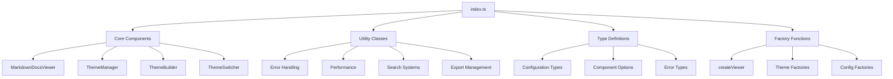

# Main Module Index

## Overview

The `index.ts` file serves as the primary entry point for the Markdown Docs Viewer library, providing a clean and organized public API by exporting all components, utilities, and types that consumers need to interact with the library.

## Architecture



## Public API Structure

### 1. Core Components

**Main Viewer Class:**

```typescript
export { MarkdownDocsViewer } from './viewer';
```

- Primary orchestrator class
- Main entry point for library consumers
- Handles initialization and lifecycle management

**Theme System:**

```typescript
export { defaultTheme, darkTheme, createCustomTheme } from './themes';
export { ThemeManager, type ThemePreset } from './theme-manager';
export { ThemeBuilder, type ThemeBuilderOptions } from './theme-builder';
export { ThemeSwitcher, type ThemeSwitcherOptions } from './theme-switcher';
```

- Complete theme management system
- Built-in themes and customization capabilities
- UI components for theme interaction

### 2. Factory Functions

**Simplified Creation:**

```typescript
export { createViewer } from './factory';
```

- Streamlined viewer instantiation
- Sensible defaults for common use cases
- Quick-start functionality

**Configuration Factories:**

```typescript
export { createExportOptions } from './export';
export { createI18nConfig, createLocaleMessages } from './i18n';
```

- Helper functions for complex configurations
- Default value management
- Type-safe configuration creation

### 3. Type System

**Complete Type Definitions:**

```typescript
export * from './types';
```

- All TypeScript interfaces and types
- Configuration options
- Component interfaces
- Callback function signatures

### 4. Error Handling System

**Comprehensive Error Management:**

```typescript
export {
  MarkdownDocsError,
  ErrorCode,
  ErrorSeverity,
  ErrorFactory,
  withRetry,
  ErrorBoundary,
  ConsoleErrorLogger,
} from './errors';
```

- Structured error handling
- Retry mechanisms
- Error categorization and logging
- Graceful error recovery

### 5. Performance Utilities

**Optimization Components:**

```typescript
export {
  LRUCache,
  PersistentCache,
  SearchIndex,
  debounce,
  throttle,
  LazyLoader,
  MemoryManager,
  PerformanceMonitor,
} from './performance';
```

- Caching systems
- Search optimization
- Memory management
- Performance monitoring
- Event optimization utilities

### 6. Feature Modules

**Search System:**

```typescript
export { SearchManager } from './search';
export { AdvancedSearchManager } from './advanced-search';
```

- Basic and advanced search capabilities
- Full-text indexing and retrieval

**Export Functionality:**

```typescript
export { ExportManager, createExportOptions } from './export';
```

- PDF and HTML export capabilities
- Export configuration management

**Internationalization:**

```typescript
export { I18nManager, createI18nConfig, defaultMessages, createLocaleMessages } from './i18n';
```

- Multi-language support
- Locale management
- Message interpolation

**Table of Contents:**

```typescript
export { TableOfContents, addHeadingIds } from './toc';
```

- Automatic TOC generation
- Scroll spy functionality
- Heading ID management

### 7. Specialized Features

**Print Support:**

```typescript
export { generatePrintStyles, addPrintUtilities, generatePrintPreview } from './print-styles';
```

- Print-optimized styling
- Print preview functionality
- Print utilities

**Dark Mode Toggle:**

```typescript
export { DarkModeToggle, type DarkModeToggleOptions } from './dark-mode-toggle';
```

- Standalone dark mode toggle component
- Theme switching interface

## API Design Principles

### 1. Clean Public Interface

**Selective Exports:**

- Only exports components meant for public consumption
- Internal utilities remain private
- Clear separation between public and private APIs

**Consistent Naming:**

- Consistent naming conventions across exports
- Clear class vs. function distinction
- Descriptive names that indicate purpose

### 2. Type Safety

**Complete Type Coverage:**

```typescript
// All types exported for consumer use
export * from './types';

// Specific option types for components
export { type ThemeBuilderOptions } from './theme-builder';
export { type ThemeSwitcherOptions } from './theme-switcher';
export { type DarkModeToggleOptions } from './dark-mode-toggle';
```

**Benefits:**

- Full TypeScript IntelliSense support
- Compile-time error detection
- Self-documenting API through types

### 3. Modular Architecture

**Independent Components:**

- Each export can be used independently
- Minimal coupling between exported components
- Clear component boundaries

**Composable Design:**

- Components can be combined in various ways
- Factory functions provide common compositions
- Flexible architecture for different use cases

## Usage Examples

### Basic Library Usage

```typescript
import { MarkdownDocsViewer, createViewer } from '@your-org/markdown-docs-viewer';

// Direct instantiation
const viewer = new MarkdownDocsViewer({
  container: '#docs-container',
  source: {
    type: 'local',
    basePath: '/docs',
    documents: [
      /* ... */
    ],
  },
});

// Factory function approach
const quickViewer = createViewer({
  container: '#docs-container',
  documents: [
    /* ... */
  ],
});
```

### Theme System Usage

```typescript
import {
  ThemeManager,
  ThemeSwitcher,
  defaultTheme,
  darkTheme,
  createCustomTheme,
} from '@your-org/markdown-docs-viewer';

// Create theme manager
const themeManager = new ThemeManager();

// Create custom theme
const customTheme = createCustomTheme('corporate', {
  colors: {
    primary: '#007acc',
    secondary: '#ff6b35',
  },
});

// Add theme switcher
const themeSwitcher = new ThemeSwitcher(themeManager, {
  position: 'header',
  showPreview: true,
});
```

### Error Handling Usage

```typescript
import {
  MarkdownDocsError,
  ErrorFactory,
  withRetry,
  ErrorBoundary,
} from '@your-org/markdown-docs-viewer';

// Use error factory
const error = ErrorFactory.documentNotFound('missing-doc');

// Implement retry logic
const result = await withRetry(() => loadDocument('doc-id'), { maxAttempts: 3, baseDelay: 1000 });

// Use error boundary
const errorBoundary = new ErrorBoundary(error => {
  console.error('Viewer error:', error);
});
```

### Performance Utilities Usage

```typescript
import {
  LRUCache,
  debounce,
  PerformanceMonitor,
  MemoryManager,
} from '@your-org/markdown-docs-viewer';

// Document caching
const cache = new LRUCache<string, string>(100);

// Debounced search
const debouncedSearch = debounce(performSearch, 300);

// Performance monitoring
const monitor = new PerformanceMonitor();
const endTiming = monitor.startTiming('document-load');
// ... perform operation
endTiming();
```

### Feature Modules Usage

```typescript
import {
  AdvancedSearchManager,
  ExportManager,
  I18nManager,
  TableOfContents,
} from '@your-org/markdown-docs-viewer';

// Advanced search
const searchManager = new AdvancedSearchManager(documents, {
  fuzzySearch: true,
  searchHistory: true,
});

// Export functionality
const exportManager = new ExportManager(viewer);
const pdfBlob = await exportManager.export({ format: 'pdf' });

// Internationalization
const i18n = new I18nManager({
  locale: 'en',
  messages: {
    /* ... */
  },
});

// Table of contents
const toc = new TableOfContents({ maxDepth: 3 });
```

## Integration Patterns

### 1. Full-Featured Integration

```typescript
import {
  MarkdownDocsViewer,
  ThemeManager,
  ThemeSwitcher,
  AdvancedSearchManager,
  ExportManager,
  I18nManager,
} from '@your-org/markdown-docs-viewer';

class DocumentationApp {
  private viewer: MarkdownDocsViewer;
  private themeManager: ThemeManager;
  private searchManager: AdvancedSearchManager;
  private exportManager: ExportManager;
  private i18n: I18nManager;

  constructor(config: AppConfig) {
    this.setupComponents(config);
    this.setupIntegrations();
  }

  private setupComponents(config: AppConfig): void {
    this.viewer = new MarkdownDocsViewer(config.viewer);
    this.themeManager = new ThemeManager(config.theme);
    this.searchManager = new AdvancedSearchManager(config.documents);
    this.exportManager = new ExportManager(this.viewer);
    this.i18n = new I18nManager(config.i18n);
  }
}
```

### 2. Minimal Integration

```typescript
import { createViewer } from '@your-org/markdown-docs-viewer';

// Simple setup with defaults
const viewer = createViewer({
  container: '#docs',
  documents: [{ id: 'intro', title: 'Introduction', path: 'docs/intro.md' }],
});
```

### 3. Custom Integration

```typescript
import {
  MarkdownDocsViewer,
  LRUCache,
  debounce,
  ErrorBoundary,
} from '@your-org/markdown-docs-viewer';

class CustomDocViewer extends MarkdownDocsViewer {
  private cache = new LRUCache<string, string>(50);
  private errorBoundary = new ErrorBoundary(this.handleError.bind(this));

  protected async loadDocument(docId: string): Promise<void> {
    return this.errorBoundary.execute(
      () => super.loadDocument(docId),
      () => this.showFallbackContent()
    );
  }
}
```

## Bundle Size Considerations

### Tree Shaking Support

**ES Module Structure:**

- Individual exports allow for tree shaking
- Unused components are excluded from final bundle
- Optimal bundle size for specific use cases

**Import Optimization:**

```typescript
// Import only what you need
import { MarkdownDocsViewer } from '@your-org/markdown-docs-viewer';

// Avoid importing everything
// import * as MDV from '@your-org/markdown-docs-viewer'; // Don't do this
```

### Lazy Loading

**Dynamic Imports:**

```typescript
// Lazy load advanced features when needed
const loadAdvancedSearch = async () => {
  const { AdvancedSearchManager } = await import('@your-org/markdown-docs-viewer');
  return new AdvancedSearchManager(documents);
};
```

## Backward Compatibility

### Versioning Strategy

**Semantic Versioning:**

- Major versions for breaking API changes
- Minor versions for new features
- Patch versions for bug fixes

**Deprecation Policy:**

- Gradual deprecation with warnings
- Migration guides for breaking changes
- Maintain backward compatibility within major versions

### Migration Support

**Legacy API Support:**

```typescript
// Current API
export { MarkdownDocsViewer } from './viewer';

// Legacy compatibility (deprecated)
export { MarkdownDocsViewer as MDViewer } from './viewer';
```

## Testing Integration

### Test Utilities

**Mock Support:**

- All components support mocking
- Clear interfaces for test doubles
- Dependency injection patterns

**Test Examples:**

```typescript
import { MarkdownDocsViewer, ErrorFactory } from '@your-org/markdown-docs-viewer';

describe('Documentation Integration', () => {
  it('should handle document loading errors', async () => {
    const viewer = new MarkdownDocsViewer(testConfig);
    const error = ErrorFactory.documentNotFound('test-doc');

    // Test error handling
    expect(() => viewer.loadDocument('missing')).toThrow(error);
  });
});
```

## Documentation Integration

### API Documentation

**Generated Docs:**

- TypeScript types provide inline documentation
- JSDoc comments for complex functions
- Examples in function documentation

**Usage Guides:**

- Component-specific documentation
- Integration examples
- Best practices guides

### IntelliSense Support

**Rich IDE Experience:**

- Complete type information
- Parameter hints
- Return type information
- Deprecation warnings
