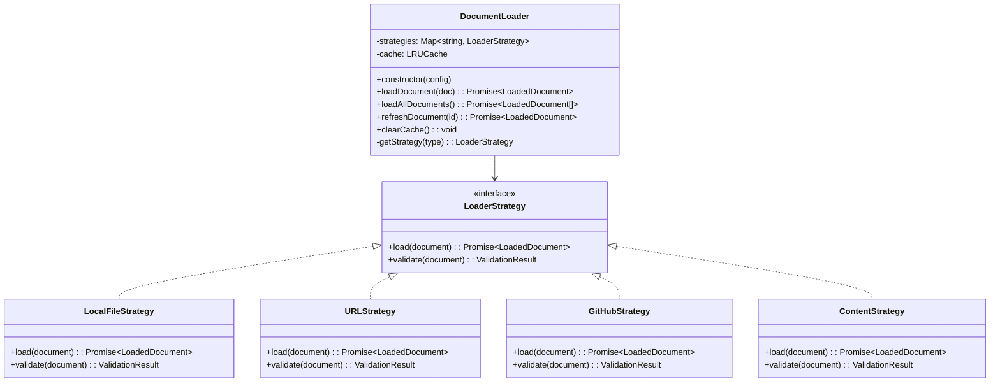

# Component: Document Loader

## Overview

The Document Loader component handles fetching markdown content from multiple sources including local files, remote URLs, GitHub repositories, and inline content. It implements a Strategy pattern to support different loading mechanisms while providing a unified interface.

## Architecture



## Loading Strategies

### Local File Strategy

Loads documents from the same origin web server.

```typescript
class LocalFileStrategy implements LoaderStrategy {
  async load(document: Document): Promise<LoadedDocument> {
    const url = this.buildUrl(document);

    try {
      const response = await fetch(url);
      if (!response.ok) {
        throw new NetworkError(`Failed to load ${url}: ${response.statusText}`);
      }

      const content = await response.text();
      return {
        ...document,
        content,
        loadedAt: new Date(),
        source: 'local',
      };
    } catch (error) {
      throw new DocumentLoadError(`Failed to load local file: ${document.file}`, error);
    }
  }

  private buildUrl(document: Document): string {
    const basePath = this.config.basePath || '';
    return `${basePath}/${document.file}`.replace(/\/+/g, '/');
  }
}
```

### URL Strategy

Loads documents from remote URLs with optional authentication.

```typescript
class URLStrategy implements LoaderStrategy {
  async load(document: Document): Promise<LoadedDocument> {
    const url = this.buildUrl(document);
    const headers = this.buildHeaders();

    try {
      const response = await fetch(url, {
        headers,
        mode: 'cors',
        cache: 'default',
      });

      if (!response.ok) {
        throw new NetworkError(`HTTP ${response.status}: ${response.statusText}`);
      }

      const content = await response.text();
      return {
        ...document,
        content,
        loadedAt: new Date(),
        source: 'url',
        etag: response.headers.get('etag'),
        lastModified: response.headers.get('last-modified'),
      };
    } catch (error) {
      throw new DocumentLoadError(`Failed to load URL: ${url}`, error);
    }
  }

  private buildHeaders(): HeadersInit {
    return {
      Accept: 'text/markdown, text/plain, */*',
      ...this.config.headers,
    };
  }
}
```

### GitHub Strategy

Loads documents directly from GitHub repositories via the API.

```typescript
class GitHubStrategy implements LoaderStrategy {
  async load(document: Document): Promise<LoadedDocument> {
    const { owner, repo, path, ref } = this.parseGitHubPath(document.file!);
    const url = `https://api.github.com/repos/${owner}/${repo}/contents/${path}${ref ? `?ref=${ref}` : ''}`;

    try {
      const response = await fetch(url, {
        headers: {
          Accept: 'application/vnd.github.v3.raw',
          'User-Agent': 'MarkdownDocsViewer',
        },
      });

      if (!response.ok) {
        if (response.status === 404) {
          throw new DocumentNotFoundError(`GitHub file not found: ${document.file}`);
        }
        throw new NetworkError(`GitHub API error: ${response.statusText}`);
      }

      const content = await response.text();
      return {
        ...document,
        content,
        loadedAt: new Date(),
        source: 'github',
        githubInfo: { owner, repo, path, ref },
      };
    } catch (error) {
      throw new DocumentLoadError(`Failed to load from GitHub: ${document.file}`, error);
    }
  }

  private parseGitHubPath(file: string): GitHubPathInfo {
    // Parse format: owner/repo/ref/path
    const parts = file.split('/');
    if (parts.length < 3) {
      throw new Error('Invalid GitHub path format. Expected: owner/repo/ref/path');
    }

    return {
      owner: parts[0],
      repo: parts[1],
      ref: parts[2] === 'main' || parts[2] === 'master' ? parts[2] : 'main',
      path: parts.slice(2).join('/'),
    };
  }
}
```

### Content Strategy

Handles inline markdown content.

```typescript
class ContentStrategy implements LoaderStrategy {
  async load(document: Document): Promise<LoadedDocument> {
    if (!document.content) {
      throw new DocumentLoadError('No content provided for inline document');
    }

    return {
      ...document,
      content: document.content,
      loadedAt: new Date(),
      source: 'content',
    };
  }

  validate(document: Document): ValidationResult {
    return {
      valid: !!document.content,
      errors: document.content ? [] : ['Content is required for inline documents'],
    };
  }
}
```

## Caching System

### LRU Cache Implementation

Efficient caching with automatic eviction.

```typescript
class DocumentCache {
  private cache = new Map<string, CacheEntry>();
  private maxSize: number;
  private ttl: number;

  constructor(maxSize = 50, ttl = 5 * 60 * 1000) {
    // 5 minutes default TTL
    this.maxSize = maxSize;
    this.ttl = ttl;
  }

  get(key: string): LoadedDocument | undefined {
    const entry = this.cache.get(key);
    if (!entry) return undefined;

    // Check if expired
    if (Date.now() - entry.timestamp > this.ttl) {
      this.cache.delete(key);
      return undefined;
    }

    // Move to end (most recently used)
    this.cache.delete(key);
    this.cache.set(key, entry);

    return entry.document;
  }

  set(key: string, document: LoadedDocument): void {
    // Remove if already exists
    this.cache.delete(key);

    // Evict oldest if at capacity
    if (this.cache.size >= this.maxSize) {
      const firstKey = this.cache.keys().next().value;
      this.cache.delete(firstKey);
    }

    this.cache.set(key, {
      document,
      timestamp: Date.now(),
    });
  }
}
```

## Error Handling

### Document Load Errors

Comprehensive error handling for different failure scenarios.

```typescript
export class DocumentLoadError extends Error {
  constructor(
    message: string,
    public readonly cause?: Error,
    public readonly document?: Document
  ) {
    super(message);
    this.name = 'DocumentLoadError';
  }
}

export class NetworkError extends DocumentLoadError {
  constructor(message: string, cause?: Error) {
    super(message, cause);
    this.name = 'NetworkError';
  }
}

export class DocumentNotFoundError extends DocumentLoadError {
  constructor(message: string, document?: Document) {
    super(message, undefined, document);
    this.name = 'DocumentNotFoundError';
  }
}

// Error recovery strategies
class ErrorRecovery {
  static async retryWithBackoff<T>(
    operation: () => Promise<T>,
    maxRetries = 3,
    baseDelay = 1000
  ): Promise<T> {
    let lastError: Error;

    for (let attempt = 0; attempt <= maxRetries; attempt++) {
      try {
        return await operation();
      } catch (error) {
        lastError = error as Error;

        if (attempt === maxRetries) break;

        // Exponential backoff
        const delay = baseDelay * Math.pow(2, attempt);
        await this.delay(delay);
      }
    }

    throw lastError!;
  }

  private static delay(ms: number): Promise<void> {
    return new Promise(resolve => setTimeout(resolve, ms));
  }
}
```

## Integration Examples

### Basic Usage

```typescript
import { DocumentLoader } from '@austinorphan/markdown-docs-viewer';

const loader = new DocumentLoader({
  type: 'local',
  basePath: '/docs',
  cacheSize: 100,
  cacheTTL: 10 * 60 * 1000, // 10 minutes
});

// Load single document
try {
  const document = await loader.loadDocument({
    id: 'intro',
    title: 'Introduction',
    file: 'intro.md',
  });

  console.log('Loaded:', document.title);
  console.log('Content length:', document.content.length);
} catch (error) {
  console.error('Failed to load document:', error.message);
}
```

### Batch Loading

```typescript
// Load multiple documents concurrently
const documents = [
  { id: 'intro', title: 'Introduction', file: 'intro.md' },
  { id: 'guide', title: 'User Guide', file: 'guide.md' },
  { id: 'api', title: 'API Reference', file: 'api.md' },
];

try {
  const loadedDocs = await loader.loadAllDocuments(documents);
  console.log(`Loaded ${loadedDocs.length} documents`);
} catch (error) {
  console.error('Batch loading failed:', error);
}
```

### GitHub Repository

```typescript
const githubLoader = new DocumentLoader({
  type: 'github',
  rateLimit: {
    requests: 60,
    windowMs: 60 * 60 * 1000, // 1 hour
  },
});

const document = await githubLoader.loadDocument({
  id: 'readme',
  title: 'README',
  file: 'microsoft/vscode/main/README.md',
});
```

## Performance Optimizations

- **Parallel Loading**: Load multiple documents concurrently
- **Smart Caching**: Cache based on content hash and modification time
- **Request Deduplication**: Avoid loading the same document multiple times
- **Compression**: Support for gzip/brotli compressed responses
- **CDN Integration**: Optimized for CDN-served content

## Testing Considerations

- **Network Mocking**: Mock fetch requests for reliable testing
- **Error Scenarios**: Test various network and parsing errors
- **Cache Behavior**: Verify cache hits, misses, and eviction
- **Concurrency**: Test parallel loading scenarios
- **Strategy Switching**: Test different loading strategies

## Future Enhancements

- **Progressive Loading**: Stream large documents progressively
- **Offline Support**: Service worker integration for offline access
- **Delta Updates**: Load only changed portions of documents
- **Compression**: Built-in compression support
- **Authentication**: OAuth and API key management
- **Webhooks**: Real-time updates via webhooks
