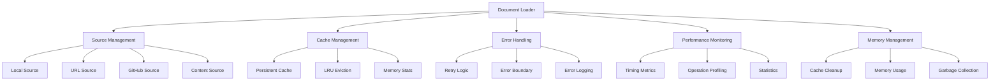

# Loader Component

## Overview

The Loader component (DocumentLoader) is a comprehensive document loading system that supports multiple source types, caching, performance monitoring, error handling, and retry logic for the Markdown Documentation Viewer.

## Architecture



## Class Structure

### DocumentLoader Class

**Purpose**: Manages document loading from various sources with caching and error handling

**Constructor**:

```typescript
constructor(
  source: DocumentSource,
  retryConfig: Partial<RetryConfig> = {},
  logger?: ErrorLogger,
  cacheSize: number = 50
)
```

**Key Properties**:

- `source: DocumentSource` - Document source configuration
- `cache: PersistentCache` - LRU cache for loaded documents
- `retryConfig: RetryConfig` - Retry configuration for failed loads
- `errorBoundary: ErrorBoundary` - Error handling wrapper
- `logger: ErrorLogger` - Error and debug logging
- `performanceMonitor: PerformanceMonitor` - Performance tracking
- `memoryManager: MemoryManager` - Memory management
- `loadingPromises: Map<string, Promise<string>>` - Deduplication map

## Core Features

### 1. Multi-Source Document Loading

**Source Type Support**:

```typescript
enum SourceType {
  LOCAL = 'local', // Files served by web server
  URL = 'url', // Remote HTTP/HTTPS files
  GITHUB = 'github', // GitHub repository files
  CONTENT = 'content', // Inline markdown content
}
```

### 2. Document Loading with Deduplication

**Smart Loading Logic**:

```typescript
async loadDocument(doc: Document): Promise<string> {
  return this.errorBoundary.execute(
    async () => {
      const endTiming = this.performanceMonitor.startTiming('document-load');

      try {
        // Check cache first
        if (this.cache.has(doc.id)) {
          const cached = this.cache.get(doc.id)!;
          endTiming();
          return cached;
        }

        // Check if already loading to prevent duplicate requests
        if (this.loadingPromises.has(doc.id)) {
          const result = await this.loadingPromises.get(doc.id)!;
          endTiming();
          return result;
        }

        // Create loading promise for deduplication
        const loadingPromise = this.createLoadingPromise(doc);
        this.loadingPromises.set(doc.id, loadingPromise);

        try {
          const content = await loadingPromise;
          return content;
        } finally {
          this.loadingPromises.delete(doc.id);
          endTiming();
        }
      } catch (error) {
        endTiming();
        throw error;
      }
    },
    () => {
      this.logger.warn('Failed to load document, returning empty content', {
        documentId: doc.id,
      });
      return '';
    },
    { operation: 'loadDocument', documentId: doc.id }
  );
}
```

**Features**:

- **Cache-First Loading**: Checks cache before network requests
- **Request Deduplication**: Prevents duplicate loading of same document
- **Performance Monitoring**: Tracks loading times and metrics
- **Error Recovery**: Graceful fallback to empty content on failure

### 3. Source-Specific Loading Methods

#### Local File Loading

**Purpose**: Load files from web server with basePath support

```typescript
private async loadLocal(path: string): Promise<string> {
  const fullPath = this.source.basePath ? `${this.source.basePath}/${path}` : path;

  try {
    const response = await fetch(fullPath);

    if (!response.ok) {
      if (response.status === 404) {
        throw ErrorFactory.documentNotFound(path);
      }
      throw ErrorFactory.networkError(fullPath, response.status, response.statusText);
    }

    const content = await response.text();
    return content;
  } catch (error) {
    // Comprehensive error handling...
  }
}
```

**Features**:

- **Base Path Resolution**: Supports configurable base paths
- **HTTP Status Handling**: Proper error codes for different failures
- **Network Error Detection**: Distinguishes network vs. application errors

#### URL Loading

**Purpose**: Load remote documents with custom headers

```typescript
private async loadFromUrl(path: string): Promise<string> {
  const url = this.source.baseUrl ? `${this.source.baseUrl}/${path}` : path;

  try {
    const response = await fetch(url, {
      headers: this.source.headers || {},
    });

    if (!response.ok) {
      if (response.status === 404) {
        throw ErrorFactory.documentNotFound(path);
      }
      if (response.status === 403 || response.status === 401) {
        throw new MarkdownDocsError(
          ErrorCode.UNAUTHORIZED_ACCESS,
          `Unauthorized access to ${url}`,
          'Access denied. Please check your credentials.',
          ErrorSeverity.HIGH,
          false
        );
      }
      if (response.status === 429) {
        throw new MarkdownDocsError(
          ErrorCode.RATE_LIMITED,
          `Rate limited when accessing ${url}`,
          'Too many requests. Please wait and try again.',
          ErrorSeverity.MEDIUM,
          true
        );
      }
      throw ErrorFactory.networkError(url, response.status, response.statusText);
    }

    return await response.text();
  } catch (error) {
    // Error handling...
  }
}
```

**Features**:

- **Custom Headers**: Support for authentication and custom headers
- **Rate Limit Handling**: Specific handling for 429 responses
- **Authorization Support**: Proper handling of 401/403 errors

#### GitHub API Loading

**Purpose**: Load files directly from GitHub repositories

```typescript
private async loadFromGithub(path: string): Promise<string> {
  // Parse GitHub URL format: owner/repo/branch/path/to/file
  const parts = path.split('/');
  const [owner, repo, branch = 'main', ...filePath] = parts;
  const apiUrl = `https://api.github.com/repos/${owner}/${repo}/contents/${filePath.join('/')}?ref=${branch}`;

  try {
    const response = await fetch(apiUrl, {
      headers: {
        Accept: 'application/vnd.github.v3+json',
        'User-Agent': 'MarkdownDocsViewer/1.0',
        ...(this.source.headers || {}),
      },
    });

    if (!response.ok) {
      if (response.status === 403) {
        const rateLimitReset = response.headers.get('X-RateLimit-Reset');
        let message = 'GitHub API rate limit exceeded';
        if (rateLimitReset) {
          const resetTime = new Date(parseInt(rateLimitReset) * 1000);
          message += `. Rate limit resets at ${resetTime.toISOString()}`;
        }
        throw ErrorFactory.githubApiError(path, 403, message);
      }
      throw ErrorFactory.githubApiError(path, response.status, await response.text());
    }

    const data = await response.json();

    // Handle directory responses
    if (Array.isArray(data)) {
      throw new MarkdownDocsError(
        ErrorCode.GITHUB_API_ERROR,
        'GitHub path points to a directory, not a file',
        'Please specify a file path.',
        ErrorSeverity.MEDIUM,
        false
      );
    }

    // Decode base64 content
    const content = atob(data.content.replace(/\s/g, ''));
    return content;
  } catch (error) {
    // Error handling...
  }
}
```

**Features**:

- **GitHub API Integration**: Uses GitHub Contents API
- **Base64 Decoding**: Handles GitHub's base64 content encoding
- **Rate Limit Awareness**: Tracks and reports rate limit information
- **Branch Support**: Configurable branch selection (defaults to 'main')

### 4. Caching System

**Persistent LRU Cache**:

```typescript
constructor() {
  this.cache = new PersistentCache(cacheSize, `mdv-cache-${this.source.type}`);
}

// Cache usage in loading
if (this.cache.has(doc.id)) {
  const cached = this.cache.get(doc.id)!;
  return cached;
}

// Cache after successful load
this.cache.set(doc.id, content);
```

**Cache Features**:

- **LRU Eviction**: Automatically removes least recently used items
- **Source-Specific**: Separate cache namespaces per source type
- **Memory Monitoring**: Tracks cache size and memory usage
- **Persistent Storage**: Optional localStorage persistence

### 5. Error Handling & Retry Logic

**Retry Configuration**:

```typescript
interface RetryConfig {
  maxAttempts: number; // Maximum retry attempts
  baseDelay: number; // Base delay between retries (ms)
  maxDelay: number; // Maximum delay cap (ms)
  exponentialBackoff: boolean; // Use exponential backoff
}
```

**Retry Implementation**:

```typescript
// Load with retry logic
content = await withRetry(() => this.loadFromSource(doc.file!), this.retryConfig);
```

**Error Recovery**:

- **Graceful Degradation**: Returns empty content on failure
- **Comprehensive Logging**: Detailed error information for debugging
- **Retryable Detection**: Distinguishes between retryable and permanent failures

### 6. Performance Monitoring

**Operation Timing**:

```typescript
const endTiming = this.performanceMonitor.startTiming('document-load');
try {
  // Loading operations...
} finally {
  endTiming();
}
```

**Metrics Tracking**:

- **Load Times**: Individual document loading duration
- **Cache Hit Rate**: Cache effectiveness measurement
- **Memory Usage**: Memory consumption tracking
- **Operation Counts**: Request frequency analysis

### 7. Memory Management

**Memory Optimization**:

```typescript
// Add cleanup task for memory management
this.memoryManager.addCleanupTask(() => {
  this.clearOldCacheEntries();
});

// Check memory after operations
this.memoryManager.checkMemoryUsage();
```

**Memory Features**:

- **Automatic Cleanup**: Triggers cache cleanup when memory is low
- **Usage Monitoring**: Tracks memory consumption patterns
- **LRU Eviction**: Removes old cache entries to free memory

## Source Configuration

### 1. Local Source Configuration

```typescript
const localSource: DocumentSource = {
  type: 'local',
  basePath: '/docs', // Optional base path
  documents: [
    { id: 'intro', title: 'Introduction', file: 'intro.md' },
    { id: 'guide', title: 'User Guide', file: 'guide.md' },
  ],
};
```

### 2. URL Source Configuration

```typescript
const urlSource: DocumentSource = {
  type: 'url',
  baseUrl: 'https://docs.example.com',
  headers: {
    Authorization: 'Bearer token',
    Accept: 'text/plain',
  },
  documents: [
    { id: 'api', title: 'API Reference', file: 'api.md' },
    { id: 'sdk', title: 'SDK Guide', file: 'sdk.md' },
  ],
};
```

### 3. GitHub Source Configuration

```typescript
const githubSource: DocumentSource = {
  type: 'github',
  headers: {
    Authorization: 'token ghp_xxxx', // Optional for private repos
  },
  documents: [
    {
      id: 'readme',
      title: 'README',
      file: 'owner/repo/main/README.md',
    },
    {
      id: 'contributing',
      title: 'Contributing',
      file: 'owner/repo/main/docs/CONTRIBUTING.md',
    },
  ],
};
```

### 4. Content Source Configuration

```typescript
const contentSource: DocumentSource = {
  type: 'content',
  documents: [
    {
      id: 'inline',
      title: 'Inline Documentation',
      content: '# Welcome\n\nThis is inline content.',
    },
  ],
};
```

## Public API Methods

### 1. Document Loading

```typescript
// Load all documents (metadata only)
async loadAll(): Promise<Document[]>

// Load specific document content
async loadDocument(doc: Document): Promise<string>

// Preload multiple documents for performance
async preloadDocuments(docIds: string[]): Promise<void>
```

### 2. Cache Management

```typescript
// Clear all cached content
clearCache(): void

// Get cache size
getCacheSize(): number

// Check if document is cached
isCached(docId: string): boolean

// Get detailed cache statistics
getCacheStats(): {
  size: number;
  capacity: number;
  memoryUsage: number;
  hitRate?: number;
}
```

### 3. Performance & Diagnostics

```typescript
// Get performance metrics
getPerformanceMetrics(): Record<string, any>

// Update retry configuration
updateRetryConfig(config: Partial<RetryConfig>): void

// Cleanup resources
destroy(): void
```

## Integration Patterns

### 1. Basic Document Loader Setup

```typescript
import { DocumentLoader } from './loader';

const loader = new DocumentLoader(
  {
    type: 'local',
    basePath: '/documentation',
    documents: documentList,
  },
  {
    maxAttempts: 3,
    baseDelay: 1000,
    exponentialBackoff: true,
  },
  logger,
  100 // cache size
);

// Load documents
const documents = await loader.loadAll();
const content = await loader.loadDocument(documents[0]);
```

### 2. Multi-Source Loader

```typescript
class MultiSourceLoader {
  private loaders: Map<string, DocumentLoader> = new Map();

  addSource(name: string, source: DocumentSource): void {
    const loader = new DocumentLoader(source, retryConfig, logger);
    this.loaders.set(name, loader);
  }

  async loadFromSource(sourceName: string, docId: string): Promise<string> {
    const loader = this.loaders.get(sourceName);
    if (!loader) {
      throw new Error(`Unknown source: ${sourceName}`);
    }

    const documents = await loader.loadAll();
    const doc = documents.find(d => d.id === docId);
    if (!doc) {
      throw new Error(`Document not found: ${docId}`);
    }

    return await loader.loadDocument(doc);
  }
}
```

### 3. Preloading Strategy

```typescript
class PreloadingLoader {
  constructor(private loader: DocumentLoader) {}

  async preloadVisible(documents: Document[]): Promise<void> {
    // Preload first 5 documents
    const visibleDocs = documents.slice(0, 5).map(doc => doc.id);
    await this.loader.preloadDocuments(visibleDocs);
  }

  async preloadAdjacent(currentDocId: string, documents: Document[]): Promise<void> {
    const currentIndex = documents.findIndex(doc => doc.id === currentDocId);
    if (currentIndex === -1) return;

    // Preload previous and next documents
    const adjacentIds = [];
    if (currentIndex > 0) adjacentIds.push(documents[currentIndex - 1].id);
    if (currentIndex < documents.length - 1) adjacentIds.push(documents[currentIndex + 1].id);

    await this.loader.preloadDocuments(adjacentIds);
  }
}
```

## Error Handling Patterns

### 1. Error Classification

```typescript
// Network errors (retryable)
ErrorCode.NETWORK_ERROR;
ErrorCode.RATE_LIMITED;

// Authentication errors (not retryable)
ErrorCode.UNAUTHORIZED_ACCESS;

// Configuration errors (not retryable)
ErrorCode.INVALID_SOURCE;
ErrorCode.INVALID_CONFIG;

// File errors (depends on context)
ErrorCode.DOCUMENT_NOT_FOUND;
ErrorCode.FILE_READ_ERROR;
```

### 2. Error Recovery Strategies

```typescript
const loader = new DocumentLoader(source, {
  maxAttempts: 3,
  baseDelay: 1000,
  exponentialBackoff: true,
});

// Graceful degradation
try {
  const content = await loader.loadDocument(doc);
  return content;
} catch (error) {
  if (error.severity === ErrorSeverity.CRITICAL) {
    throw error; // Don't recover from critical errors
  }

  // Return fallback content for less severe errors
  return `# ${doc.title}\n\nContent could not be loaded.`;
}
```

## Performance Optimizations

### 1. Cache Efficiency

**Cache Size Tuning**:

```typescript
// Adjust cache size based on available memory
const cacheSize = navigator.deviceMemory > 4 ? 100 : 50;
const loader = new DocumentLoader(source, retryConfig, logger, cacheSize);
```

**Cache Warming**:

```typescript
// Warm cache with popular documents
await loader.preloadDocuments(['introduction', 'getting-started', 'api-reference']);
```

### 2. Concurrent Loading

**Batch Loading**:

```typescript
async preloadDocuments(docIds: string[]): Promise<void> {
  const documentsToLoad = this.source.documents.filter(
    doc => docIds.includes(doc.id) && !this.cache.has(doc.id)
  );

  // Load documents in parallel with concurrency limit
  const concurrencyLimit = 3;
  for (let i = 0; i < documentsToLoad.length; i += concurrencyLimit) {
    const batch = documentsToLoad.slice(i, i + concurrencyLimit);
    await Promise.allSettled(batch.map(doc => this.loadDocument(doc)));
  }
}
```

### 3. Memory Management

**Automatic Cleanup**:

```typescript
// Memory pressure cleanup
this.memoryManager.addCleanupTask(() => {
  if (this.cache.size() > 50) {
    // Force eviction of older entries
    this.cache.evictOldest(10);
  }
});
```

## Security Considerations

### 1. Input Validation

**Path Sanitization**:

```typescript
private validatePath(path: string): void {
  // Prevent directory traversal
  if (path.includes('..') || path.includes('~')) {
    throw new Error('Invalid file path');
  }
}
```

### 2. Header Security

**Safe Header Handling**:

```typescript
// Sanitize custom headers
const safeHeaders = Object.entries(this.source.headers || {})
  .filter(([key]) => !key.toLowerCase().startsWith('x-forwarded'))
  .reduce((acc, [key, value]) => ({ ...acc, [key]: value }), {});
```

## Testing Considerations

### Unit Testing

**Mock Sources**:

```typescript
const mockSource: DocumentSource = {
  type: 'content',
  documents: [{ id: 'test', title: 'Test Doc', content: '# Test Content' }],
};

const loader = new DocumentLoader(mockSource);
```

**Error Simulation**:

```typescript
// Mock network errors
jest.spyOn(global, 'fetch').mockRejectedValue(new Error('Network error'));

// Test retry logic
const content = await loader.loadDocument(testDoc);
expect(mockFetch).toHaveBeenCalledTimes(3); // Retry attempts
```

### Integration Testing

**Real Source Testing**:

```typescript
// Test with actual GitHub API
const githubLoader = new DocumentLoader({
  type: 'github',
  documents: [{ id: 'readme', title: 'README', file: 'owner/repo/main/README.md' }],
});

const content = await githubLoader.loadDocument(githubLoader.source.documents[0]);
expect(content).toContain('# '); // Should contain markdown heading
```

## Browser Compatibility

### Feature Support

**Modern Features Used**:

- Fetch API (IE 11+ with polyfill)
- Promises (IE 11+ with polyfill)
- Map and Set (IE 11+)
- atob() for base64 decoding (IE 10+)

**Fallback Strategies**:

- XMLHttpRequest fallback for fetch
- Promise polyfill for older browsers
- Base64 polyfill if needed
