# Mobile Styles Component

## Overview

The Mobile Styles component provides comprehensive responsive design capabilities for the Markdown Documentation Viewer, implementing mobile-first design principles with touch-friendly interfaces, accessibility compliance, and optimized mobile layouts.

## Architecture

```mermaid
graph TB
    MSC[Mobile Styles Component] --> BP[Breakpoint System]
    MSC --> RV[Responsive Variables]
    MSC --> TT[Touch Targets]
    MSC --> RT[Responsive Typography]
    MSC --> ML[Mobile Layout]
    MSC --> AF[Accessibility Features]

    BP --> XS[XS: 0px]
    BP --> SM[SM: 576px]
    BP --> MD[MD: 768px]
    BP --> LG[LG: 992px]
    BP --> XL[XL: 1200px]
    BP --> XXL[XXL: 1400px]

    TT --> MIN[Minimum: 44px]
    TT --> COM[Comfortable: 48px]
    TT --> LRG[Large: 56px]

    RT --> FS[Font Scaling]
    RT --> LH[Line Heights]
    RT --> HS[Heading Sizes]

    ML --> HM[Header Mobile]
    ML --> SM[Sidebar Mobile]
    ML --> CM[Content Mobile]
    ML --> NM[Navigation Mobile]

    AF --> FC[Focus Control]
    AF --> SG[Screen Reader]
    AF --> KB[Keyboard Nav]
```



## Core Constants

### Breakpoint System

**Modern Responsive Breakpoints**:

```typescript
export const BREAKPOINTS = {
  xs: 0, // Mobile portrait
  sm: 576, // Mobile landscape
  md: 768, // Tablet portrait
  lg: 992, // Tablet landscape / Desktop
  xl: 1200, // Desktop
  xxl: 1400, // Large desktop
} as const;
```

**Container Max-Widths**:

```typescript
export const CONTAINER_MAX_WIDTHS = {
  sm: 540,
  md: 720,
  lg: 960,
  xl: 1140,
  xxl: 1320,
} as const;
```

### Touch Target Standards

**WCAG Compliant Touch Targets**:

```typescript
export const TOUCH_TARGETS = {
  minimum: 44, // WCAG AAA guideline
  comfortable: 48, // Recommended size
  large: 56, // Important actions
} as const;
```

### Mobile Typography Scale

**Responsive Font Sizes**:

```typescript
export const MOBILE_TYPOGRAPHY = {
  baseFontSize: {
    xs: 14,
    sm: 15,
    md: 16,
    lg: 16,
    xl: 16,
    xxl: 16,
  },
  lineHeight: {
    tight: 1.25,
    normal: 1.5,
    relaxed: 1.75,
  },
  headings: {
    h1: { xs: 1.75, sm: 2, md: 2.5, lg: 3, xl: 3.5, xxl: 4 },
    h2: { xs: 1.5, sm: 1.75, md: 2, lg: 2.25, xl: 2.5, xxl: 2.75 },
    // ... scaled for all heading levels
  },
};
```

## Core Functions

### 1. generateResponsiveCSSVariables()

**Purpose**: Create CSS custom properties for responsive design

**Output Variables**:

```css
:root {
  /* Breakpoints */
  --mdv-breakpoint-xs: 0px;
  --mdv-breakpoint-sm: 576px;
  --mdv-breakpoint-md: 768px;

  /* Touch targets */
  --mdv-touch-target-min: 44px;
  --mdv-touch-target-comfortable: 48px;
  --mdv-touch-target-large: 56px;

  /* Spacing scale */
  --mdv-spacing-xs: 0.25rem;
  --mdv-spacing-sm: 0.5rem;
  --mdv-spacing-md: 1rem;

  /* Mobile-specific */
  --mdv-mobile-padding: 1rem;
  --mdv-mobile-border-radius: 8px;

  /* Z-index scale */
  --mdv-z-dropdown: 1000;
  --mdv-z-modal: 1050;
  --mdv-z-tooltip: 1070;
}
```

### 2. generateMediaQueries()

**Purpose**: Mobile-first responsive layout system

**Key Features**:

- Mobile-first approach (base styles for mobile)
- Progressive enhancement for larger screens
- Container width management
- Navigation visibility control

**Example Output**:

```css
/* Mobile First - Base styles */
.mdv-container {
  width: 100%;
  padding: var(--mdv-mobile-padding);
  margin: 0 auto;
}

/* Tablets (768px and up) */
@media (min-width: 768px) {
  .mdv-sidebar {
    position: relative;
    transform: none;
  }

  .mdv-content {
    margin-left: var(--mdv-nav-width);
  }
}
```

### 3. generateResponsiveTypography()

**Purpose**: Scalable typography system across devices

**Features**:

- Responsive font sizes by breakpoint
- Optimized line heights for readability
- Mobile-specific paragraph spacing
- Heading size scaling

**Implementation**:

```css
/* Base typography */
body {
  font-size: var(--mdv-font-size-base);
  line-height: var(--mdv-line-height-base);
}

h1 {
  font-size: 1.75rem; /* mobile */
}

@media (min-width: 768px) {
  h1 {
    font-size: 2.5rem; /* desktop */
  }
}
```

### 4. generateTouchStyles()

**Purpose**: Touch-friendly interface optimization

**Key Features**:

**Touch Target Sizing**:

```css
.mdv-button,
.mdv-nav-item,
.mdv-mobile-toggle {
  min-height: var(--mdv-touch-target-min);
  min-width: var(--mdv-touch-target-min);
  touch-action: manipulation;
}
```

**Accessibility-Compliant Focus States**:

```css
.mdv-button:focus-visible {
  outline: 2px solid #f9f9f9;
  outline-offset: 0;
  box-shadow: 0 0 0 4px #193146;
  position: relative;
  z-index: 1;
}
```

**Touch Device Detection**:

```css
@media (hover: none) and (pointer: coarse) {
  .mdv-button:active {
    background-color: rgba(0, 0, 0, 0.1);
  }

  /* Remove hover states on touch devices */
  .mdv-button:hover {
    background-color: initial;
  }
}
```

### 5. generateMobileLayout()

**Purpose**: Mobile-optimized layout structures

**Mobile Navigation System**:

```css
@media (max-width: 767px) {
  .mdv-mobile-toggle {
    display: flex;
    position: absolute;
    top: 50%;
    left: var(--mdv-spacing-md);
    transform: translateY(-50%);
    z-index: var(--mdv-z-fixed);
  }

  .mdv-sidebar {
    position: fixed;
    left: 0;
    top: 0;
    height: 100vh;
    transform: translateX(-100%);
    transition: transform 0.3s ease-in-out;
    backdrop-filter: blur(10px);
  }

  .mdv-sidebar.open {
    transform: translateX(0);
  }
}
```

**Backdrop System**:

```css
.mdv-sidebar-backdrop {
  position: fixed;
  top: 0;
  left: 0;
  width: 100vw;
  height: 100vh;
  background: rgba(0, 0, 0, 0.5);
  z-index: var(--mdv-z-modal-backdrop);
  opacity: 0;
  visibility: hidden;
  transition: opacity 0.3s ease-in-out;
}
```

## Utility Functions

### Viewport Detection

```typescript
export function isMobileViewport(): boolean {
  if (typeof window === 'undefined') return false;
  return window.innerWidth < BREAKPOINTS.md;
}

export function getCurrentBreakpoint(): keyof typeof BREAKPOINTS {
  const width = window.innerWidth;

  if (width >= BREAKPOINTS.xxl) return 'xxl';
  if (width >= BREAKPOINTS.xl) return 'xl';
  if (width >= BREAKPOINTS.lg) return 'lg';
  if (width >= BREAKPOINTS.md) return 'md';
  if (width >= BREAKPOINTS.sm) return 'sm';
  return 'xs';
}
```

### Viewport Meta Management

```typescript
export function addViewportMeta(): void {
  if (typeof document === 'undefined') return;

  let viewport = document.querySelector('meta[name="viewport"]');

  if (!viewport) {
    viewport = document.createElement('meta');
    viewport.name = 'viewport';
    document.head.appendChild(viewport);
  }

  viewport.content =
    'width=device-width, initial-scale=1, shrink-to-fit=no, viewport-fit=cover, user-scalable=yes, maximum-scale=5';
}
```

## Integration Patterns

### Basic Setup

```typescript
import { generateMobileCSS, addViewportMeta } from './mobile-styles';

// Initialize mobile support
addViewportMeta();

// Generate mobile CSS
const mobileCSS = generateMobileCSS(config);

// Inject styles
const styleElement = document.createElement('style');
styleElement.textContent = mobileCSS;
document.head.appendChild(styleElement);
```

### Responsive Layout Management

```typescript
import { isMobileViewport, getCurrentBreakpoint } from './mobile-styles';

class ResponsiveManager {
  private currentBreakpoint: string;

  constructor() {
    this.currentBreakpoint = getCurrentBreakpoint();
    this.setupResizeListener();
  }

  private setupResizeListener() {
    window.addEventListener('resize', () => {
      const newBreakpoint = getCurrentBreakpoint();
      if (newBreakpoint !== this.currentBreakpoint) {
        this.currentBreakpoint = newBreakpoint;
        this.handleBreakpointChange(newBreakpoint);
      }
    });
  }

  private handleBreakpointChange(breakpoint: string) {
    if (isMobileViewport()) {
      this.enableMobileMode();
    } else {
      this.enableDesktopMode();
    }
  }
}
```

### Touch Event Handling

```typescript
class TouchHandler {
  private setupTouchEvents() {
    // Prevent 300ms click delay
    document.addEventListener('touchstart', () => {}, { passive: true });

    // Handle touch feedback
    document.addEventListener('touchstart', this.handleTouchStart, { passive: true });
    document.addEventListener('touchend', this.handleTouchEnd, { passive: true });
  }

  private handleTouchStart(event: TouchEvent) {
    const target = event.target as HTMLElement;
    if (target.classList.contains('mdv-button')) {
      target.style.backgroundColor = 'rgba(0, 0, 0, 0.1)';
    }
  }

  private handleTouchEnd(event: TouchEvent) {
    const target = event.target as HTMLElement;
    if (target.classList.contains('mdv-button')) {
      setTimeout(() => {
        target.style.backgroundColor = '';
      }, 150);
    }
  }
}
```

## Mobile Layout Features

### 1. Mobile Navigation

**Hamburger Menu**:

- Touch-friendly 48px × 48px button
- Smooth slide-in animation
- Backdrop overlay for dismissal
- Keyboard navigation support

**Sidebar Behavior**:

- Fixed positioning overlay
- Transform-based animation
- Touch-scrolling optimization
- Backdrop filter for visual depth

### 2. Header Optimization

**Mobile Header Layout**:

- Repositioned mobile toggle
- Compact action buttons
- Hidden text labels on small screens
- Responsive logo sizing

### 3. Content Adaptation

**Mobile Content Layout**:

- Removed left margin
- Increased padding for touch
- Optimized typography scale
- Horizontal scroll for tables/code

### 4. Touch Interactions

**Touch Feedback**:

- Visual feedback on touch
- Smooth transitions
- Prevention of accidental taps
- Touch-action optimization

## Accessibility Features

### WCAG Compliance

**Focus Management**:

- High-contrast focus indicators
- Two-color focus system
- Proper focus trap in mobile menu
- Skip links for keyboard users

**Touch Target Standards**:

- Minimum 44px touch targets (WCAG AAA)
- Comfortable 48px for primary actions
- Large 56px for critical actions
- Adequate spacing between targets

### Screen Reader Support

**Mobile Navigation**:

- Proper ARIA attributes
- Screen reader announcements
- Logical tab order
- Semantic HTML structure

## Performance Considerations

### CSS Optimization

**Efficient Selectors**:

- Class-based targeting
- Minimal nesting depth
- Efficient media queries
- Reduced specificity conflicts

**Animation Performance**:

- Transform-based animations
- Hardware acceleration
- Reduced repaints/reflows
- Optimized transition timing

### Memory Management

**Event Handling**:

- Passive event listeners
- Debounced resize handlers
- Efficient touch event management
- Proper cleanup on unmount

## Browser Compatibility

### Modern CSS Features

**CSS Custom Properties**:

- IE 11+ support
- Fallback strategies
- Progressive enhancement

**CSS Grid/Flexbox**:

- Modern browser support
- Graceful fallbacks
- Mobile-optimized layouts

### Touch Support

**Touch Events**:

- iOS Safari optimization
- Android Chrome support
- Windows Touch compatibility
- Pointer Events API integration

## Testing Considerations

### Responsive Testing

**Breakpoint Testing**:

- Test all breakpoint transitions
- Verify touch target sizes
- Check typography scaling
- Validate layout consistency

**Device Testing**:

- iOS Safari testing
- Android Chrome testing
- Various screen densities
- Orientation change handling

### Accessibility Testing

**Touch Accessibility**:

- Screen reader navigation
- Voice control compatibility
- Switch navigation support
- High contrast mode testing

### Performance Testing

**Mobile Performance**:

- Animation frame rates
- Scroll performance
- Touch responsiveness
- Battery impact assessment
