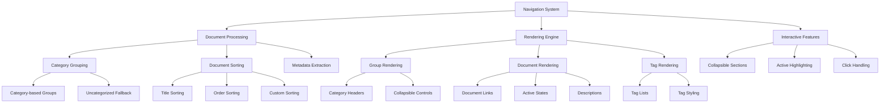

# Navigation Component

## Overview

The Navigation system provides the sidebar navigation interface for the Markdown Docs Viewer. It generates structured, accessible navigation menus with support for categorization, tagging, sorting, and collapsible sections.

## Architecture



## Core Functions

### Main Navigation Function

```typescript
export function createNavigation(
  documents: Document[],
  currentDoc: Document | null,
  options: NavigationOptions
): string;
```

**Parameters:**

- `documents`: Array of available documents
- `currentDoc`: Currently active document
- `options`: Navigation configuration options

**Returns:** Complete HTML string for navigation sidebar

### Navigation Options

```typescript
interface NavigationOptions {
  showCategories?: boolean; // Group documents by category
  showTags?: boolean; // Display document tags
  collapsible?: boolean; // Enable collapsible categories
  showDescription?: boolean; // Show document descriptions
  sortBy?: 'title' | 'order' | 'date'; // Sorting method
}
```

## Document Processing Pipeline

### 1. Category Grouping

```typescript
function groupByCategory(documents: Document[]): Record<string, Document[]> {
  return documents.reduce(
    (acc, doc) => {
      const category = doc.category || 'Uncategorized';
      if (!acc[category]) {
        acc[category] = [];
      }
      acc[category].push(doc);
      return acc;
    },
    {} as Record<string, Document[]>
  );
}
```

**Features:**

- Automatic category extraction from documents
- Fallback to "Uncategorized" for ungrouped documents
- Dynamic category creation
- Maintains document order within categories

### 2. Document Sorting

```typescript
function sortDocuments(documents: Document[], sortBy: string): Document[] {
  return [...documents].sort((a, b) => {
    switch (sortBy) {
      case 'title':
        return a.title.localeCompare(b.title);
      case 'order':
        return (a.order || 999) - (b.order || 999);
      default:
        return 0;
    }
  });
}
```

**Sorting Methods:**

- **title**: Alphabetical sorting by document title
- **order**: Numeric sorting by explicit order property
- **default**: Maintains original document order

**Features:**

- Locale-aware title sorting
- Fallback order values for missing properties
- Non-destructive sorting (creates new array)
- Extensible for additional sort methods

## Rendering System

### 1. Group Rendering

```typescript
function renderGroup(
  group: { category: string; documents: Document[] },
  currentDoc: Document | null,
  options: NavigationOptions
): string;
```

**Group Structure:**

- Category header with optional collapse controls
- Document list with appropriate styling
- Conditional rendering based on options
- Accessibility attributes for screen readers

**Collapsible Features:**

- Toggle icons for expand/collapse state
- CSS classes for styling collapsed states
- JavaScript integration points
- Keyboard navigation support

### 2. Document Rendering

```typescript
function renderDocument(
  doc: Document,
  currentDoc: Document | null,
  options: NavigationOptions
): string;
```

**Document Element Components:**

- Document title as clickable link
- Optional description text
- Tag list when enabled
- Active state highlighting
- Data attributes for JavaScript integration

**Link Generation:**

- Hash-based links for routing integration
- Document ID embedding for click handling
- Accessibility labels and descriptions
- SEO-friendly URL structure

### 3. Tag Rendering

```typescript
function renderTags(tags: string[]): string {
  return `
    <div class="mdv-nav-tags">
      ${tags.map(tag => `<span class="mdv-tag">${tag}</span>`).join('')}
    </div>
  `;
}
```

**Tag Features:**

- Individual tag styling
- Consistent tag appearance
- Overflow handling for many tags
- Click handling integration points

## HTML Structure

### Complete Navigation Structure

```html
<ul class="mdv-nav-list">
  <li class="mdv-nav-group">
    <div class="mdv-nav-category collapsible">
      Category Name
      <span class="mdv-collapse-icon">▼</span>
    </div>
    <ul class="mdv-nav-sublist">
      <li class="mdv-nav-item">
        <a href="#doc-id" class="mdv-nav-link active" data-doc-id="doc-id">
          <span class="mdv-nav-title">Document Title</span>
          <div class="mdv-nav-description">Document description</div>
          <div class="mdv-nav-tags">
            <span class="mdv-tag">tag1</span>
            <span class="mdv-tag">tag2</span>
          </div>
        </a>
      </li>
    </ul>
  </li>
</ul>
```

### CSS Classes

- `.mdv-nav-list`: Root navigation container
- `.mdv-nav-group`: Category group container
- `.mdv-nav-category`: Category header
- `.mdv-nav-sublist`: Document list within category
- `.mdv-nav-item`: Individual document item
- `.mdv-nav-link`: Document link element
- `.mdv-nav-title`: Document title
- `.mdv-nav-description`: Document description
- `.mdv-nav-tags`: Tag container
- `.mdv-tag`: Individual tag

## Usage Examples

### Basic Navigation

```typescript
import { createNavigation } from './navigation';

const documents = [
  { id: 'intro', title: 'Introduction', category: 'Getting Started' },
  { id: 'guide', title: 'User Guide', category: 'Documentation' },
  { id: 'api', title: 'API Reference', category: 'Reference' },
];

const navigationHTML = createNavigation(documents, null, {
  showCategories: true,
  showTags: false,
  collapsible: true,
  sortBy: 'order',
});
```

### Advanced Navigation with Tags

```typescript
const documentsWithTags = [
  {
    id: 'intro',
    title: 'Introduction',
    description: 'Get started with the basics',
    category: 'Getting Started',
    tags: ['beginner', 'overview'],
    order: 1,
  },
  {
    id: 'advanced',
    title: 'Advanced Features',
    description: 'Deep dive into advanced capabilities',
    category: 'Documentation',
    tags: ['advanced', 'features'],
    order: 2,
  },
];

const advancedNav = createNavigation(documentsWithTags, documentsWithTags[0], {
  showCategories: true,
  showTags: true,
  showDescription: true,
  collapsible: true,
  sortBy: 'title',
});
```

### Minimal Navigation

```typescript
// Simple flat navigation without categories
const simpleNav = createNavigation(documents, currentDoc, {
  showCategories: false,
  showTags: false,
  showDescription: false,
  sortBy: 'title',
});
```

## Integration with Viewer

### Navigation Container

```typescript
class MarkdownDocsViewer {
  private updateNavigation(): void {
    const navContainer = this.container.querySelector('.mdv-sidebar-nav');
    if (navContainer) {
      navContainer.innerHTML = createNavigation(
        this.documents,
        this.currentDocument,
        this.config.navigation || {}
      );
    }
  }
}
```

### Click Event Integration

```typescript
// Handle navigation clicks
private setupNavigationEvents(): void {
  this.container.addEventListener('click', (e) => {
    const navLink = e.target.closest('.mdv-nav-link');
    if (navLink) {
      e.preventDefault();
      const docId = navLink.dataset.docId;
      if (docId) {
        this.loadDocument(docId);
      }
    }
  });
}
```

### Collapsible Category Handling

```typescript
// Handle category collapse/expand
private setupCategoryToggle(): void {
  this.container.addEventListener('click', (e) => {
    const category = e.target.closest('.mdv-nav-category.collapsible');
    if (category) {
      const sublist = category.nextElementSibling;
      const icon = category.querySelector('.mdv-collapse-icon');

      if (sublist && icon) {
        const isCollapsed = sublist.style.display === 'none';
        sublist.style.display = isCollapsed ? 'block' : 'none';
        icon.textContent = isCollapsed ? '▼' : '▶';
      }
    }
  });
}
```

## Accessibility Features

### Semantic HTML

- Proper list structure with `<ul>` and `<li>` elements
- Meaningful link text with document titles
- Hierarchical organization with nested lists
- Landmark roles for screen reader navigation

### ARIA Attributes

```typescript
// Enhanced accessibility
const accessibleNavigation = `
  <nav role="navigation" aria-label="Documentation navigation">
    <ul class="mdv-nav-list" role="list">
      <li class="mdv-nav-group" role="listitem">
        <div class="mdv-nav-category" 
             role="button" 
             aria-expanded="true" 
             aria-controls="category-docs">
          Category Name
        </div>
        <ul class="mdv-nav-sublist" 
            id="category-docs" 
            role="list">
          <!-- Document items -->
        </ul>
      </li>
    </ul>
  </nav>
`;
```

### Keyboard Navigation

- Tab navigation through all interactive elements
- Enter/Space activation for collapsible categories
- Arrow key navigation within document lists
- Focus indicators for keyboard users

## Performance Considerations

### Optimization Features

1. **String Building**: Efficient HTML concatenation
2. **Minimal DOM Manipulation**: Pure function returns HTML string
3. **Caching**: Results can be cached based on document state
4. **Lazy Rendering**: Only render visible categories

### Memory Efficiency

```typescript
// Efficient document processing
const sortedGroups = Object.entries(grouped).map(([category, docs]) => ({
  category,
  documents: sortDocuments(docs, options.sortBy || 'order'),
}));
```

**Optimizations:**

- Single pass document grouping
- Non-destructive array operations
- Minimal temporary object creation
- Efficient string interpolation

## Responsive Design Considerations

### Mobile Navigation

- Collapsible categories for space efficiency
- Touch-friendly interaction areas
- Readable text sizes on small screens
- Swipe gesture integration points

### Desktop Features

- Hover states for better UX
- Keyboard shortcuts
- Multi-level expansion
- Context menu integration

## Error Handling

### Data Validation

- Missing document properties handled gracefully
- Invalid category names sanitized
- Malformed tags filtered out
- Empty document arrays handled

### Fallback Behavior

- Default to ungrouped navigation if categories fail
- Skip missing optional properties
- Maintain functionality with partial data
- Graceful degradation for unsupported features

## Future Enhancements

### Advanced Features

- Search integration within navigation
- Breadcrumb generation
- Recently viewed documents
- Bookmarking system
- Custom navigation templates
- Dynamic loading of navigation sections
- Keyboard shortcuts for navigation
- Drag-and-drop reordering
