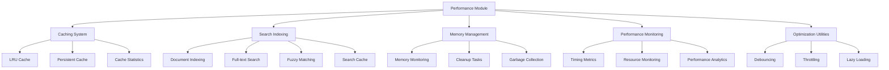

# Performance Components

## Overview

The performance module provides comprehensive optimization utilities for the Markdown Docs Viewer, including caching systems, search indexing, memory management, and performance monitoring. These components ensure efficient operation even with large document collections.

## Architecture



## Core Components

### 1. LRU Cache System

**Basic LRU Cache:**

```typescript
class LRUCache<K, V> {
  private capacity: number;
  private cache: Map<K, V>;
  private accessOrder: K[];

  constructor(capacity: number = 50) {
    this.capacity = Math.max(1, capacity);
    this.cache = new Map();
    this.accessOrder = [];
  }
}
```

**Features:**

- **Capacity Management**: Configurable size limits
- **Access Tracking**: Most recently used ordering
- **Automatic Eviction**: Removes least recently used items
- **Memory Estimation**: Calculates approximate memory usage
- **Performance Metrics**: Size and usage statistics

**Cache Operations:**

```typescript
// Get with automatic ordering update
get(key: K): V | undefined {
  if (this.cache.has(key)) {
    this.moveToFront(key);
    return this.cache.get(key);
  }
  return undefined;
}

// Set with capacity enforcement
set(key: K, value: V): void {
  if (this.cache.size >= this.capacity) {
    this.evictLeastRecentlyUsed();
  }
  this.cache.set(key, value);
  this.accessOrder.unshift(key);
}
```

### 2. Persistent Cache System

**LocalStorage Integration:**

```typescript
class PersistentCache extends LRUCache<string, string> {
  private storageKey: string;
  private useStorage: boolean;

  constructor(capacity: number = 50, storageKey: string = 'mdv-cache') {
    super(capacity);
    this.storageKey = storageKey;
    this.useStorage = this.isStorageAvailable();

    if (this.useStorage) {
      this.loadFromStorage();
    }
  }
}
```

**Persistence Features:**

- **Automatic Storage**: Saves to localStorage on changes
- **Storage Detection**: Safely handles unavailable storage
- **Data Recovery**: Loads cached data on initialization
- **Error Handling**: Graceful degradation when storage fails

### 3. Search Index System

**Full-Text Search Implementation:**

```typescript
class SearchIndex {
  private documents: Document[] = [];
  private titleIndex: Map<string, Set<number>> = new Map();
  private contentIndex: Map<string, Set<number>> = new Map();
  private tagIndex: Map<string, Set<number>> = new Map();
  private searchCache: Map<string, Document[]> = new Map();
}
```

**Indexing Features:**

- **Multi-field Indexing**: Title, content, description, and tags
- **Stop Word Filtering**: Removes common words for efficiency
- **Tokenization**: Breaks text into searchable tokens
- **Markdown Cleaning**: Removes syntax for cleaner indexing

**Search Capabilities:**

```typescript
search(query: string, options: {
  searchInTags?: boolean;
  fuzzySearch?: boolean;
  caseSensitive?: boolean;
  maxResults?: number;
} = {}): Document[]
```

**Advanced Search Features:**

- **Exact Matching**: Precise term matching
- **Prefix Matching**: Partial word matching
- **Fuzzy Search**: Levenshtein distance-based matching
- **Weighted Results**: Priority-based scoring
- **Result Caching**: Performance optimization

### 4. Memory Management

**Memory Manager Singleton:**

```typescript
class MemoryManager {
  private static instance: MemoryManager;
  private cleanupTasks: (() => void)[] = [];
  private memoryWarningThreshold = 50 * 1024 * 1024; // 50MB

  static getInstance(): MemoryManager {
    if (!MemoryManager.instance) {
      MemoryManager.instance = new MemoryManager();
    }
    return MemoryManager.instance;
  }
}
```

**Memory Features:**

- **Cleanup Task Registration**: Centralized cleanup management
- **Memory Monitoring**: Usage threshold detection
- **Garbage Collection**: Manual GC triggering when available
- **Memory Statistics**: Detailed usage reporting

**Memory Statistics:**

```typescript
getMemoryStats(): { used?: number; total?: number; limit?: number } {
  if ('memory' in performance) {
    const memInfo = (performance as any).memory;
    return {
      used: Math.round(memInfo.usedJSHeapSize / 1024 / 1024),
      total: Math.round(memInfo.totalJSHeapSize / 1024 / 1024),
      limit: Math.round(memInfo.jsHeapSizeLimit / 1024 / 1024)
    };
  }
  return {};
}
```

### 5. Performance Monitoring

**Performance Metrics Collection:**

```typescript
class PerformanceMonitor {
  private metrics: Map<string, number[]> = new Map();
  private observers: PerformanceObserver[] = [];

  startTiming(label: string): () => void {
    const start = performance.now();
    return () => {
      const duration = performance.now() - start;
      this.recordMetric(label, duration);
    };
  }
}
```

**Monitoring Features:**

- **Timing Measurements**: Operation duration tracking
- **Resource Timing**: Network request monitoring
- **Statistical Analysis**: Min, max, average calculations
- **Metric History**: Last 100 measurements retention

**Usage Examples:**

```typescript
const monitor = new PerformanceMonitor();

// Time an operation
const endTiming = monitor.startTiming('document-load');
await loadDocument();
endTiming();

// Get metrics
const metrics = monitor.getMetrics('document-load');
console.log(`Average load time: ${metrics.avg}ms`);
```

### 6. Optimization Utilities

**Debouncing:**

```typescript
export function debounce<T extends (...args: any[]) => any>(
  func: T,
  wait: number
): (...args: Parameters<T>) => void {
  let timeout: number | undefined;

  return (...args: Parameters<T>): void => {
    const later = () => {
      timeout = undefined;
      func(...args);
    };

    if (timeout) {
      clearTimeout(timeout);
    }
    timeout = setTimeout(later, wait);
  };
}
```

**Throttling:**

```typescript
export function throttle<T extends (...args: any[]) => any>(
  func: T,
  limit: number
): (...args: Parameters<T>) => void {
  let inThrottle: boolean;

  return (...args: Parameters<T>): void => {
    if (!inThrottle) {
      func(...args);
      inThrottle = true;
      setTimeout(() => (inThrottle = false), limit);
    }
  };
}
```

**Lazy Loading:**

```typescript
class LazyLoader {
  private observers: Map<Element, IntersectionObserver> = new Map();
  private loadedElements: WeakSet<Element> = new WeakSet();

  observeElement(
    element: Element,
    callback: () => void,
    options: IntersectionObserverInit = {}
  ): void;
}
```

## Usage Examples

### Document Caching

```typescript
import { LRUCache, PersistentCache } from './performance';

// Memory-only cache
const documentCache = new LRUCache<string, string>(100);
documentCache.set('doc-1', markdownContent);
const cached = documentCache.get('doc-1');

// Persistent cache with localStorage
const persistentCache = new PersistentCache(50, 'mdv-docs');
persistentCache.set('doc-1', content);
// Content automatically saved to localStorage
```

### Search Optimization

```typescript
import { SearchIndex } from './performance';

const searchIndex = new SearchIndex();

// Build index from documents
const contentCache = new Map([
  ['doc-1', 'Document content here...'],
  ['doc-2', 'More content...'],
]);

searchIndex.updateIndex(documents, contentCache);

// Perform optimized searches
const results = searchIndex.search('javascript', {
  fuzzySearch: true,
  maxResults: 10,
  searchInTags: true,
});
```

### Performance Monitoring

```typescript
import { PerformanceMonitor } from './performance';

const monitor = new PerformanceMonitor();

// Monitor document loading
const endTiming = monitor.startTiming('document-render');
await renderDocument(content);
endTiming();

// Monitor resource loading
monitor.observeResourceTiming();

// Get performance insights
const allMetrics = monitor.getAllMetrics();
console.log('Performance metrics:', allMetrics);
```

### Memory Management

```typescript
import { MemoryManager } from './performance';

const memoryManager = MemoryManager.getInstance();

// Register cleanup tasks
memoryManager.addCleanupTask(() => {
  documentCache.clear();
  searchIndex.clearCache();
});

// Monitor memory usage
const stats = memoryManager.getMemoryStats();
if (stats.used && stats.used > 100) {
  console.warn('High memory usage detected');
  memoryManager.cleanup();
}
```

### Event Optimization

```typescript
import { debounce, throttle } from './performance';

// Debounced search input
const debouncedSearch = debounce((query: string) => {
  performSearch(query);
}, 300);

searchInput.addEventListener('input', e => {
  debouncedSearch(e.target.value);
});

// Throttled scroll handler
const throttledScroll = throttle(() => {
  updateScrollPosition();
}, 100);

window.addEventListener('scroll', throttledScroll);
```

### Lazy Loading Implementation

```typescript
import { LazyLoader } from './performance';

const lazyLoader = new LazyLoader();

// Lazy load document sections
document.querySelectorAll('.document-section').forEach(section => {
  lazyLoader.observeElement(
    section,
    () => {
      const docId = section.dataset.docId;
      loadDocumentSection(docId);
    },
    {
      rootMargin: '100px',
      threshold: 0.1,
    }
  );
});
```

## Performance Optimization Strategies

### 1. Caching Strategy

**Multi-level Caching:**

- **L1 Cache**: In-memory LRU cache for frequently accessed documents
- **L2 Cache**: LocalStorage persistent cache for session persistence
- **L3 Cache**: HTTP cache headers for network optimization

**Cache Invalidation:**

- Time-based expiration
- Version-based invalidation
- Manual cache clearing
- Capacity-based eviction

### 2. Search Optimization

**Index Structure:**

- Inverted index for fast lookups
- Separate indices for different content types
- Stop word filtering for reduced index size
- Stemming for improved matching

**Query Optimization:**

- Query caching for repeated searches
- Result pagination for large result sets
- Search suggestion pre-computation
- Fuzzy search optimization

### 3. Memory Optimization

**Memory Monitoring:**

- Continuous memory usage tracking
- Automatic cleanup when thresholds exceeded
- Weak references for temporary objects
- Garbage collection hints

**Memory Reduction Techniques:**

- Object pooling for frequently created objects
- String interning for repeated text
- Lazy loading of large resources
- Efficient data structures

### 4. Rendering Performance

**DOM Optimization:**

- Virtual scrolling for large lists
- DocumentFragment for batch updates
- CSS containment for layout optimization
- RequestAnimationFrame for smooth animations

**Resource Loading:**

- Image lazy loading
- Code splitting for JavaScript
- CSS critical path optimization
- Font loading optimization

## Browser Compatibility

### Modern Features

- **IntersectionObserver**: Lazy loading (with polyfill fallback)
- **PerformanceObserver**: Resource timing (with graceful degradation)
- **WeakSet/WeakMap**: Memory-efficient object tracking
- **performance.memory**: Memory monitoring (Chrome/Edge only)

### Fallback Support

- Manual scroll-based lazy loading
- setTimeout-based performance timing
- Map/Set fallbacks for WeakSet/WeakMap
- Generic memory estimation

## Testing Considerations

### Performance Tests

- Cache hit/miss ratios
- Search response times
- Memory usage patterns
- Resource loading metrics

### Load Testing

- Large document collections
- Concurrent user simulation
- Memory leak detection
- Performance regression testing

### Browser Testing

- Cross-browser performance
- Mobile device performance
- Network throttling scenarios
- Memory-constrained environments

## Integration with Viewer

### Viewer Performance Integration

```typescript
class MarkdownDocsViewer {
  private documentCache: PersistentCache;
  private searchIndex: SearchIndex;
  private performanceMonitor: PerformanceMonitor;
  private memoryManager: MemoryManager;

  constructor(config: DocumentationConfig) {
    this.documentCache = new PersistentCache(100, 'mdv-docs');
    this.searchIndex = new SearchIndex();
    this.performanceMonitor = new PerformanceMonitor();
    this.memoryManager = MemoryManager.getInstance();

    this.setupPerformanceOptimizations();
  }

  private setupPerformanceOptimizations(): void {
    // Setup debounced search
    this.debouncedSearch = debounce(this.performSearch.bind(this), 300);

    // Register cleanup tasks
    this.memoryManager.addCleanupTask(() => {
      this.documentCache.clear();
      this.searchIndex.clearCache();
    });

    // Monitor performance
    this.performanceMonitor.observeResourceTiming();
  }
}
```

## Advanced Optimizations

### Worker Thread Integration

- Background search indexing
- Parallel document processing
- Non-blocking markdown parsing
- Offloaded heavy computations

### Service Worker Caching

- Offline document availability
- Background cache updates
- Network-first/cache-first strategies
- Intelligent cache management

### Progressive Enhancement

- Core functionality without optimization
- Enhanced features with modern APIs
- Graceful degradation patterns
- Feature detection and polyfills
