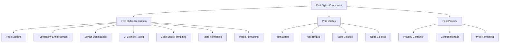

# Print Styles Component

## Overview

The Print Styles component provides comprehensive print optimization for the Markdown Documentation Viewer, enabling high-quality document printing with proper page formatting, typography optimization, and print-specific layout adjustments.

## Architecture



## Core Functions

### 1. generatePrintStyles()

**Purpose**: Generate comprehensive print-optimized CSS

**Signature**:

```typescript
function generatePrintStyles(theme: Theme): string;
```

**Key Features**:

**Page Setup**:

```css
@page {
  margin: 2cm;
  size: A4;
}

@page :first {
  margin-top: 3cm;
}

@page {
  @bottom-right {
    content: counter(page) ' of ' counter(pages);
    font-size: 10pt;
    color: #666;
  }
}
```

**UI Element Hiding**:

```css
.mdv-header,
.mdv-sidebar,
.mdv-mobile-toggle,
.mdv-footer,
.mdv-copy-button,
.mdv-search,
.mdv-navigation,
.no-print {
  display: none !important;
}
```

### 2. addPrintUtilities()

**Purpose**: Add print-specific functionality to documents

**Signature**:

```typescript
function addPrintUtilities(container: HTMLElement): void;
```

**Features**:

- Print button integration
- Automatic page break insertion
- Table break prevention
- Code block optimization

### 3. generatePrintPreview()

**Purpose**: Create print preview interface

**Signature**:

```typescript
function generatePrintPreview(content: string, theme: Theme): string;
```

**Returns**: Complete HTML document with print preview

## Print Optimization Features

### 1. Page Layout

**A4 Page Configuration**:

- Standard A4 size (21cm × 29.7cm)
- 2cm margins on all sides
- 3cm top margin on first page
- Automatic page numbering

**Layout Reset**:

```css
.mdv-app {
  display: block !important;
  width: 100% !important;
  height: auto !important;
  overflow: visible !important;
}

.mdv-content {
  width: 100% !important;
  max-width: 100% !important;
  margin: 0 !important;
  padding: 0 !important;
}
```

### 2. Typography Optimization

**Print-Specific Typography**:

```css
body {
  font-size: 11pt !important;
  line-height: 1.6 !important;
  color: #000 !important;
  background: #fff !important;
}

h1 {
  font-size: 20pt !important;
  border-bottom: 2pt solid #000 !important;
  padding-bottom: 0.5em !important;
}

h2 {
  font-size: 16pt !important;
}
h3 {
  font-size: 14pt !important;
}
h4 {
  font-size: 12pt !important;
}
```

**Page Break Management**:

```css
h1,
h2,
h3,
h4,
h5,
h6 {
  page-break-after: avoid;
  page-break-inside: avoid;
  margin-top: 1.5em !important;
  margin-bottom: 0.5em !important;
}

p,
li {
  orphans: 3;
  widows: 3;
}
```

### 3. Link Handling

**URL Display**:

```css
a[href^='http']:after,
a[href^='https']:after {
  content: ' (' attr(href) ')';
  font-size: 9pt;
  color: #666;
  word-wrap: break-word;
}

/* Don't show URLs for internal links */
a[href^='#']:after {
  content: '';
}
```

### 4. Code Block Optimization

**Print-Friendly Code Formatting**:

```css
pre,
code {
  font-family: 'Courier New', Courier, monospace !important;
  font-size: 10pt !important;
  background: #f5f5f5 !important;
  color: #000 !important;
  border: 1pt solid #ddd !important;
  page-break-inside: avoid;
}

pre {
  padding: 1em !important;
  white-space: pre-wrap !important;
  word-wrap: break-word !important;
  overflow-wrap: break-word !important;
  max-width: 100% !important;
}
```

**Syntax Highlighting for Print**:

```css
.hljs-keyword {
  color: #000 !important;
  font-weight: bold !important;
}
.hljs-string {
  color: #333 !important;
}
.hljs-comment {
  color: #666 !important;
  font-style: italic !important;
}
```

### 5. Table Formatting

**Print-Optimized Tables**:

```css
table {
  border-collapse: collapse !important;
  width: 100% !important;
  page-break-inside: avoid;
  margin: 1em 0 !important;
}

th,
td {
  border: 1pt solid #000 !important;
  padding: 0.5em !important;
  font-size: 10pt !important;
}

th {
  background: #f0f0f0 !important;
  font-weight: bold !important;
}
```

### 6. Image Optimization

**Image Print Handling**:

```css
img {
  max-width: 100% !important;
  height: auto !important;
  page-break-inside: avoid;
  display: block;
  margin: 1em auto !important;
}
```

### 7. Content Structure

**Blockquotes**:

```css
blockquote {
  border-left: 3pt solid #666 !important;
  padding-left: 1em !important;
  margin: 1em 0 !important;
  color: #333 !important;
  font-style: italic !important;
  page-break-inside: avoid;
}
```

**Lists**:

```css
ul,
ol {
  margin: 1em 0 !important;
  padding-left: 2em !important;
}

li {
  margin: 0.5em 0 !important;
  page-break-inside: avoid;
}
```

## Print Utilities

### Print Button Integration

```typescript
const printButton = document.createElement('button');
printButton.className = 'mdv-print-button no-print';
printButton.textContent = 'Print';
printButton.onclick = () => window.print();

const header = container.querySelector('.mdv-header');
if (header) {
  header.appendChild(printButton);
}
```

### Automatic Page Breaks

```typescript
const sections = container.querySelectorAll('h1, h2');
sections.forEach((section, index) => {
  if (index > 0 && index % 3 === 0) {
    section.classList.add('page-break');
  }
});
```

### Table Break Prevention

```typescript
const tables = container.querySelectorAll('table');
tables.forEach(table => {
  table.classList.add('avoid-break');
});
```

### Code Block Optimization

```typescript
const codeBlocks = container.querySelectorAll('pre');
codeBlocks.forEach(block => {
  if (block.scrollHeight > 800) {
    // Long code blocks should allow page breaks
    block.style.pageBreakInside = 'auto';
  } else {
    block.classList.add('avoid-break');
  }
});
```

## Print Preview System

### Preview Page Structure

```html
<div class="print-preview-page">
  <!-- Document content with print formatting -->
</div>

<div class="print-preview-controls no-print">
  <button onclick="window.print()">Print</button>
  <button onclick="window.close()">Close Preview</button>
</div>
```

### Preview Styling

```css
.print-preview-page {
  background: white;
  box-shadow: 0 0 10px rgba(0, 0, 0, 0.1);
  margin: 0 auto 20px;
  padding: 2cm;
  width: 21cm;
  min-height: 29.7cm;
  box-sizing: border-box;
}
```

## Integration Patterns

### Basic Print Support

```typescript
import { generatePrintStyles, addPrintUtilities } from './print-styles';

class DocumentViewer {
  private setupPrintSupport() {
    // Generate print styles
    const printCSS = generatePrintStyles(this.theme);

    // Create style element
    const styleElement = document.createElement('style');
    styleElement.textContent = printCSS;
    document.head.appendChild(styleElement);

    // Add print utilities
    addPrintUtilities(this.container);
  }
}
```

### Print Preview Implementation

```typescript
import { generatePrintPreview } from './print-styles';

class PrintPreviewManager {
  openPrintPreview(content: string) {
    const previewHTML = generatePrintPreview(content, this.theme);

    const previewWindow = window.open('', '_blank');
    if (previewWindow) {
      previewWindow.document.write(previewHTML);
      previewWindow.document.close();
    }
  }
}
```

### Custom Print Formatting

```typescript
class CustomPrintFormatter {
  addCustomPrintStyles(customCSS: string) {
    const printStyles = generatePrintStyles(this.theme);
    const combinedStyles = `
      ${printStyles}
      
      @media print {
        ${customCSS}
      }
    `;

    this.updatePrintStyles(combinedStyles);
  }

  addPageBreakBefore(selector: string) {
    const elements = document.querySelectorAll(selector);
    elements.forEach(element => {
      element.classList.add('page-break');
    });
  }
}
```

## Print-Specific CSS Classes

### Utility Classes

```css
.page-break,
.mdv-page-break {
  page-break-before: always;
}

.avoid-break {
  page-break-inside: avoid;
}

.print-only {
  display: none;
}

@media print {
  .print-only {
    display: block !important;
  }

  .no-print {
    display: none !important;
  }
}
```

### Table of Contents for Print

```css
.mdv-toc-inline {
  display: none;
}

@media print {
  .mdv-toc-inline {
    display: block !important;
    page-break-after: always;
    margin-bottom: 2em !important;
  }

  .mdv-toc-inline .mdv-toc-link:after {
    content: leader('. ') target-counter(attr(href), page);
    font-size: 11pt !important;
  }
}
```

## Browser Compatibility

### Print CSS Support

**Modern Browsers**:

- Chrome/Edge: Full support
- Firefox: Full support
- Safari: Full support with minor limitations

**Print-Specific Features**:

- Page margins and sizing
- Page counters and numbering
- Page break controls
- @page rules

### Print Limitations

**Browser Differences**:

- Page counter support varies
- CSS generated content limitations
- Background printing settings
- Font rendering differences

## Accessibility in Print

### Print Accessibility Features

**High Contrast**:

- Black text on white background
- Clear borders and separators
- Bold headings for structure

**Typography**:

- Adequate font sizes (11pt minimum)
- Proper line spacing (1.6)
- Clear heading hierarchy

**Structure Preservation**:

- Semantic HTML maintained
- List structure preserved
- Table relationships clear

## Performance Considerations

### Print CSS Optimization

**Efficient Selectors**:

- Scoped to @media print
- Minimal specificity
- Essential styles only

**Resource Management**:

- No background images
- Simplified animations
- Reduced DOM complexity

## Testing Print Functionality

### Print Testing Strategy

**Browser Testing**:

- Test in all major browsers
- Check print preview accuracy
- Verify page breaks
- Test various page sizes

**Content Testing**:

- Long documents
- Complex tables
- Code blocks
- Image handling

### Print Quality Assurance

**Visual Verification**:

- Page break placement
- Typography readability
- Layout consistency
- URL display accuracy

**Functional Testing**:

- Print button functionality
- Preview window behavior
- Custom formatting application
