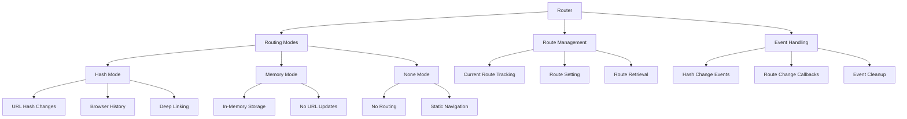

# Router Component

## Overview

The `Router` class provides client-side routing functionality for the Markdown Docs Viewer, enabling navigation between documents without page reloads. It supports multiple routing modes and integrates seamlessly with the browser's history API.

## Architecture



## Class Structure

### Constructor

```typescript
constructor(mode: RoutingMode, onRouteChange: (docId: string) => void)
```

**Parameters:**

- `mode`: Routing behavior mode
- `onRouteChange`: Callback for route changes

### Routing Modes

```typescript
type RoutingMode = 'hash' | 'memory' | 'none';
```

**Mode Descriptions:**

- **hash**: Uses URL hash for routing (e.g., `#document-id`)
- **memory**: Routes stored in memory only
- **none**: No routing functionality

## Core Features

### 1. Hash-based Routing

**URL Integration:**

- Updates browser URL hash on navigation
- Enables deep linking to documents
- Supports back/forward browser navigation
- Provides shareable URLs

**Hash Change Handling:**

```typescript
private handleHashChange(): void {
  const hash = window.location.hash.slice(1);
  if (hash && hash !== this.currentRoute) {
    this.currentRoute = hash;
    this.onRouteChange(hash);
  }
}
```

**Features:**

- Automatic hash parsing
- Route change detection
- Duplicate route filtering
- Event-driven updates

### 2. Memory-based Routing

**In-Memory Storage:**

- Routes stored internally without URL updates
- No browser history integration
- Useful for embedded or iframe contexts
- Maintains routing behavior without URL pollution

**Use Cases:**

- Embedded documentation widgets
- Modal or popup documentation
- Applications with custom navigation
- Multi-instance documentation viewers

### 3. No Routing Mode

**Static Navigation:**

- Disables all routing functionality
- Manual navigation control
- Suitable for single-document views
- Minimal overhead implementation

## Implementation Details

### Route Management

```typescript
setRoute(docId: string): void {
  this.currentRoute = docId;

  if (this.mode === 'hash') {
    window.location.hash = docId;
  }
}
```

**Route Setting Features:**

- Mode-aware route handling
- Current route tracking
- Conditional URL updates
- State synchronization

### Event Handling

```typescript
// Setup
if (mode === 'hash') {
  this.boundHashChangeHandler = this.handleHashChange.bind(this);
  window.addEventListener('hashchange', this.boundHashChangeHandler);
  this.handleHashChange();
}

// Cleanup
destroy(): void {
  if (this.mode === 'hash' && this.boundHashChangeHandler) {
    window.removeEventListener('hashchange', this.boundHashChangeHandler);
    this.boundHashChangeHandler = null;
  }
}
```

**Event Management:**

- Proper event binding and cleanup
- Memory leak prevention
- Handler reference tracking
- Initialization on construction

### Route Retrieval

```typescript
getCurrentRoute(): string | null {
  if (this.mode === 'hash') {
    return window.location.hash.slice(1) || null;
  }
  return this.currentRoute || null;
}
```

**Retrieval Features:**

- Mode-specific route access
- Null handling for empty routes
- Consistent return format
- Hash parsing and cleaning

## Usage Examples

### Hash Routing Setup

```typescript
import { Router } from './router';

// Create hash-based router
const router = new Router('hash', docId => {
  console.log('Navigating to document:', docId);
  viewer.loadDocument(docId);
});

// Set initial route
router.setRoute('introduction');

// Get current route
const currentDoc = router.getCurrentRoute();
```

### Memory Routing Setup

```typescript
// Create memory-based router
const memoryRouter = new Router('memory', docId => {
  updateDocumentDisplay(docId);
});

// Navigate programmatically
memoryRouter.setRoute('api-reference');
```

### Disabled Routing

```typescript
// No routing functionality
const staticRouter = new Router('none', docId => {
  // Callback still called for manual navigation
  handleManualNavigation(docId);
});
```

## Integration with Viewer

### Viewer Integration Pattern

```typescript
class MarkdownDocsViewer {
  private router: Router;

  constructor(config: DocumentationConfig) {
    this.router = new Router(config.routing?.mode || 'hash', this.handleRouteChange.bind(this));
  }

  private handleRouteChange(docId: string): void {
    const document = this.documents.find(doc => doc.id === docId);
    if (document) {
      this.loadDocument(document);
    }
  }

  public navigateToDocument(docId: string): void {
    this.router.setRoute(docId);
  }
}
```

### Navigation Integration

```typescript
// Navigation click handling
document.addEventListener('click', e => {
  const link = e.target.closest('.mdv-nav-link');
  if (link) {
    e.preventDefault();
    const docId = link.dataset.docId;
    router.setRoute(docId);
  }
});
```

## Browser Compatibility

### Hash Routing Support

- **Modern Browsers**: Full support with `hashchange` events
- **Legacy Browsers**: Basic hash support with polling fallback
- **Mobile Browsers**: Native support across all platforms

### Memory Management

- **Event Listeners**: Properly cleaned up on destroy
- **Memory Leaks**: Prevention through explicit cleanup
- **Garbage Collection**: No circular references

## Security Considerations

### Route Validation

```typescript
// Validate document ID before routing
private isValidDocumentId(docId: string): boolean {
  return /^[a-zA-Z0-9-_]+$/.test(docId) && docId.length <= 100;
}

// Sanitize route input
private sanitizeRoute(route: string): string {
  return route.replace(/[^a-zA-Z0-9-_]/g, '');
}
```

### XSS Prevention

- Route parameters sanitized
- No direct HTML injection
- Validation before document loading
- Safe fallback handling

## Performance Considerations

### Optimization Features

1. **Event Delegation**: Single hash change listener
2. **Debouncing**: Prevents rapid route changes
3. **Caching**: Current route cached in memory
4. **Lazy Loading**: Minimal initialization overhead

### Memory Efficiency

```typescript
// Efficient event handler management
private boundHashChangeHandler: (() => void) | null = null;

// Proper cleanup prevents memory leaks
destroy(): void {
  if (this.boundHashChangeHandler) {
    window.removeEventListener('hashchange', this.boundHashChangeHandler);
    this.boundHashChangeHandler = null;
  }
}
```

## Error Handling

### Route Validation

- Invalid document IDs handled gracefully
- Missing documents show appropriate errors
- Malformed hashes sanitized or ignored

### Fallback Behavior

- Default to first document on invalid routes
- Graceful degradation when routing fails
- User feedback for navigation errors

## Testing Considerations

### Unit Tests

- Route setting and getting
- Mode-specific behavior
- Event handler management
- Cleanup functionality

### Integration Tests

- Browser history interaction
- Hash change detection
- Document loading integration
- Navigation UI synchronization

### Browser Tests

- Cross-browser hash support
- Back/forward button functionality
- Deep linking behavior
- Mobile browser compatibility

## Configuration Options

### Future Enhancements

```typescript
interface RouterOptions {
  mode: RoutingMode;
  hashPrefix?: string; // Custom hash prefix
  scrollBehavior?: 'auto' | 'smooth' | 'instant';
  validateRoutes?: boolean; // Route validation
  fallbackRoute?: string; // Default route for invalid navigation
  historyMode?: boolean; // HTML5 History API support
}
```

### Advanced Features

- Custom route validation
- Route transformation
- History API integration
- Scroll position restoration
- Route transition animations
