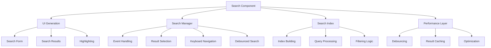

# Search Component

## Overview

The Search component provides comprehensive search functionality for the Markdown Documentation Viewer, including real-time search, keyboard navigation, result highlighting, and search index management with performance optimization.

## Architecture



## Core Functions

### 1. createSearch Function

**Purpose**: Generate search UI HTML structure

**Signature**:

```typescript
function createSearch(options: SearchOptions): string;
```

**Parameters**:

- `options: SearchOptions` - Search configuration options

**Returns**: HTML string for search interface

**Generated HTML**:

```html
<div class="mdv-search">
  <input
    type="text"
    class="mdv-search-input"
    placeholder="Search documentation..."
    aria-label="Search documentation"
  />
  <div class="mdv-search-results"></div>
</div>
```

**Usage Example**:

```typescript
const searchHTML = createSearch({
  enabled: true,
  placeholder: 'Search API docs...',
  caseSensitive: false,
  fuzzySearch: true,
  maxResults: 15,
});
```

## SearchManager Class

### Purpose

Complete search functionality management with real-time search, keyboard navigation, and result highlighting.

### Constructor

```typescript
constructor(options: SearchOptions, onDocumentSelect?: (doc: Document) => void)
```

**Parameters**:

- `options: SearchOptions` - Search configuration
- `onDocumentSelect?: (doc: Document) => void` - Document selection callback

### Key Properties

```typescript
class SearchManager {
  private searchIndex: SearchIndex; // Search indexing system
  private options: SearchOptions; // Search configuration
  private searchInput: HTMLInputElement; // Search input element
  private searchResults: HTMLElement; // Results container
  private debouncedSearch: (query: string) => void; // Debounced search function
  private currentQuery: string; // Current search query
  private onDocumentSelect?: (doc: Document) => void; // Selection callback
}
```

## Core Features

### 1. Real-Time Search

**Debounced Input Handling**:

```typescript
constructor(options: SearchOptions, onDocumentSelect?: (doc: Document) => void) {
  this.debouncedSearch = debounce(
    (query: string) => this.performSearch(query),
    300 // 300ms delay
  );
}

private handleSearchInput(event: Event): void {
  const target = event.target as HTMLInputElement;
  const query = target.value.trim();
  this.currentQuery = query;

  if (query.length === 0) {
    this.hideResults();
    return;
  }

  if (query.length >= 2) {
    this.debouncedSearch(query);
  }
}
```

**Performance Benefits**:

- **Debounced Input**: Prevents excessive search calls during typing
- **Minimum Query Length**: Requires 2+ characters to trigger search
- **Instant Clear**: Immediately hides results when query is empty

### 2. Keyboard Navigation

**Complete Keyboard Support**:

```typescript
private handleKeyDown(event: KeyboardEvent): void {
  const results = this.searchResults.querySelectorAll('.mdv-search-result');
  const activeResult = this.searchResults.querySelector('.mdv-search-result.active');

  switch (event.key) {
    case 'ArrowDown':
      event.preventDefault();
      this.navigateResults(results, activeResult, 1);
      break;
    case 'ArrowUp':
      event.preventDefault();
      this.navigateResults(results, activeResult, -1);
      break;
    case 'Enter':
      event.preventDefault();
      if (activeResult) {
        this.selectResult(activeResult);
      } else if (results.length > 0) {
        this.selectResult(results[0]);
      }
      break;
    case 'Escape':
      this.hideResults();
      this.searchInput?.blur();
      break;
  }
}
```

**Navigation Features**:

- **Arrow Keys**: Navigate up/down through results
- **Enter**: Select highlighted result or first result
- **Escape**: Close search results and blur input
- **Wrap-Around**: Cycles from last to first result and vice versa

### 3. Result Navigation Logic

**Smart Navigation**:

```typescript
private navigateResults(
  results: NodeListOf<Element>,
  activeResult: Element | null,
  direction: number
): void {
  if (results.length === 0) return;

  // Remove current active class
  if (activeResult) {
    activeResult.classList.remove('active');
  }

  let newIndex = 0;
  if (activeResult) {
    const currentIndex = Array.from(results).indexOf(activeResult);
    newIndex = currentIndex + direction;
  } else if (direction === -1) {
    newIndex = results.length - 1;
  }

  // Wrap around
  if (newIndex < 0) newIndex = results.length - 1;
  if (newIndex >= results.length) newIndex = 0;

  results[newIndex].classList.add('active');
  results[newIndex].scrollIntoView({ block: 'nearest' });
}
```

### 4. Search Result Rendering

**Rich Result Display**:

```typescript
private renderResults(results: Document[], query: string): void {
  if (results.length === 0) {
    this.searchResults.innerHTML = `
      <div class="mdv-search-no-results">
        No results found for "${this.escapeHtml(query)}"
      </div>
    `;
    return;
  }

  const resultsHtml = results
    .map((doc, index) => {
      const highlightedTitle = this.highlightQuery(doc.title, query);
      const description = doc.description ? this.highlightQuery(doc.description, query) : '';
      const tags = doc.tags
        ? doc.tags
            .map(tag => `<span class="mdv-search-tag">${this.escapeHtml(tag)}</span>`)
            .join('')
        : '';

      return `
        <div class="mdv-search-result ${index === 0 ? 'active' : ''}" data-doc-id="${this.escapeHtml(doc.id)}">
          <div class="mdv-search-result-title">${highlightedTitle}</div>
          ${description ? `<div class="mdv-search-result-description">${description}</div>` : ''}
          ${tags ? `<div class="mdv-search-result-tags">${tags}</div>` : ''}
          ${doc.category ? `<div class="mdv-search-result-category">${this.escapeHtml(doc.category)}</div>` : ''}
        </div>
      `;
    })
    .join('');

  this.searchResults.innerHTML = resultsHtml;
}
```

**Result Components**:

- **Title**: Document title with query highlighting
- **Description**: Optional description with highlighting
- **Tags**: Visual tag display for categorization
- **Category**: Document category information
- **Active State**: First result automatically selected

### 5. Query Highlighting

**Smart Highlighting System**:

```typescript
private highlightQuery(text: string, query: string): string {
  if (!query) {
    return this.escapeHtml(text);
  }

  // Default to case-insensitive if not explicitly set to true
  const flags = this.options.caseSensitive === true ? 'g' : 'gi';
  const regex = new RegExp(`(${this.escapeRegex(query)})`, flags);
  return this.escapeHtml(text).replace(regex, '<mark>$1</mark>');
}
```

**Highlighting Features**:

- **Case Sensitivity**: Respects caseSensitive option
- **XSS Protection**: HTML escaping before highlighting
- **Regex Escaping**: Safely handles special characters in queries
- **Mark Tags**: Uses semantic `<mark>` elements for highlights

### 6. Search Index Integration

**Index Management**:

```typescript
updateIndex(documents: Document[], contentCache: Map<string, string>): void {
  this.searchIndex.updateIndex(documents, contentCache);
}
```

**Search Execution**:

```typescript
private performSearch(query: string): void {
  const results = this.searchIndex.search(query, {
    searchInTags: this.options.searchInTags,
    fuzzySearch: this.options.fuzzySearch,
    caseSensitive: this.options.caseSensitive,
    maxResults: this.options.maxResults || 10,
  });

  this.renderResults(results, query);
}
```

## Event Handling System

### 1. Input Event Management

**Complete Event Coverage**:

```typescript
attachToDOM(container: HTMLElement): void {
  this.searchInput = container.querySelector('.mdv-search-input') as HTMLInputElement;
  this.searchResults = container.querySelector('.mdv-search-results') as HTMLElement;

  if (this.searchInput) {
    this.searchInput.addEventListener('input', this.handleSearchInput.bind(this));
    this.searchInput.addEventListener('keydown', this.handleKeyDown.bind(this));
    this.searchInput.addEventListener('focus', this.handleFocus.bind(this));
    this.searchInput.addEventListener('blur', this.handleBlur.bind(this));
  }
}
```

### 2. Focus Management

**Smart Focus Behavior**:

```typescript
private handleFocus(): void {
  if (this.currentQuery.length >= 2) {
    this.performSearch(this.currentQuery);
  }
}

private handleBlur(): void {
  // Delay hiding to allow clicking on results
  setTimeout(() => {
    this.hideResults();
  }, 150);
}
```

**Focus Features**:

- **Resume Search**: Shows previous results when refocusing
- **Click Protection**: Delayed blur allows result clicking
- **Clean UX**: Hides results when focus moves away

### 3. Result Selection

**Selection Logic**:

```typescript
private selectResult(resultElement: Element): void {
  const docId = resultElement.getAttribute('data-doc-id');
  if (docId && this.onDocumentSelect) {
    const doc = this.findDocumentById(docId);
    if (doc) {
      this.onDocumentSelect(doc);
      this.hideResults();
      if (this.searchInput) {
        this.searchInput.value = '';
        this.currentQuery = '';
      }
    }
  }
}
```

**Selection Features**:

- **Callback Execution**: Triggers document selection callback
- **Clean State**: Clears search input and results after selection
- **Result Hiding**: Immediately hides search results

## Public API Methods

### 1. Index Management

```typescript
updateIndex(documents: Document[], contentCache: Map<string, string>): void {
  this.searchIndex.updateIndex(documents, contentCache);
}

setDocuments(documents: Document[]): void {
  this.findDocumentById = (docId: string) => {
    return documents.find(doc => doc.id === docId) || null;
  };
}
```

### 2. Search Control

```typescript
clearSearch(): void {
  if (this.searchInput) {
    this.searchInput.value = '';
  }
  this.currentQuery = '';
  this.hideResults();
}
```

### 3. Lifecycle Management

```typescript
destroy(): void {
  if (this.searchInput) {
    this.searchInput.removeEventListener('input', this.handleSearchInput.bind(this));
    this.searchInput.removeEventListener('keydown', this.handleKeyDown.bind(this));
    this.searchInput.removeEventListener('focus', this.handleFocus.bind(this));
    this.searchInput.removeEventListener('blur', this.handleBlur.bind(this));
  }
}
```

## Integration Patterns

### 1. Basic Search Setup

```typescript
import { createSearch, SearchManager } from './search';

// Create search UI
const searchHTML = createSearch({
  enabled: true,
  placeholder: 'Search documentation...',
  maxResults: 10,
});

// Initialize search manager
const searchManager = new SearchManager(
  {
    enabled: true,
    fuzzySearch: true,
    searchInTags: true,
    maxResults: 10,
  },
  doc => {
    console.log(`Selected document: ${doc.title}`);
    loadDocument(doc.id);
  }
);

// Attach to DOM
const container = document.querySelector('#search-container');
container.innerHTML = searchHTML;
searchManager.attachToDOM(container);
```

### 2. Advanced Search Configuration

```typescript
const advancedSearchManager = new SearchManager(
  {
    enabled: true,
    placeholder: 'Search API documentation...',
    caseSensitive: false,
    fuzzySearch: true,
    searchInTags: true,
    maxResults: 20,
  },
  doc => {
    // Custom document selection logic
    analytics.track('document_searched', {
      documentId: doc.id,
      query: searchManager.currentQuery,
    });

    // Navigate to document
    router.navigate(`/docs/${doc.id}`);

    // Update URL
    history.pushState(null, '', `/docs/${doc.id}`);
  }
);
```

### 3. Integration with Document Loader

```typescript
class DocumentationViewer {
  private searchManager: SearchManager;
  private documents: Document[] = [];

  constructor() {
    this.searchManager = new SearchManager(searchOptions, this.handleDocumentSelect.bind(this));
  }

  async loadDocuments(): Promise<void> {
    this.documents = await this.documentLoader.loadAll();

    // Update search index
    this.searchManager.setDocuments(this.documents);
    this.searchManager.updateIndex(this.documents, this.contentCache);
  }

  private handleDocumentSelect(doc: Document): void {
    this.loadDocument(doc.id);
  }
}
```

## Security Considerations

### 1. XSS Prevention

**HTML Escaping**:

```typescript
private escapeHtml(text: string): string {
  const div = document.createElement('div');
  div.textContent = text;
  return div.innerHTML;
}
```

**Regex Escaping**:

```typescript
private escapeRegex(text: string): string {
  return text.replace(/[.*+?^${}()|[\]\\]/g, '\\$&');
}
```

### 2. Safe Query Processing

**Input Sanitization**:

- All user input is HTML-escaped before rendering
- Regular expressions are properly escaped
- No dynamic code execution from search queries

## Performance Optimizations

### 1. Debounced Search

**Efficient Input Handling**:

```typescript
this.debouncedSearch = debounce(
  (query: string) => this.performSearch(query),
  300 // 300ms delay
);
```

**Benefits**:

- Reduces API calls during typing
- Improves perceived performance
- Reduces server load

### 2. Minimal Query Length

**Early Termination**:

```typescript
if (query.length >= 2) {
  this.debouncedSearch(query);
}
```

**Benefits**:

- Prevents single-character searches
- Improves result relevance
- Reduces computational overhead

### 3. Efficient DOM Updates

**Smart Rendering**:

- Batch DOM updates
- Minimal HTML regeneration
- Efficient event handler attachment

## Accessibility Features

### 1. ARIA Support

**Screen Reader Support**:

```html
<input
  type="text"
  class="mdv-search-input"
  placeholder="Search documentation..."
  aria-label="Search documentation"
/>
```

### 2. Keyboard Navigation

**Full Keyboard Support**:

- Tab navigation to search input
- Arrow keys for result navigation
- Enter for selection
- Escape for dismissal

### 3. Focus Management

**Logical Focus Flow**:

- Clear focus indicators
- Proper focus trapping in results
- Intuitive navigation patterns

## Testing Considerations

### Unit Testing

**Component Testing**:

- Search input handling
- Keyboard navigation logic
- Result rendering accuracy
- Event handler functionality

**Mock Requirements**:

- SearchIndex mock
- DOM environment setup
- Event simulation utilities

### Integration Testing

**Full Search Workflow**:

- Complete search interaction flow
- Document selection integration
- Performance under load
- Cross-browser compatibility

### Accessibility Testing

**A11y Validation**:

- Screen reader compatibility
- Keyboard-only navigation
- Focus management
- ARIA attribute accuracy
