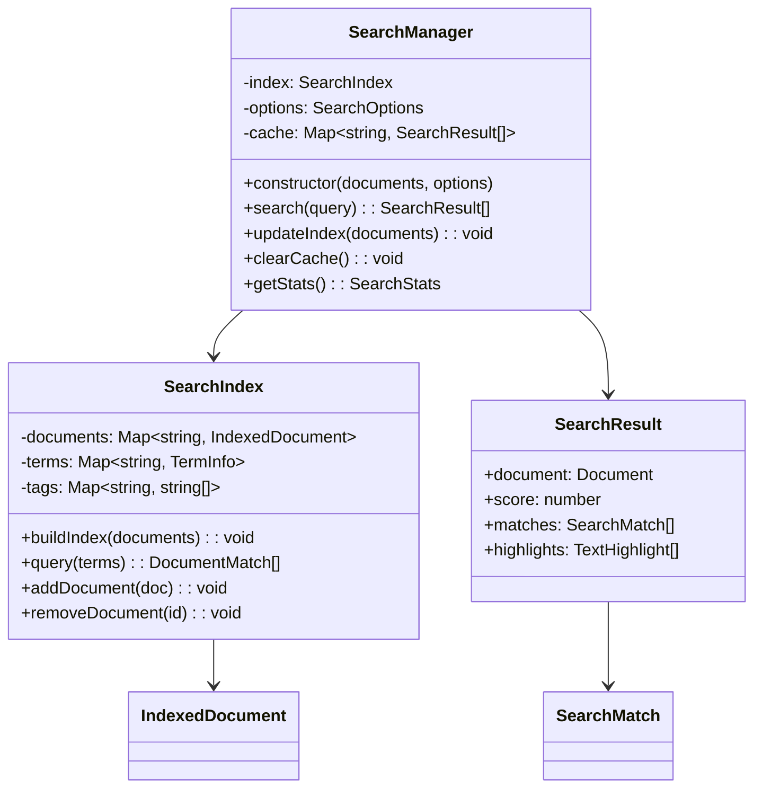

# Component: Search System

## Overview

The search system provides fast, flexible document search with support for full-text search, tag filtering, and result highlighting. It includes both basic and advanced search capabilities with configurable options for different use cases.

## Architecture



## Search Index

### Document Indexing

Builds searchable index from document content.

```typescript
class SearchIndex {
  private documents = new Map<string, IndexedDocument>();
  private termFrequency = new Map<string, Map<string, number>>();
  private inverseDocumentFrequency = new Map<string, number>();

  buildIndex(documents: Document[]): void {
    this.clear();

    documents.forEach(doc => this.addDocument(doc));
    this.calculateIDF();
  }

  private addDocument(document: Document): void {
    const tokens = this.tokenize(document);
    const termCounts = this.countTerms(tokens);

    // Store indexed document
    this.documents.set(document.id, {
      id: document.id,
      title: document.title,
      content: document.content || '',
      tokens,
      termCounts,
      tags: document.tags || [],
      category: document.category,
    });

    // Update term frequency
    this.termFrequency.set(document.id, termCounts);
  }

  private tokenize(document: Document): string[] {
    const content = [
      document.title,
      document.content || '',
      document.description || '',
      ...(document.tags || []),
    ].join(' ');

    return content
      .toLowerCase()
      .replace(/[^\w\s]/g, ' ')
      .split(/\s+/)
      .filter(token => token.length > 2)
      .filter(token => !this.isStopWord(token));
  }

  private countTerms(tokens: string[]): Map<string, number> {
    const counts = new Map<string, number>();
    tokens.forEach(token => {
      counts.set(token, (counts.get(token) || 0) + 1);
    });
    return counts;
  }

  private calculateIDF(): void {
    const totalDocs = this.documents.size;
    const termDocCounts = new Map<string, number>();

    // Count documents containing each term
    this.termFrequency.forEach(termCounts => {
      termCounts.forEach((_, term) => {
        termDocCounts.set(term, (termDocCounts.get(term) || 0) + 1);
      });
    });

    // Calculate IDF for each term
    termDocCounts.forEach((docCount, term) => {
      const idf = Math.log(totalDocs / docCount);
      this.inverseDocumentFrequency.set(term, idf);
    });
  }
}
```

### TF-IDF Scoring

Implements Term Frequency-Inverse Document Frequency scoring.

```typescript
class TFIDFScorer {
  calculateScore(
    queryTerms: string[],
    document: IndexedDocument,
    termFreq: Map<string, number>,
    idf: Map<string, number>
  ): number {
    let score = 0;

    queryTerms.forEach(term => {
      const tf = termFreq.get(term) || 0;
      const termIDF = idf.get(term) || 0;

      if (tf > 0) {
        // TF-IDF calculation
        const termScore = (tf / document.tokens.length) * termIDF;
        score += termScore;

        // Boost for title matches
        if (document.title.toLowerCase().includes(term)) {
          score += termScore * 2;
        }

        // Boost for tag matches
        if (document.tags.some(tag => tag.toLowerCase().includes(term))) {
          score += termScore * 1.5;
        }
      }
    });

    return score;
  }
}
```

## Search Operations

### Basic Search

Simple text-based search with relevance scoring.

```typescript
class BasicSearch {
  search(query: string, options: SearchOptions): SearchResult[] {
    if (!query.trim()) return [];

    const queryTerms = this.normalizeQuery(query);
    const results: SearchResult[] = [];

    this.index.documents.forEach(doc => {
      const score = this.calculateRelevance(queryTerms, doc);

      if (score > 0) {
        const matches = this.findMatches(queryTerms, doc);
        const highlights = this.generateHighlights(matches, doc.content);

        results.push({
          document: doc,
          score,
          matches,
          highlights,
        });
      }
    });

    return this.sortAndLimit(results, options);
  }

  private normalizeQuery(query: string): string[] {
    return query
      .toLowerCase()
      .replace(/[^\w\s]/g, ' ')
      .split(/\s+/)
      .filter(term => term.length > 0);
  }

  private findMatches(queryTerms: string[], document: IndexedDocument): SearchMatch[] {
    const matches: SearchMatch[] = [];

    // Title matches
    queryTerms.forEach(term => {
      if (document.title.toLowerCase().includes(term)) {
        matches.push({
          type: 'title',
          term,
          position: document.title.toLowerCase().indexOf(term),
          context: this.extractContext(document.title, term),
        });
      }
    });

    // Content matches
    queryTerms.forEach(term => {
      const content = document.content.toLowerCase();
      let position = content.indexOf(term);

      while (position !== -1) {
        matches.push({
          type: 'content',
          term,
          position,
          context: this.extractContext(document.content, term, position),
        });

        position = content.indexOf(term, position + 1);
      }
    });

    return matches;
  }
}
```

### Advanced Search

Enhanced search with filters, facets, and complex queries.

```typescript
class AdvancedSearch extends BasicSearch {
  search(query: string, filters: SearchFilters): SearchResult[] {
    let results = super.search(query, filters);

    // Apply filters
    if (filters.categories?.length) {
      results = results.filter(r => filters.categories!.includes(r.document.category || ''));
    }

    if (filters.tags?.length) {
      results = results.filter(r => r.document.tags?.some(tag => filters.tags!.includes(tag)));
    }

    if (filters.dateRange) {
      results = results.filter(r => this.isWithinDateRange(r.document, filters.dateRange!));
    }

    // Apply sorting
    return this.applySorting(results, filters.sortBy);
  }

  getFacets(results: SearchResult[]): SearchFacets {
    const categories = new Map<string, number>();
    const tags = new Map<string, number>();

    results.forEach(result => {
      // Count categories
      if (result.document.category) {
        const count = categories.get(result.document.category) || 0;
        categories.set(result.document.category, count + 1);
      }

      // Count tags
      result.document.tags?.forEach(tag => {
        const count = tags.get(tag) || 0;
        tags.set(tag, count + 1);
      });
    });

    return {
      categories: Array.from(categories.entries())
        .map(([name, count]) => ({ name, count }))
        .sort((a, b) => b.count - a.count),
      tags: Array.from(tags.entries())
        .map(([name, count]) => ({ name, count }))
        .sort((a, b) => b.count - a.count),
    };
  }
}
```

## Result Highlighting

### Text Highlighting

Highlights search terms in content with configurable styling.

```typescript
class SearchHighlighter {
  highlight(content: string, matches: SearchMatch[]): string {
    if (!matches.length) return content;

    // Sort matches by position (descending to avoid offset issues)
    const sortedMatches = matches
      .filter(m => m.type === 'content')
      .sort((a, b) => b.position - a.position);

    let highlightedContent = content;

    sortedMatches.forEach(match => {
      const before = highlightedContent.substring(0, match.position);
      const term = highlightedContent.substring(match.position, match.position + match.term.length);
      const after = highlightedContent.substring(match.position + match.term.length);

      highlightedContent = before + this.wrapHighlight(term) + after;
    });

    return highlightedContent;
  }

  private wrapHighlight(term: string): string {
    return `<mark class="mdv-search-highlight">${term}</mark>`;
  }

  generateSnippets(content: string, matches: SearchMatch[], maxLength = 200): string[] {
    const snippets: string[] = [];

    matches.forEach(match => {
      const start = Math.max(0, match.position - maxLength / 2);
      const end = Math.min(content.length, match.position + maxLength / 2);

      let snippet = content.substring(start, end);

      // Add ellipsis if truncated
      if (start > 0) snippet = '...' + snippet;
      if (end < content.length) snippet = snippet + '...';

      snippets.push(snippet);
    });

    return snippets;
  }
}
```

## Search UI Components

### Search Input

Debounced search input with suggestions.

```typescript
class SearchInput {
  constructor(
    private container: HTMLElement,
    private searchManager: SearchManager,
    private options: SearchInputOptions
  ) {
    this.render();
    this.setupEventListeners();
  }

  private render(): void {
    this.container.innerHTML = `
      <div class="mdv-search-container">
        <input 
          type="text" 
          class="mdv-search-input" 
          placeholder="${this.options.placeholder}"
          autocomplete="off"
        />
        <div class="mdv-search-suggestions" style="display: none;"></div>
        <div class="mdv-search-results" style="display: none;"></div>
      </div>
    `;
  }

  private setupEventListeners(): void {
    const input = this.container.querySelector('.mdv-search-input') as HTMLInputElement;
    const suggestions = this.container.querySelector('.mdv-search-suggestions') as HTMLElement;
    const results = this.container.querySelector('.mdv-search-results') as HTMLElement;

    // Debounced search
    let searchTimeout: number;
    input.addEventListener('input', e => {
      clearTimeout(searchTimeout);
      const query = (e.target as HTMLInputElement).value;

      searchTimeout = window.setTimeout(() => {
        this.performSearch(query, results);
      }, this.options.debounceMs || 300);
    });

    // Show/hide suggestions
    input.addEventListener('focus', () => {
      if (input.value.length > 0) {
        suggestions.style.display = 'block';
      }
    });

    input.addEventListener('blur', () => {
      setTimeout(() => {
        suggestions.style.display = 'none';
      }, 200);
    });
  }

  private async performSearch(query: string, resultsContainer: HTMLElement): Promise<void> {
    if (query.length < 2) {
      resultsContainer.style.display = 'none';
      return;
    }

    try {
      const results = this.searchManager.search(query);
      this.renderResults(results, resultsContainer);
      resultsContainer.style.display = 'block';
    } catch (error) {
      console.error('Search error:', error);
      this.renderError(error, resultsContainer);
    }
  }
}
```

## Integration Examples

### Basic Search Setup

```typescript
import { SearchManager, BasicSearch } from '@austinorphan/markdown-docs-viewer';

const searchManager = new SearchManager(documents, {
  caseSensitive: false,
  fuzzySearch: true,
  maxResults: 20,
  highlightResults: true,
});

// Perform search
const results = searchManager.search('getting started');
console.log(`Found ${results.length} results`);

results.forEach(result => {
  console.log(`${result.document.title} (score: ${result.score})`);
});
```

### Advanced Search with Filters

```typescript
const advancedSearch = new AdvancedSearchManager(documents, {
  filters: {
    categories: ['Getting Started', 'API'],
    tags: ['beginner', 'tutorial'],
    dateRange: {
      from: new Date('2024-01-01'),
      to: new Date(),
    },
  },
  faceted: true,
  highlighting: true,
});

const results = advancedSearch.search('authentication', {
  categories: ['API'],
  sortBy: 'relevance',
});

const facets = advancedSearch.getFacets(results);
console.log('Available categories:', facets.categories);
```

## Performance Optimizations

- **Index Caching**: Cache search index in memory/localStorage
- **Debounced Queries**: Prevent excessive search requests
- **Result Pagination**: Load results incrementally
- **Worker Threads**: Offload indexing to web workers
- **Prefix Matching**: Fast prefix-based suggestions

## Testing Considerations

- **Index Building**: Test index creation with various document types
- **Search Accuracy**: Verify relevant results are returned
- **Performance**: Test search speed with large document sets
- **Edge Cases**: Handle empty queries, special characters
- **Highlighting**: Verify correct term highlighting

## Future Enhancements

- **Fuzzy Search**: Support for typo tolerance
- **Semantic Search**: Vector-based similarity search
- **Search Analytics**: Track popular queries and results
- **Auto-Complete**: Smart query completion
- **Search History**: Remember user's previous searches
- **Export Results**: Allow exporting search results
