# Styles Component

## Overview

The Styles component is a comprehensive CSS generation system that creates dynamic, theme-aware stylesheets for the Markdown Documentation Viewer. It provides complete styling coverage for all UI components with responsive design and customization support.

## Architecture

```mermaid
graph TB
    SG[Style Generator] --> BT[Base Theme Input]
    SG --> DC[Documentation Config]

    SG --> BS[Base Styles]
    SG --> LS[Layout Styles]
    SG --> CS[Component Styles]
    SG --> MS[Markdown Styles]
    SG --> RS[Responsive Styles]
    SG --> SS[State Styles]

    BS --> APP[App Container]
    BS --> BOX[Box Model]

    LS --> HD[Header Layout]
    LS --> SB[Sidebar Layout]
    LS --> CT[Content Layout]

    CS --> NAV[Navigation]
    CS --> SCH[Search]
    CS --> BTN[Buttons]
    CS --> THM[Theme Controls]

    MS --> TYP[Typography]
    MS --> COD[Code Blocks]
    MS --> TBL[Tables]
    MS --> LST[Lists]

    RS --> MOB[Mobile Styles]
    RS --> SBR[Scrollbars]

    SS --> HVR[Hover States]
    SS --> ACT[Active States]
    SS --> FCS[Focus States]
    SS --> LD[Loading States]
```



## Function Structure

### generateStyles Function

**Purpose**: Generate complete CSS stylesheet from theme and configuration

**Signature**:

```typescript
function generateStyles(theme: Theme, config: DocumentationConfig): string;
```

**Parameters**:

- `theme: Theme` - Theme object with colors, fonts, spacing
- `config: DocumentationConfig` - Configuration object (currently unused but reserved)

**Returns**: Complete CSS string ready for injection

## Core Style Categories

### 1. Base Styles

**App Container**:

```css
.mdv-app {
  font-family: var(--font-body);
  color: var(--color-text-primary);
  background-color: var(--color-background);
  height: 100%;
  display: flex;
  flex-direction: column;
  overflow: hidden;
}
```

**Box Model Reset**:

- Universal box-sizing: border-box
- Consistent element behavior

### 2. Layout System

**Header Layout**:

- Fixed header with surface background
- Flex layout for logo, title, and controls
- Responsive action bar

**Sidebar Layout**:

- Fixed width with overflow handling
- Flex column with search and navigation sections
- Smooth transform transitions

**Content Layout**:

- Flexible content area with scroll
- Centered document container
- Maximum width constraints

### 3. Navigation Styles

**Navigation Structure**:

```css
.mdv-nav-link {
  display: block;
  padding: calc(var(--spacing-unit) * 1.5) calc(var(--spacing-unit) * 2);
  color: var(--color-text-secondary);
  transition: all 0.2s;
  border-radius: var(--border-radius);
}

.mdv-nav-link:hover {
  background-color: var(--color-background);
  color: var(--color-text-primary);
  transform: translateX(4px);
}
```

**Features**:

- Hierarchical navigation structure
- Collapsible categories
- Smooth hover animations
- Active state indication
- Tag system for navigation items

### 4. Search Interface

**Search Input**:

```css
.mdv-search-input {
  width: 100%;
  padding: calc(var(--spacing-unit) * 1.5) calc(var(--spacing-unit) * 2);
  background-color: var(--color-background);
  border: 1px solid var(--color-border);
  border-radius: var(--border-radius);
  transition: border-color 0.2s;
}

.mdv-search-input:focus {
  outline: none;
  border-color: var(--color-primary);
  box-shadow: 0 0 0 3px var(--color-primary-33);
}
```

### 5. Markdown Content Styles

**Typography Hierarchy**:

```css
.mdv-document-content h1 {
  font-size: 2rem;
}
.mdv-document-content h2 {
  font-size: 1.5rem;
}
.mdv-document-content h3 {
  font-size: 1.25rem;
}
.mdv-document-content h4 {
  font-size: 1.125rem;
}
```

**Code Block Styling**:

```css
.mdv-code-block {
  position: relative;
  margin-bottom: calc(var(--spacing-unit) * 2);
}

.mdv-copy-button {
  position: absolute;
  top: var(--spacing-unit);
  right: var(--spacing-unit);
  background-color: var(--color-primary);
  color: white;
  border: none;
  border-radius: var(--border-radius);
}
```

**Table Styling**:

- Full-width responsive tables
- Header background differentiation
- Consistent cell padding
- Border styling

### 6. Theme Integration

**CSS Custom Properties**:

```css
/* Colors */
color: var(--mdv-color-text-primary);
background-color: var(--mdv-color-background);
border-color: var(--mdv-color-border);

/* Typography */
font-family: var(--mdv-font-body);
font-family: var(--mdv-font-heading);
font-family: var(--mdv-font-code);

/* Spacing */
padding: calc(var(--mdv-spacing-unit) * 2);
max-width: var(--mdv-container-max-width);
width: var(--mdv-sidebar-width);

/* Effects */
border-radius: var(--mdv-border-radius);
```

### 7. Interactive States

**Hover Effects**:

- Smooth transitions (0.2s duration)
- Color and transform changes
- Visual feedback for all interactive elements

**Focus States**:

- Keyboard navigation support
- Visible focus indicators
- Accessibility-compliant contrast

**Active States**:

- Visual distinction for current selection
- Persistent state indication

### 8. Mobile Considerations

**Mobile Toggle**:

```css
.mdv-mobile-toggle {
  display: none;
  background: var(--color-primary);
  color: white;
  border: none;
  width: 48px;
  height: 48px;
  border-radius: 8px;
}
```

**Responsive Integration**:

- Mobile styles injected separately
- Touch-friendly sizing
- Collapsible navigation

### 9. Scrollbar Customization

**Webkit Scrollbars**:

```css
.mdv-navigation::-webkit-scrollbar {
  width: 8px;
}

.mdv-navigation::-webkit-scrollbar-thumb {
  background: var(--color-border);
  border-radius: 4px;
}
```

### 10. Syntax Highlighting Integration

**highlight.js Override**:

```css
.hljs {
  background: transparent !important;
  color: var(--color-text-primary) !important;
}
```

## CSS Architecture Patterns

### 1. BEM-like Naming Convention

**Block-Element Structure**:

- `.mdv-` prefix for all classes
- `block__element` pattern
- `block--modifier` for variations

### 2. Custom Property System

**Spacing Calculations**:

```css
padding: calc(var(--spacing-unit) * 1.5);
margin: calc(var(--spacing-unit) * 2);
```

**Color Variations**:

- Base colors from theme
- Opacity variants (e.g., `${colors.primary}33` for 33% opacity)
- RGB variants for transparency

### 3. Progressive Enhancement

**Base Functionality**:

- Core styles work without JavaScript
- Enhanced interactions with JS
- Graceful degradation

## Integration Patterns

### Basic Usage

```typescript
import { generateStyles } from './styles';
import { defaultTheme } from './themes';

const cssText = generateStyles(defaultTheme, config);

// Inject into document
const styleElement = document.createElement('style');
styleElement.textContent = cssText;
document.head.appendChild(styleElement);
```

### Dynamic Theme Application

```typescript
class StyleManager {
  private styleElement: HTMLStyleElement;

  updateStyles(theme: Theme, config: DocumentationConfig) {
    const newStyles = generateStyles(theme, config);
    this.styleElement.textContent = newStyles;
  }
}
```

### Custom CSS Integration

```typescript
const themeWithCustomCSS = {
  ...theme,
  customCSS: `
    .mdv-custom-component {
      background: linear-gradient(45deg, #007acc, #0099ff);
    }
  `,
};
```

## Performance Considerations

### Optimization Strategies

**Efficient CSS Generation**:

- Single pass CSS generation
- Template literal optimization
- Minimal runtime calculations

**CSS Size Management**:

- No unused style generation
- Compressed output format
- Efficient selector specificity

### Memory Management

**Style Element Handling**:

- Single style element per instance
- Proper cleanup on theme changes
- Garbage collection friendly

## Browser Compatibility

### CSS Feature Support

**Modern CSS Features**:

- CSS Custom Properties (IE 11+)
- Flexbox layout (IE 10+)
- CSS calc() function (IE 9+)
- CSS transitions (IE 10+)

**Fallback Strategies**:

- Progressive enhancement approach
- Feature detection patterns
- Graceful degradation for older browsers

### Vendor Prefixes

**Webkit Scrollbars**:

- Chrome/Safari specific styling
- Fallback to system scrollbars
- Cross-browser consistency where possible

## Accessibility Features

### WCAG Compliance

**Color Contrast**:

- Theme-based contrast validation
- Accessible focus indicators
- Semantic color usage

**Keyboard Navigation**:

- Visible focus states
- Logical tab order
- Skip link support

### Screen Reader Support

**Semantic Markup**:

- Proper heading hierarchy
- ARIA attributes integration
- Content structure preservation

## Testing Considerations

### Unit Testing

**CSS Generation Testing**:

- Theme input validation
- Output CSS structure verification
- Custom CSS integration testing

**Mock Requirements**:

- Theme object mocking
- Configuration object mocking
- CSS parsing utilities

### Visual Regression Testing

**Styling Consistency**:

- Cross-theme compatibility
- Component appearance verification
- Mobile responsive behavior

### Integration Testing

**Theme Application**:

- Style injection workflow
- Theme switching behavior
- Performance impact measurement

## Security Considerations

### CSS Injection Prevention

**Safe CSS Generation**:

- Template literal sanitization
- No user input in CSS generation
- Controlled custom CSS integration

**XSS Protection**:

- CSS content validation
- Safe style element manipulation
- Trusted theme sources only
