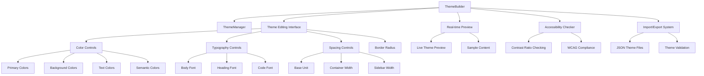

# Theme Builder Component

## Overview

The `ThemeBuilder` class provides a comprehensive visual interface for creating custom themes in the Markdown Docs Viewer. It offers a modal-based theme editor with real-time preview, accessibility checking, and import/export capabilities, allowing users to customize all aspects of the visual appearance.

## Architecture



## Class Structure

### Constructor

```typescript
constructor(themeManager: ThemeManager, options: ThemeBuilderOptions = {})
```

**Dependencies:**

- `ThemeManager`: Core theme management and validation
- Utility functions for sanitization and validation

### Configuration Options

```typescript
interface ThemeBuilderOptions {
  onThemeCreate?: (theme: ThemePreset) => void;
  onThemeUpdate?: (theme: ThemePreset) => void;
  onClose?: () => void;
  allowExport?: boolean;
  allowImport?: boolean;
  showPreview?: boolean;
  showAccessibilityCheck?: boolean;
}
```

**Default Values:**

- `allowExport`: `true`
- `allowImport`: `true`
- `showPreview`: `true`
- `showAccessibilityCheck`: `true`

## Core Features

### 1. Color Management System

**Categorized Color Controls:**

- **Primary**: Main accent colors (primary, secondary, link, linkHover)
- **Background**: Surface colors (background, surface, codeBackground)
- **Text**: Content colors (text, textPrimary, textSecondary, textLight, code)
- **Semantic**: State colors (error, warning, success)

**Color Input Interface:**

- Dual input system: color picker + text input
- Real-time synchronization between inputs
- Color validation and sanitization
- Visual preview of color changes

### 2. Typography Controls

**Font Family Management:**

- Body font for general content
- Heading font for titles and headers
- Code font for monospace content
- Font family validation and sanitization

**Typography Features:**

- Web-safe font fallbacks
- Custom font family support
- Real-time font preview
- Cross-browser compatibility checking

### 3. Spacing and Layout System

**Configurable Spacing:**

- Base unit (pixel-based spacing foundation)
- Container maximum width
- Sidebar width
- Border radius customization

**Layout Controls:**

- Responsive design considerations
- Consistent spacing relationships
- Visual hierarchy maintenance

### 4. Real-time Preview System

**Live Theme Application:**

- Immediate visual feedback
- Sample content rendering
- Component style updates
- CSS custom property injection

**Preview Content:**

- Headings and text samples
- Links and interactive elements
- Code blocks and inline code
- Blockquotes and surface elements
- Button variations

### 5. Accessibility Compliance

**Contrast Ratio Checking:**

- Text/background contrast validation
- Primary/background contrast verification
- WCAG AA compliance indicators
- Real-time accessibility feedback

**Accessibility Features:**

- Color blindness considerations
- High contrast mode support
- Keyboard navigation support
- Screen reader compatibility

### 6. Import/Export System

**Theme Export:**

- JSON format theme files
- Complete theme definition export
- Downloadable theme packages
- Cross-platform compatibility

**Theme Import:**

- JSON file validation
- Theme structure verification
- Error handling for malformed themes
- Seamless theme loading

## Implementation Details

### Color Input Management

```typescript
private updateColor(key: keyof ThemeColors, value: string): void {
  this.currentTheme.colors[key] = value;
  this.updatePreview();
  this.updateAccessibilityCheck();
}
```

**Color Input Features:**

- Dual synchronization (color picker ↔ text input)
- Color format validation
- Sanitization for security
- Real-time preview updates

### Theme State Management

```typescript
private currentTheme: Theme;
private originalTheme: Theme;
```

**State Tracking:**

- Current editing state
- Original theme backup
- Reset functionality
- Change detection

### Accessibility Validation

```typescript
private renderAccessibilityCheck(): string {
  const textBgRatio = this.themeManager.getContrastRatio(
    this.currentTheme.colors.textPrimary,
    this.currentTheme.colors.background
  );
  // Real-time contrast ratio calculation
}
```

**Validation Features:**

- Continuous contrast checking
- WCAG compliance indicators
- Visual pass/fail indicators
- Multiple color pair validation

## Usage Examples

### Basic Theme Builder

```typescript
import { ThemeBuilder } from './theme-builder';
import { ThemeManager } from './theme-manager';

const themeManager = new ThemeManager();
const themeBuilder = new ThemeBuilder(themeManager, {
  onThemeCreate: theme => {
    console.log('New theme created:', theme.name);
    themeManager.setTheme(theme.name);
  },
  onClose: () => {
    console.log('Theme builder closed');
  },
});

// Render and attach
const container = document.createElement('div');
container.innerHTML = themeBuilder.render();
document.body.appendChild(container);
themeBuilder.attachTo(container);

// Open the builder
themeBuilder.open();
```

### Minimal Theme Builder

```typescript
const minimalBuilder = new ThemeBuilder(themeManager, {
  showPreview: false,
  showAccessibilityCheck: false,
  allowImport: false,
  allowExport: false,
});
```

### Enterprise Theme Builder

```typescript
const enterpriseBuilder = new ThemeBuilder(themeManager, {
  showAccessibilityCheck: true,
  onThemeCreate: theme => {
    // Validate theme meets company standards
    if (validateEnterpriseTheme(theme)) {
      deployTheme(theme);
    }
  },
  onThemeUpdate: theme => {
    // Auto-save theme changes
    saveThemeDraft(theme);
  },
});
```

## Color Input System

### Interface Definition

```typescript
interface ColorInput {
  key: keyof ThemeColors;
  label: string;
  description?: string;
  category: 'primary' | 'background' | 'text' | 'semantic';
}
```

### Color Categories

1. **Primary Colors** - Brand and accent colors
2. **Background Colors** - Surface and container colors
3. **Text Colors** - Content and typography colors
4. **Semantic Colors** - State and status colors

### Color Validation

```typescript
private isValidColor(color: string): boolean {
  return /^#([A-Fa-f0-9]{6}|[A-Fa-f0-9]{3})$/.test(color);
}
```

## Modal System

### Modal Lifecycle

1. **Creation**: Builder instance created with configuration
2. **Opening**: Modal overlay and content rendered
3. **Interaction**: User edits theme properties
4. **Preview**: Real-time updates shown
5. **Validation**: Accessibility checks performed
6. **Saving**: Theme finalized and registered
7. **Closing**: Modal dismissed and cleanup performed

### Modal Features

- **Overlay System**: Semi-transparent background
- **Escape Handling**: ESC key closes modal
- **Click Outside**: Clicking overlay closes modal
- **Responsive Design**: Mobile-friendly layout
- **Keyboard Navigation**: Full keyboard accessibility

## Error Handling

### Input Validation

```typescript
// Color validation
if (this.isValidColor(value)) {
  this.updateColor(input.key, value);
  colorInput.value = value;
}

// Font family sanitization
value: sanitizeFontFamily(this.currentTheme.fonts[font.key]);

// CSS value sanitization
value: sanitizeCssValue(this.currentTheme.spacing[input.key]);
```

### Error Recovery

- **Invalid Colors**: Fall back to previous valid color
- **Malformed Fonts**: Use system font fallbacks
- **Invalid Spacing**: Reset to default values
- **Import Failures**: Show error message, maintain current state

## Performance Considerations

### Optimization Features

1. **Debounced Updates**: Input changes debounced for performance
2. **Selective Re-rendering**: Only update changed preview elements
3. **Memory Management**: Proper cleanup on modal close
4. **Lazy Loading**: Modal content loaded on demand

### Resource Management

```typescript
private deepCloneTheme(theme: Theme): Theme {
  // Use modern structuredClone when available
  if (typeof structuredClone !== 'undefined') {
    return structuredClone(theme);
  }
  // Fallback for older browsers
  return JSON.parse(JSON.stringify(theme));
}
```

## Styling System

### CSS Architecture

The Theme Builder uses a comprehensive CSS system with:

- **CSS Custom Properties**: Dynamic theme application
- **Responsive Design**: Mobile-first approach
- **Component Isolation**: Scoped styling to prevent conflicts
- **Animation System**: Smooth transitions and micro-interactions

### Key Style Classes

- `.mdv-theme-builder-overlay`: Modal backdrop
- `.mdv-theme-builder`: Main modal container
- `.mdv-theme-builder-sidebar`: Controls panel
- `.mdv-theme-builder-preview`: Live preview area
- `.mdv-theme-builder-field`: Input field containers

## Integration Points

### ThemeManager Integration

```typescript
// Theme creation
const customTheme = this.themeManager.createCustomTheme(this.currentTheme.name, this.currentTheme);

// Contrast calculation
const ratio = this.themeManager.getContrastRatio(color1, color2);

// Theme import/export
const themeJson = this.themeManager.exportTheme(theme);
const importedTheme = this.themeManager.importTheme(json);
```

### Viewer Integration

- **Theme Switcher Integration**: Seamless theme creation flow
- **Live Updates**: Theme changes applied immediately
- **Persistence**: Created themes saved for future use
- **Callback System**: Parent components notified of changes

## Testing Considerations

### Unit Tests

- Color validation and sanitization
- Theme state management
- Accessibility calculations
- Import/export functionality

### Integration Tests

- ThemeManager interaction
- Modal lifecycle management
- Real-time preview updates
- Keyboard navigation

### Accessibility Tests

- Screen reader compatibility
- Keyboard navigation flow
- Color contrast compliance
- Focus management

### Visual Tests

- Cross-browser rendering
- Mobile responsiveness
- Theme preview accuracy
- Animation performance
