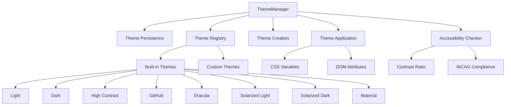

# Theme Manager Component

## Overview

The Theme Manager is a comprehensive theming system that provides runtime theme switching, persistence, accessibility validation, and extensive customization capabilities for the Markdown Documentation Viewer.

## Architecture



## Class Structure

### ThemeManager Class

**Purpose**: Core theme management with registration, application, and persistence

**Key Methods**:

- `registerTheme(theme: ThemePreset)` - Register new theme
- `setTheme(themeName: string)` - Apply theme with persistence
- `getCurrentTheme()` - Get active theme
- `getAvailableThemes()` - List all registered themes
- `createCustomTheme(name, overrides)` - Generate custom theme
- `applyCSSVariables(theme)` - Apply theme to DOM
- `exportTheme(theme)` - Export theme as JSON
- `importTheme(json)` - Import theme from JSON

**Configuration Options**:

```typescript
interface ThemeManagerOptions {
  enablePersistence?: boolean; // localStorage persistence
  storageKey?: string; // Storage key name
  onThemeChange?: (theme) => void; // Change callback
}
```

## Core Features

### 1. Built-in Theme Collection

**Available Themes**:

- **Light**: Clean modern light theme
- **Dark**: Easy on the eyes dark theme
- **High Contrast**: Accessibility-focused high contrast
- **GitHub**: GitHub-inspired styling
- **Dracula**: Popular dark theme with vibrant colors
- **Solarized Light/Dark**: Precision color schemes
- **Material**: Material Design inspired

### 2. Theme Persistence

**Storage Mechanism**:

- Automatic localStorage persistence
- Configurable storage key
- Safe error handling for storage failures
- Theme restoration on initialization

### 3. CSS Variable System

**Dynamic Application**:

```typescript
// Color variables with RGB variants
--mdv-color-primary: #007acc
--mdv-color-primary-rgb: 0, 122, 204

// Font variables
--mdv-font-body: 'Inter', sans-serif
--mdv-font-heading: 'Inter', sans-serif
--mdv-font-code: 'Fira Code', monospace

// Layout variables
--mdv-spacing-unit: 8px
--mdv-container-max-width: 1200px
--mdv-sidebar-width: 280px
```

### 4. Accessibility Validation

**WCAG Compliance**:

- Contrast ratio calculation
- AA/AAA level validation
- Luminance computation
- Color accessibility checking

**Usage Example**:

```typescript
const isAccessible = themeManager.isAccessible(
  '#000000', // foreground
  '#ffffff', // background
  'AA' // WCAG level
);
```

### 5. Custom Theme Creation

**Dynamic Generation**:

```typescript
const customTheme = themeManager.createCustomTheme('my-theme', {
  colors: {
    primary: '#ff6b6b',
    secondary: '#4ecdc4',
    // Partial overrides merge with base theme
  },
  fonts: {
    body: 'Roboto, sans-serif',
  },
});
```

## Integration Patterns

### Basic Setup

```typescript
import { ThemeManager } from './theme-manager';

const themeManager = new ThemeManager({
  enablePersistence: true,
  storageKey: 'my-app-theme',
  onThemeChange: theme => {
    console.log(`Theme changed to: ${theme.name}`);
  },
});
```

### Theme Switching

```typescript
// Apply built-in theme
themeManager.setTheme('dark');

// Create and apply custom theme
const customTheme = themeManager.createCustomTheme('brand', {
  colors: { primary: '#007acc' },
});
themeManager.setTheme('brand');
```

### Theme Export/Import

```typescript
// Export theme
const currentTheme = themeManager.getCurrentTheme();
const themeJson = themeManager.exportTheme(currentTheme);

// Import theme
const importedTheme = themeManager.importTheme(themeJson);
if (importedTheme) {
  themeManager.setTheme(importedTheme.name);
}
```

### Accessibility Checking

```typescript
const themes = themeManager.getAvailableThemes();
const accessibleThemes = themes.filter(theme =>
  themeManager.isAccessible(theme.colors.text, theme.colors.background, 'AA')
);
```

## Theme Structure

### Theme Preset Interface

```typescript
interface ThemePreset extends Theme {
  description?: string; // Theme description
  author?: string; // Theme author
  version?: string; // Theme version
}
```

### Color System

**Required Colors**:

- `primary`, `secondary` - Brand colors
- `background`, `surface` - Layout backgrounds
- `text`, `textPrimary`, `textSecondary`, `textLight` - Text variations
- `border` - UI borders
- `code`, `codeBackground` - Code styling
- `link`, `linkHover` - Link states
- `error`, `warning`, `success` - Semantic colors

### Typography System

```typescript
fonts: {
  body: string; // Body text font stack
  heading: string; // Heading font stack
  code: string; // Code font stack
}
```

## Error Handling

### Theme Validation

**Validation Checks**:

- Required theme name validation
- Color object presence validation
- Required color properties validation
- Type safety for all theme properties

**Error Recovery**:

- Graceful fallback to default theme
- Warning messages for missing themes
- Safe storage operation handling

### Storage Error Handling

```typescript
private saveThemeName(name: string): void {
  try {
    localStorage.setItem(this.options.storageKey, name);
  } catch (error) {
    console.warn('Failed to save theme preference:', error);
    // Continue without persistence
  }
}
```

## Testing Considerations

### Unit Tests

**Test Coverage Areas**:

- Theme registration and retrieval
- Theme application and CSS variable generation
- Persistence functionality
- Accessibility calculations
- Custom theme creation
- Import/export functionality
- Error handling scenarios

**Mock Requirements**:

- localStorage API
- DOM document.documentElement
- CSS custom property application

### Integration Tests

**Test Scenarios**:

- Theme switching with persistence
- Custom theme creation and application
- Accessibility validation workflow
- Import/export round-trip testing
- Error recovery behavior

## Performance Considerations

### Optimization Strategies

**Efficient Operations**:

- Theme caching in Map structure
- Lazy CSS variable application
- Minimal DOM manipulation
- RGB color caching for opacity support

**Memory Management**:

- Efficient theme storage structure
- Proper cleanup of CSS variables
- Event handler management

## Security Considerations

### Safe Theme Handling

**Input Validation**:

- Theme JSON parsing with error handling
- Required property validation
- Type checking for theme properties
- Safe CSS variable application

**Storage Security**:

- localStorage error handling
- No sensitive data in themes
- Safe JSON serialization/deserialization

## Browser Compatibility

### CSS Custom Properties

- Modern browser requirement
- Fallback strategies for older browsers
- Progressive enhancement approach

### Storage API

- localStorage availability checking
- Graceful degradation without persistence
- Error handling for storage restrictions
