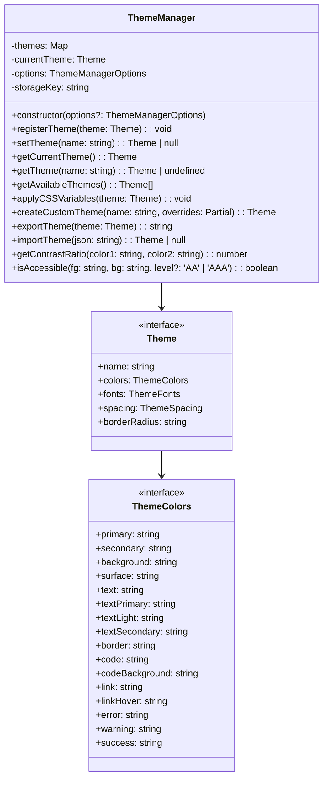
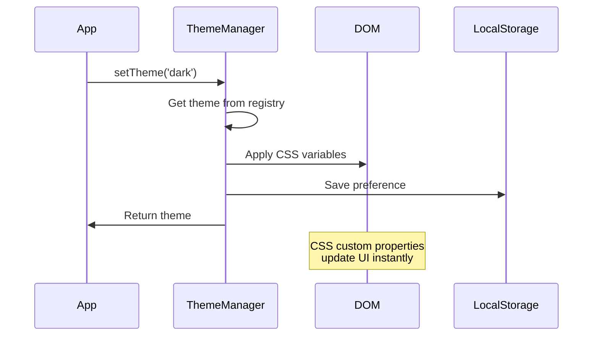

# Component: Theme Manager

## Overview

The Theme Manager is responsible for applying themes, managing theme persistence, and providing theme-related utilities like contrast checking and color manipulation.

## Architecture



## Responsibilities

1. **Theme Registration**: Managing available themes
2. **Theme Application**: Applying CSS custom properties
3. **Theme Persistence**: Saving/loading theme preferences
4. **Theme Creation**: Building custom themes
5. **Accessibility**: Contrast ratio calculations
6. **Import/Export**: Theme sharing capabilities

## Key Methods

### setTheme(name: string)

```typescript
setTheme(name: string): Theme | null {
    const theme = this.themes.get(name);
    if (!theme) return null;

    this.currentTheme = theme;
    this.applyCSSVariables(theme);

    if (this.options.persist) {
        localStorage.setItem(this.storageKey, name);
    }

    this.options.onThemeChange?.(theme);
    return theme;
}
```

### applyCSSVariables(theme: Theme)

```typescript
applyCSSVariables(theme: Theme): void {
    const root = document.documentElement;

    // Apply colors
    Object.entries(theme.colors).forEach(([key, value]) => {
        const cssVar = `--mdv-color-${this.camelToKebab(key)}`;
        root.style.setProperty(cssVar, value);

        // Also set RGB values for alpha transparency
        const rgb = this.hexToRgb(value);
        if (rgb) {
            root.style.setProperty(`${cssVar}-rgb`, rgb);
        }
    });

    // Apply fonts, spacing, etc.
    // Set theme attribute for CSS selectors
    root.setAttribute('data-mdv-theme', theme.name);
}
```

## Data Flow



## Built-in Themes

| Theme        | Description                      | Use Case                |
| ------------ | -------------------------------- | ----------------------- |
| default      | Light theme with blue accent     | General purpose         |
| dark         | Dark backgrounds with light text | Low-light environments  |
| github       | GitHub-inspired theme            | Developer documentation |
| ocean        | Blue-green palette               | Marine/water themes     |
| forest       | Green natural colors             | Environmental docs      |
| sunset       | Warm orange/red tones            | Creative projects       |
| monochrome   | Grayscale only                   | Accessibility           |
| highContrast | Maximum contrast                 | Vision impairment       |

## CSS Variable Naming Convention

```css
--mdv-color-[name]        /* Color values */
--mdv-color-[name]-rgb    /* RGB triplet for alpha */
--mdv-font-[name]         /* Font families */
--mdv-spacing-[name]      /* Spacing values */
--mdv-border-radius       /* Border radius */
```

## Integration Example

```javascript
// Initialize with options
const themeManager = new ThemeManager({
  defaultTheme: 'dark',
  persist: true,
  storageKey: 'my-app-theme',
  onThemeChange: theme => {
    console.log('Theme changed to:', theme.name);
  },
});

// Register custom theme
themeManager.registerTheme({
  name: 'custom',
  colors: {
    primary: '#ff6b6b',
    background: '#fafafa',
    // ... other colors
  },
  // ... other properties
});

// Apply theme
themeManager.setTheme('custom');
```

## Testing Considerations

1. **Unit Tests**: Theme registration, CSS variable application
2. **Visual Tests**: Theme appearance validation
3. **Accessibility Tests**: Contrast ratio compliance
4. **Browser Tests**: CSS custom property support
5. **Persistence Tests**: LocalStorage save/load

## Performance Optimizations

- CSS variables update entire document at once
- No JavaScript style recalculation needed
- Theme objects are cached after first load
- Minimal DOM operations (only root element)

## Future Enhancements

1. **Theme Interpolation**: Animate between themes
2. **System Theme**: Follow OS dark/light preference
3. **Theme Variants**: Light/dark versions of each theme
4. **Color Schemes**: Automatic color generation
5. **Theme Marketplace**: Share themes online
