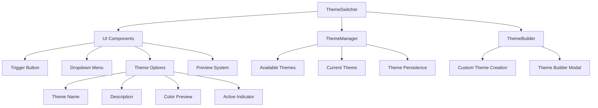

# Theme Switcher Component

## Overview

The `ThemeSwitcher` class provides a comprehensive UI component for dynamically switching between available themes in the Markdown Docs Viewer. It offers an accessible, keyboard-navigable dropdown interface with theme previews and optional custom theme creation capabilities.

## Architecture



## Class Structure

### Constructor

```typescript
constructor(themeManager: ThemeManager, options: ThemeSwitcherOptions = {})
```

**Dependencies:**

- `ThemeManager`: Manages theme state and switching logic
- `ThemeBuilder`: Optional component for custom theme creation

### Configuration Options

```typescript
interface ThemeSwitcherOptions {
  position?: 'header' | 'footer' | 'sidebar' | 'floating';
  showPreview?: boolean;
  showDescription?: boolean;
  allowCustomThemes?: boolean;
  onThemeChange?: (theme: Theme) => void;
}
```

**Default Values:**

- `position`: `'header'`
- `showPreview`: `true`
- `showDescription`: `true`
- `allowCustomThemes`: `true`

## Core Features

### 1. Theme Switching Interface

**Trigger Button:**

- Displays current theme name and icon
- Hover effects and accessibility labels
- Click to toggle dropdown visibility

**Dropdown Menu:**

- Positioned relative to trigger or fixed for floating mode
- Smooth open/close animations
- Auto-closes when clicking outside

### 2. Theme Visualization

**Theme Options Display:**

- Theme name with capitalization
- Optional description text
- Color preview squares showing key theme colors
- Active state indicator (checkmark icon)

**Color Preview System:**

- Four color squares: background, primary, secondary, surface
- Tooltips for color identification
- Visual consistency across themes

### 3. Accessibility Features

**Keyboard Navigation:**

- Arrow keys navigate between options
- Enter/Space to select theme
- Escape to close dropdown
- Proper ARIA attributes and roles

**Screen Reader Support:**

- Semantic HTML structure
- Descriptive labels and descriptions
- Live region updates for theme changes

### 4. Responsive Design

**Desktop:**

- Positioned dropdown with optimal spacing
- Hover states and transitions
- Keyboard focus indicators

**Mobile:**

- Bottom sheet modal on small screens
- Touch-friendly interaction areas
- Reduced motion for better performance

## Implementation Details

### Event Handling

```typescript
private setupEventListeners(): void {
  // Dropdown toggle
  trigger?.addEventListener('click', e => {
    e.stopPropagation();
    this.toggleDropdown();
  });

  // Theme selection
  this.container.addEventListener('click', e => {
    const themeOption = target.closest('.mdv-theme-option');
    if (themeOption?.dataset.theme) {
      this.selectTheme(themeOption.dataset.theme);
    }
  });

  // Keyboard navigation
  this.container.addEventListener('keydown', e => {
    this.handleKeyboardNavigation(e);
  });
}
```

### Theme Selection Flow

1. User clicks theme option or uses keyboard
2. `selectTheme()` calls ThemeManager to apply theme
3. UI updates to reflect new active theme
4. Dropdown closes automatically
5. Optional callback notifies parent component

### Custom Theme Integration

**Theme Builder Integration:**

- Lazy-loaded ThemeBuilder component
- Modal overlay for theme customization
- Automatic theme registration after creation
- Seamless integration with existing theme list

## Usage Examples

### Basic Implementation

```typescript
import { ThemeSwitcher } from './theme-switcher';
import { ThemeManager } from './theme-manager';

const themeManager = new ThemeManager();
const themeSwitcher = new ThemeSwitcher(themeManager, {
  position: 'header',
  showPreview: true,
  onThemeChange: theme => {
    console.log('Theme changed to:', theme.name);
  },
});

// Render and attach
container.innerHTML = themeSwitcher.render();
themeSwitcher.attachTo(container);
```

### Floating Theme Switcher

```typescript
const floatingThemeSwitcher = new ThemeSwitcher(themeManager, {
  position: 'floating',
  showDescription: false,
  allowCustomThemes: false,
});
```

### Minimal Theme Switcher

```typescript
const minimalThemeSwitcher = new ThemeSwitcher(themeManager, {
  showPreview: false,
  showDescription: false,
  allowCustomThemes: false,
});
```

## Styling System

### CSS Custom Properties

The component uses CSS custom properties for consistent theming:

```css
.mdv-theme-switcher {
  --mdv-color-surface: /* Surface background */ --mdv-color-border: /* Border colors */
    --mdv-color-primary: /* Primary accent */ --mdv-border-radius: /* Border radius */
    --mdv-z-fixed: /* Z-index for floating */;
}
```

### Component Classes

- `.mdv-theme-switcher`: Main container
- `.mdv-theme-trigger`: Clickable trigger button
- `.mdv-theme-dropdown`: Dropdown menu container
- `.mdv-theme-option`: Individual theme option
- `.mdv-theme-preview`: Color preview container

## Performance Considerations

### Optimization Features

1. **Event Delegation**: Single event listener for multiple theme options
2. **Lazy Loading**: ThemeBuilder only loaded when needed
3. **Efficient Updates**: Targeted DOM updates instead of full re-renders
4. **CSS Transitions**: Hardware-accelerated animations

### Memory Management

- Event listeners properly cleaned up
- ThemeBuilder instances disposed after use
- Minimal DOM manipulation during theme switches

## Integration Points

### ThemeManager Integration

- Reads available themes from ThemeManager
- Delegates theme switching to ThemeManager
- Syncs UI state with ThemeManager state

### ThemeBuilder Integration

- Optional custom theme creation
- Modal-based theme builder interface
- Automatic theme registration and selection

### Viewer Integration

- Embedded in viewer header by default
- Callback system for theme change notifications
- Consistent styling with viewer theme system

## Error Handling

### Graceful Degradation

- Falls back to basic functionality if ThemeBuilder unavailable
- Handles missing theme icons with default fallback
- Continues operation if individual themes fail to load

### Validation

- Theme name validation before switching
- Safe HTML escaping for user-provided content
- Boundary checks for keyboard navigation

## Testing Considerations

### Unit Tests

- Theme switching functionality
- Keyboard navigation behavior
- UI state management
- Event handling

### Integration Tests

- ThemeManager integration
- ThemeBuilder integration
- Accessibility compliance
- Responsive behavior

### Visual Tests

- Theme preview accuracy
- Animation smoothness
- Cross-browser compatibility
- Mobile responsiveness
