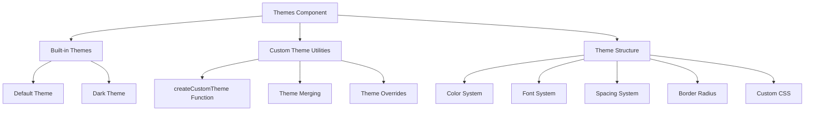

# Themes Component

## Overview

The Themes component provides a comprehensive theming system with pre-built themes and utilities for creating custom themes for the Markdown Documentation Viewer. It defines the visual foundation of the entire application.

## Architecture



## Built-in Themes

### 1. Default Theme

**Purpose**: Clean, modern light theme suitable for most documentation

```typescript
export const defaultTheme: Theme = {
  name: 'default',
  colors: {
    primary: '#3b82f6', // Blue primary color
    secondary: '#10b981', // Green secondary color
    background: '#ffffff', // White background
    surface: '#f3f4f6', // Light gray surfaces
    text: '#111827', // Dark text
    textPrimary: '#111827', // Primary headings
    textLight: '#6b7280', // Light text variant
    textSecondary: '#6b7280', // Secondary text
    border: '#e5e7eb', // Light borders
    code: '#8b5cf6', // Purple code text
    codeBackground: '#f3f4f6', // Light code background
    link: '#3b82f6', // Blue links
    linkHover: '#2563eb', // Darker blue on hover
    error: '#ef4444', // Red error color
    warning: '#f59e0b', // Amber warning color
    success: '#10b981', // Green success color
  },
  fonts: {
    body: '-apple-system, BlinkMacSystemFont, "Segoe UI", Roboto, "Helvetica Neue", Arial, sans-serif',
    heading:
      '-apple-system, BlinkMacSystemFont, "Segoe UI", Roboto, "Helvetica Neue", Arial, sans-serif',
    code: '"Fira Code", "Consolas", "Monaco", "Andale Mono", "Ubuntu Mono", monospace',
  },
  spacing: {
    unit: 8, // 8px base spacing unit
    containerMaxWidth: '1200px', // Maximum content width
    sidebarWidth: '320px', // Sidebar width
  },
  borderRadius: '0.5rem', // 8px border radius
};
```

**Design Characteristics**:

- **Professional Appearance**: Clean, corporate-friendly design
- **High Readability**: Excellent contrast ratios for accessibility
- **Modern Typography**: System font stack for native feel
- **Consistent Spacing**: 8px grid system for visual harmony

### 2. Dark Theme

**Purpose**: Dark mode variant with eye-friendly colors for low-light environments

```typescript
export const darkTheme: Theme = {
  name: 'dark',
  colors: {
    primary: '#3b82f6', // Blue primary (consistent)
    secondary: '#10b981', // Green secondary (consistent)
    background: '#0f172a', // Dark slate background
    surface: '#1e293b', // Lighter slate surfaces
    text: '#f1f5f9', // Light text
    textPrimary: '#f1f5f9', // Light primary headings
    textLight: '#94a3b8', // Muted light text
    textSecondary: '#94a3b8', // Muted secondary text
    border: '#334155', // Dark borders
    code: '#8b5cf6', // Purple code (consistent)
    codeBackground: '#1a202c', // Dark code background
    link: '#3b82f6', // Blue links (consistent)
    linkHover: '#60a5fa', // Lighter blue on hover
    error: '#ef4444', // Red error (consistent)
    warning: '#f59e0b', // Amber warning (consistent)
    success: '#10b981', // Green success (consistent)
  },
  fonts: defaultTheme.fonts, // Inherit font system
  spacing: defaultTheme.spacing, // Inherit spacing system
  borderRadius: defaultTheme.borderRadius, // Inherit border radius
};
```

**Design Characteristics**:

- **Eye-Friendly**: Reduced strain in low-light conditions
- **Consistent Branding**: Maintains brand colors (primary, secondary)
- **Accessible Contrast**: WCAG-compliant text contrast ratios
- **Semantic Colors**: Consistent error, warning, success colors

## Theme Structure

### Color System

**Brand Colors**:

```typescript
colors: {
  primary: string; // Main brand color
  secondary: string; // Secondary brand color
}
```

**Layout Colors**:

```typescript
colors: {
  background: string; // Main page background
  surface: string; // Card/component surfaces
  border: string; // UI element borders
}
```

**Text Colors**:

```typescript
colors: {
  text: string; // Default text color
  textPrimary: string; // Primary headings and emphasis
  textSecondary: string; // Secondary text and descriptions
  textLight: string; // Muted text and metadata
}
```

**Content Colors**:

```typescript
colors: {
  code: string; // Inline code text
  codeBackground: string; // Code block backgrounds
  link: string; // Link text color
  linkHover: string; // Link hover state color
}
```

**Semantic Colors**:

```typescript
colors: {
  error: string; // Error states and messages
  warning: string; // Warning states and alerts
  success: string; // Success states and confirmations
}
```

### Typography System

**Font Stacks**:

```typescript
fonts: {
  body: string; // Body text and paragraphs
  heading: string; // Headings and titles
  code: string; // Code blocks and inline code
}
```

**Font Selection Strategy**:

- **System Fonts**: Prioritizes OS-native fonts for performance
- **Fallback Chain**: Comprehensive fallback for cross-platform support
- **Code Fonts**: Monospace fonts optimized for code readability

### Spacing System

**Grid-Based Spacing**:

```typescript
spacing: {
  unit: number; // Base spacing unit (8px)
  containerMaxWidth: string; // Maximum content width
  sidebarWidth: string; // Navigation sidebar width
}
```

**Spacing Philosophy**:

- **8px Grid**: All spacing based on 8px increments
- **Consistent Rhythm**: Harmonious vertical and horizontal spacing
- **Responsive Scaling**: Adapts to different screen sizes

## Custom Theme Creation

### createCustomTheme Function

**Purpose**: Create custom themes by extending base themes

**Signature**:

```typescript
function createCustomTheme(overrides: Partial<Theme>): Theme;
```

**Implementation**:

```typescript
export function createCustomTheme(overrides: Partial<Theme>): Theme {
  const baseTheme = overrides.name === 'dark' ? darkTheme : defaultTheme;
  return {
    ...baseTheme,
    ...overrides,
    colors: {
      ...baseTheme.colors,
      ...(overrides.colors || {}),
    },
    fonts: {
      ...baseTheme.fonts,
      ...(overrides.fonts || {}),
    },
    spacing: {
      ...baseTheme.spacing,
      ...(overrides.spacing || {}),
    },
  };
}
```

**Features**:

- **Smart Base Selection**: Automatically chooses appropriate base theme
- **Deep Merging**: Properly merges nested objects (colors, fonts, spacing)
- **Partial Overrides**: Only specify properties you want to change

## Theme Usage Patterns

### 1. Basic Theme Application

```typescript
import { defaultTheme, darkTheme } from './themes';

// Use built-in theme
const viewer = new MarkdownDocsViewer({
  container: '#docs',
  theme: defaultTheme,
  // ... other config
});

// Switch to dark theme
viewer.setTheme(darkTheme);
```

### 2. Brand Theme Creation

```typescript
import { createCustomTheme } from './themes';

const brandTheme = createCustomTheme({
  name: 'corporate-brand',
  colors: {
    primary: '#007acc', // Company blue
    secondary: '#ff6b35', // Company orange
    background: '#fafafa', // Light gray background
    surface: '#ffffff', // Pure white surfaces
  },
  fonts: {
    heading: '"Roboto", sans-serif',
    body: '"Open Sans", sans-serif',
  },
  spacing: {
    containerMaxWidth: '1400px', // Wider layout
  },
});
```

### 3. Dark Brand Theme

```typescript
const darkBrandTheme = createCustomTheme({
  name: 'corporate-brand-dark',
  colors: {
    primary: '#007acc', // Consistent brand blue
    secondary: '#ff6b35', // Consistent brand orange
    background: '#1a1a1a', // Dark background
    surface: '#2d2d2d', // Dark surfaces
    text: '#ffffff', // White text
    textSecondary: '#cccccc', // Light gray text
    border: '#404040', // Dark borders
  },
});
```

### 4. High Contrast Theme

```typescript
const highContrastTheme = createCustomTheme({
  name: 'high-contrast',
  colors: {
    primary: '#0066cc',
    secondary: '#008055',
    background: '#ffffff',
    surface: '#f0f0f0',
    text: '#000000',
    textPrimary: '#000000',
    textSecondary: '#333333',
    border: '#000000',
    code: '#6600cc',
    codeBackground: '#ffffcc',
    link: '#0066cc',
    linkHover: '#0044aa',
  },
  borderRadius: '0.25rem', // Sharper corners
});
```

### 5. Minimal Theme

```typescript
const minimalTheme = createCustomTheme({
  name: 'minimal',
  colors: {
    primary: '#000000',
    secondary: '#666666',
    background: '#ffffff',
    surface: '#ffffff',
    text: '#333333',
    textPrimary: '#000000',
    textSecondary: '#666666',
    textLight: '#999999',
    border: '#eeeeee',
    code: '#000000',
    codeBackground: '#f8f8f8',
    link: '#000000',
    linkHover: '#666666',
  },
  fonts: {
    body: '"Georgia", serif',
    heading: '"Georgia", serif',
    code: '"Courier New", monospace',
  },
});
```

## Advanced Theme Features

### 1. Custom CSS Integration

```typescript
const customStyledTheme = createCustomTheme({
  name: 'custom-styled',
  colors: {
    primary: '#3b82f6',
    // ... other colors
  },
  customCSS: `
    .mdv-nav-link {
      border-left: 3px solid transparent;
      transition: border-color 0.2s ease;
    }
    
    .mdv-nav-link.active {
      border-left-color: var(--mdv-color-primary);
      background: linear-gradient(90deg, 
        var(--mdv-color-primary)22 0%, 
        transparent 100%);
    }
    
    .mdv-document-title {
      background: linear-gradient(45deg, 
        var(--mdv-color-primary), 
        var(--mdv-color-secondary));
      -webkit-background-clip: text;
      -webkit-text-fill-color: transparent;
      background-clip: text;
    }
  `,
});
```

### 2. Theme Variants

```typescript
const themeVariants = {
  light: createCustomTheme({
    name: 'brand-light',
    colors: {
      primary: '#007acc',
      background: '#ffffff',
      text: '#333333',
    },
  }),

  dark: createCustomTheme({
    name: 'brand-dark',
    colors: {
      primary: '#007acc',
      background: '#1a1a1a',
      text: '#ffffff',
    },
  }),

  sepia: createCustomTheme({
    name: 'brand-sepia',
    colors: {
      primary: '#8b4513',
      background: '#fdf6e3',
      surface: '#eee8d5',
      text: '#657b83',
    },
  }),
};
```

### 3. Dynamic Theme Generation

```typescript
function generateThemeFromBrandColors(
  primaryColor: string,
  secondaryColor: string,
  isDark = false
): Theme {
  const baseTheme = isDark ? darkTheme : defaultTheme;

  return createCustomTheme({
    name: `generated-${isDark ? 'dark' : 'light'}`,
    colors: {
      ...baseTheme.colors,
      primary: primaryColor,
      secondary: secondaryColor,
      link: primaryColor,
      linkHover: adjustColorBrightness(primaryColor, isDark ? 20 : -20),
    },
  });
}

// Usage
const brandTheme = generateThemeFromBrandColors('#ff6b35', '#007acc');
const brandDarkTheme = generateThemeFromBrandColors('#ff6b35', '#007acc', true);
```

## Color System Best Practices

### 1. Accessibility Guidelines

**WCAG Contrast Requirements**:

- **Normal Text**: 4.5:1 contrast ratio minimum
- **Large Text**: 3:1 contrast ratio minimum
- **UI Components**: 3:1 contrast ratio for borders and focus indicators

**Color Validation**:

```typescript
function validateThemeAccessibility(theme: Theme): boolean {
  const checks = [
    getContrastRatio(theme.colors.text, theme.colors.background) >= 4.5,
    getContrastRatio(theme.colors.textPrimary, theme.colors.background) >= 4.5,
    getContrastRatio(theme.colors.link, theme.colors.background) >= 4.5,
    getContrastRatio(theme.colors.border, theme.colors.background) >= 3.0,
  ];

  return checks.every(Boolean);
}
```

### 2. Color Harmony

**Complementary Color Schemes**:

```typescript
const harmonicTheme = createCustomTheme({
  name: 'harmonic',
  colors: {
    primary: '#3b82f6', // Blue
    secondary: '#f59e0b', // Complementary orange
    background: '#ffffff',
    surface: '#f8fafc', // Subtle blue tint
    text: '#1e293b', // Dark blue-gray
  },
});
```

**Analogous Color Schemes**:

```typescript
const analogousTheme = createCustomTheme({
  name: 'analogous',
  colors: {
    primary: '#3b82f6', // Blue
    secondary: '#8b5cf6', // Purple (analogous)
    background: '#ffffff',
    surface: '#f1f5f9', // Light blue-gray
    text: '#334155', // Blue-gray
  },
});
```

## Typography Best Practices

### 1. Font Loading Strategy

```typescript
const performantTheme = createCustomTheme({
  name: 'performant',
  fonts: {
    // System fonts first for immediate rendering
    body: '-apple-system, BlinkMacSystemFont, "Segoe UI", Roboto, "Helvetica Neue", Arial, sans-serif',
    heading:
      '-apple-system, BlinkMacSystemFont, "Segoe UI", Roboto, "Helvetica Neue", Arial, sans-serif',
    // Web fonts with local fallbacks
    code: '"Fira Code", "SF Mono", Monaco, "Cascadia Code", "Roboto Mono", Consolas, "Courier New", monospace',
  },
});
```

### 2. Typography Scale

```typescript
const scaledTheme = createCustomTheme({
  name: 'scaled-typography',
  customCSS: `
    .mdv-document-content h1 { font-size: 2.5rem; line-height: 1.2; }
    .mdv-document-content h2 { font-size: 2rem; line-height: 1.3; }
    .mdv-document-content h3 { font-size: 1.5rem; line-height: 1.4; }
    .mdv-document-content h4 { font-size: 1.25rem; line-height: 1.4; }
    .mdv-document-content h5 { font-size: 1.125rem; line-height: 1.5; }
    .mdv-document-content h6 { font-size: 1rem; line-height: 1.5; }
    .mdv-document-content p { font-size: 1rem; line-height: 1.7; }
  `,
});
```

## Theme Testing

### 1. Theme Validation

```typescript
function validateTheme(theme: Theme): string[] {
  const errors: string[] = [];

  // Required properties
  if (!theme.name) errors.push('Theme name is required');
  if (!theme.colors.primary) errors.push('Primary color is required');
  if (!theme.colors.background) errors.push('Background color is required');

  // Color format validation
  const colorProperties = Object.keys(theme.colors);
  for (const prop of colorProperties) {
    const color = theme.colors[prop as keyof typeof theme.colors];
    if (!isValidHexColor(color) && !isValidRgbColor(color)) {
      errors.push(`Invalid color format for ${prop}: ${color}`);
    }
  }

  return errors;
}
```

### 2. Theme Preview

```typescript
function generateThemePreview(theme: Theme): string {
  return `
    <div style="
      font-family: ${theme.fonts.body};
      background: ${theme.colors.background};
      color: ${theme.colors.text};
      padding: 16px;
      border: 1px solid ${theme.colors.border};
      border-radius: ${theme.borderRadius};
    ">
      <h3 style="color: ${theme.colors.textPrimary}; margin: 0 0 12px 0;">
        ${theme.name}
      </h3>
      <p style="color: ${theme.colors.textSecondary}; margin: 0 0 12px 0;">
        Sample text with <a href="#" style="color: ${theme.colors.link};">links</a>
      </p>
      <code style="
        font-family: ${theme.fonts.code};
        background: ${theme.colors.codeBackground};
        color: ${theme.colors.code};
        padding: 4px 6px;
        border-radius: 4px;
      ">
        code sample
      </code>
    </div>
  `;
}
```

## Performance Considerations

### CSS Custom Properties

**Efficient CSS Variable Generation**:

```typescript
function generateCSSVariables(theme: Theme): string {
  const variables: string[] = [];

  // Generate color variables
  Object.entries(theme.colors).forEach(([key, value]) => {
    variables.push(`--mdv-color-${kebabCase(key)}: ${value};`);
  });

  // Generate font variables
  Object.entries(theme.fonts).forEach(([key, value]) => {
    variables.push(`--mdv-font-${kebabCase(key)}: ${value};`);
  });

  return `:root { ${variables.join(' ')} }`;
}
```

### Theme Switching Performance

**Optimized Theme Application**:

```typescript
function applyThemeOptimized(theme: Theme): void {
  // Use requestAnimationFrame for smooth transitions
  requestAnimationFrame(() => {
    const root = document.documentElement;

    // Batch DOM updates
    Object.entries(theme.colors).forEach(([key, value]) => {
      root.style.setProperty(`--mdv-color-${kebabCase(key)}`, value);
    });

    root.setAttribute('data-theme', theme.name);
  });
}
```
