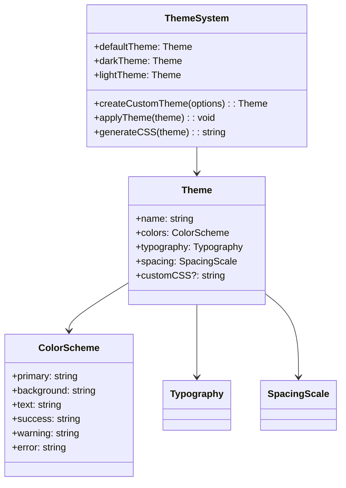

# Component: Theme System

## Overview

The theme system provides comprehensive visual customization for the markdown documentation viewer through CSS custom properties, predefined themes, and runtime theme switching capabilities.

## Architecture



## Built-in Themes

### Default Theme

A clean, modern light theme optimized for readability.

```typescript
export const defaultTheme: Theme = {
  name: 'default',
  colors: {
    primary: '#3b82f6',
    secondary: '#6366f1',
    background: '#ffffff',
    surface: '#f8fafc',
    text: '#1f2937',
    textSecondary: '#6b7280',
    textMuted: '#9ca3af',
    success: '#10b981',
    warning: '#f59e0b',
    error: '#ef4444',
    info: '#3b82f6',
    link: '#3b82f6',
    linkHover: '#2563eb',
    border: '#e5e7eb',
    borderLight: '#f3f4f6',
  },
  typography: {
    bodyFont: '-apple-system, BlinkMacSystemFont, "Segoe UI", system-ui, sans-serif',
    headingFont: '-apple-system, BlinkMacSystemFont, "Segoe UI", system-ui, sans-serif',
    codeFont: '"SF Mono", Monaco, "Cascadia Code", "Roboto Mono", monospace',
    fontSize: {
      xs: '0.75rem',
      sm: '0.875rem',
      base: '1rem',
      lg: '1.125rem',
      xl: '1.25rem',
      '2xl': '1.5rem',
      '3xl': '1.875rem',
    },
    lineHeight: {
      tight: 1.25,
      normal: 1.5,
      relaxed: 1.75,
    },
  },
  spacing: {
    xs: '0.25rem',
    sm: '0.5rem',
    md: '1rem',
    lg: '1.5rem',
    xl: '2rem',
    '2xl': '3rem',
  },
};
```

### Dark Theme

A dark theme optimized for low-light environments.

```typescript
export const darkTheme: Theme = {
  name: 'dark',
  colors: {
    primary: '#60a5fa',
    secondary: '#818cf8',
    background: '#111827',
    surface: '#1f2937',
    text: '#f9fafb',
    textSecondary: '#d1d5db',
    textMuted: '#9ca3af',
    success: '#34d399',
    warning: '#fbbf24',
    error: '#f87171',
    info: '#60a5fa',
    link: '#60a5fa',
    linkHover: '#93c5fd',
    border: '#374151',
    borderLight: '#4b5563',
  },
  // Typography and spacing inherit from default
  ...defaultTheme.typography,
  ...defaultTheme.spacing,
};
```

## Theme Creation

### createCustomTheme()

Helper function for creating custom themes with partial overrides.

```typescript
export function createCustomTheme(options: Partial<Theme>): Theme {
  return {
    name: options.name || 'custom',
    colors: {
      ...defaultTheme.colors,
      ...options.colors,
    },
    typography: {
      ...defaultTheme.typography,
      ...options.typography,
    },
    spacing: {
      ...defaultTheme.spacing,
      ...options.spacing,
    },
    customCSS: options.customCSS,
  };
}
```

### Theme Validation

Ensures theme objects are valid and complete.

```typescript
export function validateTheme(theme: Theme): ValidationResult {
  const errors: string[] = [];
  const warnings: string[] = [];

  // Required properties
  if (!theme.name) errors.push('Theme name is required');
  if (!theme.colors) errors.push('Theme colors are required');

  // Color validation
  const requiredColors = ['primary', 'background', 'text'];
  requiredColors.forEach(color => {
    if (!theme.colors[color]) {
      errors.push(`Color '${color}' is required`);
    } else if (!isValidColor(theme.colors[color])) {
      errors.push(`Color '${color}' has invalid format`);
    }
  });

  return { valid: errors.length === 0, errors, warnings };
}
```

## CSS Generation

### CSS Custom Properties

Themes are applied using CSS custom properties for dynamic updates.

```typescript
export function generateThemeCSS(theme: Theme): string {
  const cssVars = Object.entries(theme.colors)
    .map(([key, value]) => `--mdv-${kebabCase(key)}: ${value};`)
    .join('\n  ');

  const typographyVars = Object.entries(theme.typography)
    .map(([key, value]) => `--mdv-${kebabCase(key)}: ${value};`)
    .join('\n  ');

  return `
.mdv-app {
  /* Color variables */
  ${cssVars}
  
  /* Typography variables */
  ${typographyVars}
  
  /* Custom CSS */
  ${theme.customCSS || ''}
}`;
}
```

### Component Styling

How components use theme variables.

```css
/* Button component using theme variables */
.mdv-button {
  background-color: var(--mdv-primary);
  color: var(--mdv-text);
  font-family: var(--mdv-body-font);
  padding: var(--mdv-sm) var(--mdv-md);
  border-radius: var(--mdv-border-radius);
  border: 1px solid var(--mdv-border);
}

.mdv-button:hover {
  background-color: var(--mdv-primary-hover, var(--mdv-primary));
  border-color: var(--mdv-border-light);
}

/* Content area styling */
.mdv-content {
  background-color: var(--mdv-background);
  color: var(--mdv-text);
  font-family: var(--mdv-body-font);
  font-size: var(--mdv-font-size-base);
  line-height: var(--mdv-line-height-normal);
}
```

## Theme Switching

### Runtime Theme Changes

Themes can be changed dynamically without page reload.

```typescript
export function applyTheme(theme: Theme, container: HTMLElement): void {
  // Generate CSS
  const css = generateThemeCSS(theme);

  // Update or create style element
  let styleElement = container.querySelector('#mdv-theme-styles') as HTMLStyleElement;
  if (!styleElement) {
    styleElement = document.createElement('style');
    styleElement.id = 'mdv-theme-styles';
    container.appendChild(styleElement);
  }

  styleElement.textContent = css;

  // Update data attribute for theme-specific styles
  container.setAttribute('data-theme', theme.name);

  // Emit theme change event
  container.dispatchEvent(
    new CustomEvent('theme-change', {
      detail: { theme },
      bubbles: true,
    })
  );
}
```

## Integration Examples

### Basic Theme Usage

```typescript
import { createViewer, darkTheme } from '@austinorphan/markdown-docs-viewer';

const viewer = createViewer({
  container: '#docs',
  theme: darkTheme,
  source: {
    /* ... */
  },
});
```

### Custom Theme Creation

```typescript
import { createViewer, createCustomTheme } from '@austinorphan/markdown-docs-viewer';

const brandTheme = createCustomTheme({
  name: 'brand',
  colors: {
    primary: '#007acc',
    background: '#fafafa',
    text: '#333333',
  },
  typography: {
    bodyFont: '"Inter", system-ui, sans-serif',
    headingFont: '"Inter", system-ui, sans-serif',
  },
  customCSS: `
    .mdv-nav-link {
      font-weight: 500;
    }
    .mdv-content h1 {
      border-bottom: 2px solid var(--mdv-primary);
    }
  `,
});

const viewer = createViewer({
  container: '#docs',
  theme: brandTheme,
  source: {
    /* ... */
  },
});
```

### Dynamic Theme Switching

```typescript
// Theme switcher component
const themeSwitcher = document.createElement('select');
themeSwitcher.innerHTML = `
  <option value="default">Light</option>
  <option value="dark">Dark</option>
  <option value="custom">Brand</option>
`;

themeSwitcher.addEventListener('change', e => {
  const themeName = (e.target as HTMLSelectElement).value;
  const theme = getThemeByName(themeName);
  viewer.setTheme(theme);
});
```

## Accessibility Considerations

### Color Contrast

All themes must meet WCAG accessibility standards.

```typescript
export function validateColorContrast(theme: Theme): AccessibilityResult {
  const issues: string[] = [];

  // Check text on background
  const textContrast = calculateContrast(theme.colors.text, theme.colors.background);
  if (textContrast < 4.5) {
    issues.push('Text color does not meet contrast requirements');
  }

  // Check primary color accessibility
  const primaryContrast = calculateContrast('#ffffff', theme.colors.primary);
  if (primaryContrast < 3) {
    issues.push('Primary color may not be accessible for white text');
  }

  return {
    compliant: issues.length === 0,
    issues,
    score: calculateAccessibilityScore(theme),
  };
}
```

### Prefers-Color-Scheme Support

Automatic theme detection based on user preferences.

```typescript
export function detectPreferredTheme(): 'light' | 'dark' {
  if (typeof window !== 'undefined' && window.matchMedia) {
    return window.matchMedia('(prefers-color-scheme: dark)').matches ? 'dark' : 'light';
  }
  return 'light';
}

// Auto-apply preferred theme
export function applyPreferredTheme(container: HTMLElement): void {
  const preference = detectPreferredTheme();
  const theme = preference === 'dark' ? darkTheme : defaultTheme;
  applyTheme(theme, container);
}
```

## Performance Optimizations

- **CSS Variable Caching**: Cache generated CSS to avoid regeneration
- **Minimal DOM Updates**: Only update changed CSS variables
- **Lazy Loading**: Load theme CSS only when needed
- **Preloading**: Preload popular themes for instant switching

## Testing Considerations

- **Color Validation**: Test that all colors are valid CSS values
- **CSS Generation**: Verify generated CSS is syntactically correct
- **Theme Switching**: Test smooth transitions between themes
- **Accessibility**: Validate color contrast ratios
- **Browser Compatibility**: Test CSS custom property support

## Future Enhancements

- **Theme Marketplace**: Repository of community-created themes
- **Theme Builder UI**: Visual interface for creating custom themes
- **CSS-in-JS Support**: Alternative to CSS custom properties
- **Theme Animations**: Smooth transitions during theme changes
- **Theme Inheritance**: Support for theme composition and inheritance
