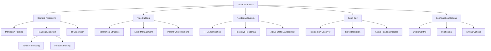

# Table of Contents Component

## Overview

The `TableOfContents` class generates and manages interactive table of contents for markdown documents. It provides hierarchical navigation, scroll spy functionality, and customizable positioning options.

## Architecture



## Class Structure

### Constructor

```typescript
constructor(options: TableOfContentsOptions = {})
```

### Configuration Options

```typescript
interface TableOfContentsOptions {
  enabled?: boolean; // Enable/disable TOC
  maxDepth?: number; // Maximum heading depth (1-6)
  sticky?: boolean; // Sticky positioning
  scrollSpy?: boolean; // Auto-highlight current section
  collapsible?: boolean; // Collapsible sections
  position?: 'right' | 'left' | 'inline'; // TOC position
}
```

**Default Values:**

- `enabled`: `true`
- `maxDepth`: `3`
- `sticky`: `true`
- `scrollSpy`: `true`
- `collapsible`: `false`
- `position`: `'right'`

## Core Features

### 1. Content Analysis

**Heading Extraction:**

```typescript
generate(content: string): TOCItem[] {
  this.headings = [];
  let tokens: Token[] = [];

  try {
    // Use marked.js lexer for token extraction
    tokens = marked.lexer(content);
    this.extractHeadings(tokens);
  } catch {
    // Fallback to manual parsing
    this.parseHeadingsManually(content);
  }

  return this.buildTree();
}
```

**Token Processing:**

```typescript
private extractHeadings(tokens: Token[]): void {
  for (const token of tokens) {
    if (token.type === 'heading' && token.depth <= this.options.maxDepth!) {
      const id = this.generateId(token.text);
      this.headings.push({
        id,
        text: token.text,
        level: token.depth,
        children: [],
      });
    }
  }
}
```

**Fallback Parsing:**

```typescript
private parseHeadingsManually(content: string): void {
  const lines = content.split('\n');

  for (const line of lines) {
    if (line.startsWith('#')) {
      const hashMatch = line.match(/^#{1,6}/);
      if (hashMatch) {
        const level = hashMatch[0].length;
        const text = line.slice(level).trim();

        if (text.length > 0 && level <= this.options.maxDepth!) {
          const id = this.generateId(text);
          this.headings.push({ level, text, id, children: [] });
        }
      }
    }
  }
}
```

### 2. Hierarchical Tree Building

**Tree Structure:**

```typescript
interface TOCItem {
  id: string;
  text: string;
  level: number;
  children: TOCItem[];
}
```

**Tree Construction Algorithm:**

```typescript
private buildTree(): TOCItem[] {
  const tree: TOCItem[] = [];
  const stack: TOCItem[] = [];

  for (const heading of this.headings) {
    // Find appropriate parent
    while (stack.length > 0 && stack[stack.length - 1].level >= heading.level) {
      stack.pop();
    }

    if (stack.length === 0) {
      tree.push(heading); // Top-level heading
    } else {
      const parent = stack[stack.length - 1];
      parent.children.push(heading); // Child heading
    }

    stack.push(heading);
  }

  return tree;
}
```

**Features:**

- Automatic parent-child relationship detection
- Handles irregular heading structures
- Maintains document order
- Supports any heading depth configuration

### 3. ID Generation System

**Unique ID Creation:**

```typescript
private generateId(text: string): string {
  const id = text
    .toLowerCase()
    .replace(/[^\w\s-]/g, '')    // Remove special characters
    .replace(/\s+/g, '-')        // Replace spaces with hyphens
    .replace(/-+/g, '-')         // Collapse multiple hyphens
    .trim();

  // Ensure uniqueness
  let counter = 1;
  let uniqueId = id;
  while (this.headings.some(h => h.id === uniqueId)) {
    uniqueId = `${id}-${counter}`;
    counter++;
  }

  return uniqueId;
}
```

**ID Features:**

- URL-safe character conversion
- Automatic uniqueness enforcement
- Incremental numbering for duplicates
- Consistent transformation rules

### 4. Rendering System

**HTML Generation:**

```typescript
render(): string {
  if (!this.options.enabled || this.headings.length === 0) {
    return '';
  }

  const position = this.options.position;
  const sticky = this.options.sticky ? 'mdv-toc-sticky' : '';
  const collapsible = this.options.collapsible ? 'mdv-toc-collapsible' : '';

  return `
    <nav class="mdv-toc mdv-toc-${position} ${sticky} ${collapsible}"
         role="navigation"
         aria-label="Table of contents">
      <h2 class="mdv-toc-title">Table of Contents</h2>
      ${this.renderTree(this.buildTree())}
    </nav>
  `;
}
```

**Recursive Tree Rendering:**

```typescript
private renderTree(items: TOCItem[], level: number = 1): string {
  if (items.length === 0) return '';

  const listItems = items.map(item => {
    const hasChildren = item.children.length > 0;
    const active = item.id === this.activeId ? 'mdv-toc-active' : '';

    return `
      <li class="mdv-toc-item mdv-toc-level-${level} ${active}">
        <a href="#${item.id}" class="mdv-toc-link" data-toc-id="${item.id}">
          ${item.text}
        </a>
        ${hasChildren ? this.renderTree(item.children, level + 1) : ''}
      </li>
    `;
  }).join('');

  return `<ul class="mdv-toc-list mdv-toc-list-${level}">${listItems}</ul>`;
}
```

### 5. Scroll Spy System

**Intersection Observer Setup:**

```typescript
initScrollSpy(container: HTMLElement): void {
  if (!this.options.scrollSpy || !this.options.enabled) return;

  const headingElements: HTMLElement[] = [];

  // Collect heading elements
  this.headings.forEach(heading => {
    const element = container.querySelector(`#${heading.id}`) as HTMLElement;
    if (element) headingElements.push(element);
  });

  // Create intersection observer
  const observer = new IntersectionObserver(entries => {
    entries.forEach(entry => {
      if (entry.isIntersecting) {
        this.setActiveHeading(entry.target.id);
      }
    });
  }, {
    rootMargin: '-20% 0% -70% 0%',
    threshold: 0
  });

  // Observe all headings
  headingElements.forEach(element => observer.observe(element));
}
```

**Active State Management:**

```typescript
private setActiveHeading(id: string): void {
  this.activeId = id;

  // Update DOM active states
  document.querySelectorAll('.mdv-toc-link').forEach(link => {
    link.classList.remove('mdv-toc-active');
    if (link.getAttribute('data-toc-id') === id) {
      link.classList.add('mdv-toc-active');

      // Ensure active item is visible
      if (this.options.sticky) {
        link.scrollIntoView({ behavior: 'smooth', block: 'center' });
      }
    }
  });
}
```

## Usage Examples

### Basic Table of Contents

```typescript
import { TableOfContents } from './toc';

// Create TOC instance
const toc = new TableOfContents({
  maxDepth: 3,
  sticky: true,
  scrollSpy: true,
});

// Generate from markdown content
const tocItems = toc.generate(markdownContent);

// Render HTML
const tocHtml = toc.render();
document.getElementById('toc-container').innerHTML = tocHtml;

// Initialize scroll spy
toc.initScrollSpy(contentContainer);
```

### Customized Configuration

```typescript
// Right-sidebar TOC with collapsible sections
const sidebarToc = new TableOfContents({
  position: 'right',
  maxDepth: 4,
  collapsible: true,
  sticky: true,
  scrollSpy: true,
});

// Inline TOC without scroll spy
const inlineToc = new TableOfContents({
  position: 'inline',
  maxDepth: 2,
  sticky: false,
  scrollSpy: false,
});

// Minimal TOC for mobile
const mobileToc = new TableOfContents({
  maxDepth: 2,
  collapsible: true,
  position: 'inline',
});
```

### Integration with Content Processing

```typescript
// Add heading IDs to HTML content
import { addHeadingIds } from './toc';

const processedHtml = addHeadingIds(htmlContent);

// Generate TOC from processed content
const toc = new TableOfContents();
const tocItems = toc.generate(markdownSource);
```

## Styling System

### CSS Classes

**Container Classes:**

- `.mdv-toc`: Main TOC container
- `.mdv-toc-sticky`: Sticky positioning
- `.mdv-toc-right`: Right-side positioning
- `.mdv-toc-left`: Left-side positioning
- `.mdv-toc-inline`: Inline positioning

**Content Classes:**

- `.mdv-toc-title`: TOC heading
- `.mdv-toc-list`: List containers
- `.mdv-toc-item`: Individual TOC items
- `.mdv-toc-link`: TOC links
- `.mdv-toc-active`: Active/current item

**Responsive Classes:**

- Level-specific styling (`.mdv-toc-level-1`, `.mdv-toc-level-2`, etc.)
- Mobile-responsive adjustments
- Print-friendly styles

### Default Styles

```css
.mdv-toc {
  padding: 1rem;
  background: var(--mdv-surface);
  border-radius: var(--mdv-border-radius);
  max-height: calc(100vh - 200px);
  overflow-y: auto;
}

.mdv-toc-sticky {
  position: sticky;
  top: 1rem;
}

.mdv-toc-link {
  display: block;
  padding: 0.25rem 0.5rem;
  color: var(--mdv-text-secondary);
  text-decoration: none;
  border-radius: 0.25rem;
  transition: all 0.2s ease;
}

.mdv-toc-link.mdv-toc-active {
  color: var(--mdv-primary);
  font-weight: 500;
  background: var(--mdv-background);
}
```

## Accessibility Features

### Semantic HTML

- Proper `<nav>` element with `role="navigation"`
- Hierarchical list structure (`<ul>`, `<ol>`, `<li>`)
- Meaningful link text
- ARIA labels and descriptions

### Keyboard Navigation

- Tab navigation through all links
- Enter/Space activation
- Focus indicators
- Skip links for screen readers

### Screen Reader Support

- Descriptive ARIA labels
- Landmark navigation
- List structure announcement
- Current position indication

## Performance Considerations

### Optimization Features

1. **Lazy Initialization**: TOC only generated when needed
2. **Efficient Parsing**: Fallback parsing for marked.js failures
3. **Minimal DOM Queries**: Cached element references
4. **Throttled Updates**: Debounced scroll event handling

### Memory Management

```typescript
// Intersection Observer cleanup
private observers: IntersectionObserver[] = [];

destroy(): void {
  this.observers.forEach(observer => observer.disconnect());
  this.observers = [];
}
```

### Large Document Handling

```typescript
// Limit TOC depth for performance
private limitTocSize(headings: TOCItem[]): TOCItem[] {
  const MAX_ITEMS = 100;

  if (this.getTotalItems(headings) > MAX_ITEMS) {
    return this.truncateHeadings(headings, MAX_ITEMS);
  }

  return headings;
}
```

## Integration with Viewer

### Viewer Integration

```typescript
class MarkdownDocsViewer {
  private toc: TableOfContents;

  private initializeTOC(): void {
    this.toc = new TableOfContents(this.config.toc || {});

    // Generate TOC when document loads
    this.on('documentLoad', (doc, content) => {
      const tocItems = this.toc.generate(content);
      this.updateTOCDisplay(tocItems);
    });
  }

  private updateTOCDisplay(items: TOCItem[]): void {
    const tocContainer = this.container.querySelector('.mdv-toc-container');
    if (tocContainer) {
      tocContainer.innerHTML = this.toc.render();
      this.toc.initScrollSpy(this.contentContainer);
    }
  }
}
```

## Error Handling

### Parsing Errors

```typescript
// Safe markdown parsing with fallback
try {
  tokens = marked.lexer(content);
  this.extractHeadings(tokens);
} catch (error) {
  console.warn('Marked lexer failed, using fallback parser:', error);
  this.parseHeadingsManually(content);
}
```

### DOM Errors

```typescript
// Safe DOM operations
private safeQuerySelector(selector: string): HTMLElement | null {
  try {
    return document.querySelector(selector);
  } catch (error) {
    console.warn('Invalid CSS selector:', selector);
    return null;
  }
}
```

## Browser Compatibility

### Modern Features

- Intersection Observer API (with fallback)
- CSS sticky positioning (with fallback)
- Modern JavaScript features (ES2018+)

### Fallback Support

- Manual scroll event handling
- Absolute positioning fallback
- Polyfills for older browsers

## Testing Considerations

### Unit Tests

- Heading extraction accuracy
- Tree building logic
- ID generation uniqueness
- HTML rendering correctness
- Active state management

### Integration Tests

- Scroll spy functionality
- Viewer integration
- Theme integration
- Responsive behavior
- Accessibility compliance

### Performance Tests

- Large document handling
- Memory usage optimization
- Scroll event performance
- Rendering speed benchmarks
