# Types Component

## Overview

The Types component defines the complete TypeScript interface system for the Markdown Documentation Viewer, providing type safety, configuration validation, and comprehensive API contracts for all viewer functionality.

## Architecture

```mermaid
graph TB
    TS[Types System] --> CC[Core Components]
    TS --> CF[Configuration]
    TS --> ST[State Management]
    TS --> EX[Export System]
    TS --> I18[Internationalization]
    TS --> ADV[Advanced Features]

    CC --> DOC[Document Interface]
    CC --> SRC[Document Source]
    CC --> THM[Theme Interface]

    CF --> DCF[Documentation Config]
    CF --> SO[Search Options]
    CF --> NO[Navigation Options]
    CF --> RO[Render Options]
    CF --> EHO[Error Handling Options]
    CF --> PO[Performance Options]
    CF --> MO[Mobile Options]

    ST --> VS[Viewer State]

    EX --> EF[Export Format]
    EX --> EO[Export Options]

    I18 --> IC[I18n Config]
    I18 --> IM[I18n Messages]

    ADV --> ASO[Advanced Search Options]
    ADV --> TOC[Table of Contents Options]
```



## Core Interfaces

### 1. Document Interface

**Purpose**: Defines the structure of documentation files

```typescript
export interface Document {
  id: string; // Unique identifier
  title: string; // Display title
  file?: string; // Source file path
  content?: string; // Loaded markdown content
  description?: string; // Optional description
  category?: string; // Grouping category
  tags?: string[]; // Searchable tags
  order?: number; // Display order
}
```

**Key Features**:

- **Unique Identification**: `id` field for routing and referencing
- **Flexible Content**: Supports both file-based and inline content
- **Metadata Rich**: Category, tags, and description for organization
- **Ordering Support**: Optional order field for custom sorting

### 2. Document Source Interface

**Purpose**: Configures document loading strategy

```typescript
export interface DocumentSource {
  type: 'local' | 'url' | 'github' | 'content';
  basePath?: string; // Base path for local files
  baseUrl?: string; // Base URL for remote files
  documents: Document[]; // Document list
  headers?: Record<string, string>; // Custom headers for requests
}
```

**Source Types**:

- **local**: Files served by web server with basePath
- **url**: Remote files accessed via HTTP with optional headers
- **github**: GitHub repository files with API access
- **content**: Inline markdown content without file references

### 3. Theme Interface

**Purpose**: Comprehensive theming system configuration

```typescript
export interface Theme {
  name: string;
  colors: {
    primary: string; // Brand primary color
    secondary: string; // Brand secondary color
    background: string; // Page background
    surface: string; // Component surfaces
    text: string; // Default text color
    textPrimary: string; // Primary text (headings)
    textLight: string; // Lighter text variant
    textSecondary: string; // Secondary text
    border: string; // Border color
    code: string; // Code text color
    codeBackground: string; // Code block background
    link: string; // Link color
    linkHover: string; // Link hover color
    error: string; // Error state color
    warning: string; // Warning state color
    success: string; // Success state color
  };
  fonts: {
    body: string; // Body text font stack
    heading: string; // Heading font stack
    code: string; // Code font stack
  };
  spacing: {
    unit: number; // Base spacing unit (px)
    containerMaxWidth: string; // Content max width
    sidebarWidth: string; // Sidebar width
  };
  borderRadius: string; // Global border radius
  customCSS?: string; // Additional custom CSS

  // Theme management options
  enablePersistence?: boolean; // Save theme preference
  storageKey?: string; // LocalStorage key
  switcherPosition?: 'header' | 'footer' | 'sidebar' | 'floating';
  showPreview?: boolean; // Show theme preview
  showDescription?: boolean; // Show theme description
  allowCustomThemes?: boolean; // Allow user custom themes
  darkTogglePosition?: 'header' | 'footer' | 'floating';
  showDarkModeLabel?: boolean; // Show dark mode label
  compactDarkToggle?: boolean; // Use compact toggle
}
```

## Configuration Interfaces

### 1. Search Options

**Purpose**: Search functionality configuration

```typescript
export interface SearchOptions {
  enabled: boolean; // Enable search feature
  placeholder?: string; // Search input placeholder
  caseSensitive?: boolean; // Case-sensitive search
  fuzzySearch?: boolean; // Fuzzy matching
  searchInTags?: boolean; // Include tags in search
  maxResults?: number; // Maximum results to show
}
```

### 2. Navigation Options

**Purpose**: Navigation behavior configuration

```typescript
export interface NavigationOptions {
  showCategories: boolean; // Show category grouping
  showTags: boolean; // Display document tags
  collapsible: boolean; // Collapsible categories
  showDescription: boolean; // Show document descriptions
  sortBy?: 'title' | 'order' | 'date'; // Sorting strategy
}
```

### 3. Render Options

**Purpose**: Content rendering configuration

```typescript
export interface RenderOptions {
  syntaxHighlighting: boolean; // Enable code highlighting
  highlightTheme?: string; // Highlight.js theme
  copyCodeButton: boolean; // Add copy buttons to code
  linkTarget?: '_blank' | '_self'; // Link target behavior
  sanitizeHtml?: boolean; // HTML sanitization
  customRenderers?: Record<string, (content: string) => string>;
}
```

### 4. Error Handling Options

**Purpose**: Error management configuration

```typescript
export interface ErrorHandlingOptions {
  retryConfig?: {
    maxAttempts?: number; // Maximum retry attempts
    baseDelay?: number; // Base delay between retries
    maxDelay?: number; // Maximum delay cap
    exponentialBackoff?: boolean; // Use exponential backoff
  };
  gracefulDegradation?: boolean; // Graceful failure handling
  showErrorDetails?: boolean; // Show detailed error info
  enableErrorLogging?: boolean; // Enable error logging
  customErrorMessages?: Record<string, string>; // Custom messages
}
```

### 5. Performance Options

**Purpose**: Performance optimization configuration

```typescript
export interface PerformanceOptions {
  cacheSize?: number; // Cache size limit
  enablePersistentCache?: boolean; // Persistent caching
  enablePerformanceMonitoring?: boolean; // Performance metrics
  enableMemoryManagement?: boolean; // Memory optimization
  preloadStrategy?: 'none' | 'visible' | 'adjacent' | 'all';
  lazyLoading?: {
    enabled?: boolean; // Enable lazy loading
    threshold?: number; // Loading threshold (px)
    rootMargin?: string; // Intersection observer margin
  };
  searchOptions?: {
    debounceDelay?: number; // Search input debounce
    indexUpdateThrottle?: number; // Index update throttle
    cacheSearchResults?: boolean; // Cache search results
  };
}
```

### 6. Mobile Options

**Purpose**: Mobile optimization configuration

```typescript
export interface MobileOptions {
  enabled?: boolean; // Enable mobile optimizations
  breakpoints?: {
    xs?: number; // Extra small devices
    sm?: number; // Small devices
    md?: number; // Medium devices
    lg?: number; // Large devices
    xl?: number; // Extra large devices
    xxl?: number; // Extra extra large devices
  };
  touchTargets?: {
    minimum?: number; // Minimum touch target size
    comfortable?: number; // Comfortable touch target size
    large?: number; // Large touch target size
  };
  typography?: {
    baseFontSize?: {
      xs?: number;
      sm?: number;
      md?: number;
      lg?: number;
      xl?: number;
      xxl?: number;
    };
    lineHeight?: {
      tight?: number; // Tight line height
      normal?: number; // Normal line height
      relaxed?: number; // Relaxed line height
    };
    scaleRatio?: number; // Typography scale ratio
  };
  navigation?: {
    swipeGestures?: boolean; // Enable swipe gestures
    collapseBehavior?: 'overlay' | 'push' | 'reveal';
    showBackdrop?: boolean; // Show backdrop overlay
    closeOnOutsideClick?: boolean; // Close on outside click
  };
  gestures?: {
    swipeToNavigate?: boolean; // Swipe navigation
    pinchToZoom?: boolean; // Pinch to zoom
    doubleTapToZoom?: boolean; // Double tap zoom
    swipeThreshold?: number; // Swipe sensitivity
  };
  layout?: {
    containerPadding?: number; // Container padding
    contentSpacing?: number; // Content spacing
    borderRadius?: number; // Border radius
  };
  performance?: {
    enableTouchOptimizations?: boolean; // Touch optimizations
    preventDefaultTouch?: boolean; // Prevent default touch
    optimizeScrolling?: boolean; // Scroll optimizations
  };
}
```

## Main Configuration Interface

### DocumentationConfig

**Purpose**: Master configuration interface for the entire viewer

```typescript
export interface DocumentationConfig {
  // Required configuration
  container: string | HTMLElement; // Target container
  source: DocumentSource; // Document source config

  // Optional configuration
  theme?: Theme; // Theme configuration
  search?: SearchOptions; // Search configuration
  navigation?: NavigationOptions; // Navigation configuration
  render?: RenderOptions; // Rendering configuration
  errorHandling?: ErrorHandlingOptions; // Error handling
  performance?: PerformanceOptions; // Performance optimization
  mobile?: MobileOptions; // Mobile configuration

  // Display configuration
  title?: string; // Viewer title
  logo?: string; // Logo URL
  footer?: string; // Footer content

  // Callback configuration
  onDocumentLoad?: (doc: Document) => void; // Document load callback
  onError?: (error: Error) => void; // Error callback
  onPerformanceMetrics?: (metrics: Record<string, any>) => void;
  onThemeChange?: (theme: Theme) => void; // Theme change callback

  // Global options
  responsive?: boolean; // Enable responsive design
  routing?: 'hash' | 'memory' | 'none'; // Routing strategy
}
```

## State Management Interface

### ViewerState

**Purpose**: Defines the internal state structure of the viewer

```typescript
export interface ViewerState {
  currentDocument: Document | null; // Currently displayed document
  documents: Document[]; // All loaded documents
  searchQuery: string; // Current search query
  searchResults: Document[]; // Search results
  loading: boolean; // Loading state
  error: Error | null; // Error state
  sidebarOpen: boolean; // Sidebar visibility (mobile)
}
```

**State Properties**:

- **currentDocument**: The document being displayed
- **documents**: Complete document collection
- **searchQuery**: Active search string
- **searchResults**: Filtered search results
- **loading**: Loading indicator state
- **error**: Error information for display
- **sidebarOpen**: Mobile sidebar toggle state

## Export System Interfaces

### Export Options

**Purpose**: Configuration for document export functionality

```typescript
export type ExportFormat = 'pdf' | 'html';

export interface ExportOptions {
  format: ExportFormat; // Export format
  documentIds?: string[]; // Specific documents to export
  filename?: string; // Output filename
  title?: string; // Export title
  includeTheme?: boolean; // Include theme styling
  includeTOC?: boolean; // Include table of contents
  embedAssets?: boolean; // Embed external assets
  locale?: string; // Export locale
  pdfOptions?: {
    format?: 'a4' | 'a3' | 'letter' | 'legal';
    orientation?: 'portrait' | 'landscape';
    margin?:
      | number
      | {
          top?: number;
          right?: number;
          bottom?: number;
          left?: number;
        };
  };
}
```

## Internationalization Interfaces

### I18n Configuration

**Purpose**: Internationalization support configuration

```typescript
export interface I18nConfig {
  locale: string; // Current locale
  fallbackLocale?: string; // Fallback locale
  messages: Record<string, I18nMessages>; // Locale messages
}

export interface I18nMessages {
  [key: string]: string | I18nMessages; // Nested message structure
}
```

## Advanced Feature Interfaces

### Advanced Search Options

**Purpose**: Extended search functionality configuration

```typescript
export interface AdvancedSearchOptions extends SearchOptions {
  filters?: {
    categories?: string[]; // Category filters
    tags?: string[]; // Tag filters
    dateRange?: {
      from?: Date; // Date range start
      to?: Date; // Date range end
    };
  };
  highlighting?: boolean; // Result highlighting
  searchHistory?: boolean; // Search history
  maxHistoryItems?: number; // History item limit
}
```

### Table of Contents Options

**Purpose**: Table of contents functionality configuration

```typescript
export interface TableOfContentsOptions {
  enabled?: boolean; // Enable TOC
  maxDepth?: number; // Maximum heading depth
  sticky?: boolean; // Sticky positioning
  scrollSpy?: boolean; // Scroll spy functionality
  collapsible?: boolean; // Collapsible sections
  position?: 'left' | 'right' | 'inline'; // TOC position
}
```

## Type Utility Patterns

### Generic Type Helpers

**Partial Configuration Updates**:

```typescript
type PartialConfig = Partial<DocumentationConfig>;
type RequiredConfig = Required<Pick<DocumentationConfig, 'container' | 'source'>>;
```

**State Updates**:

```typescript
type StateUpdate = Partial<ViewerState>;
type LoadingState = Pick<ViewerState, 'loading' | 'error'>;
```

**Theme Customization**:

```typescript
type ThemeOverrides = Partial<Theme>;
type ColorOverrides = Partial<Theme['colors']>;
type FontOverrides = Partial<Theme['fonts']>;
```

## Integration Patterns

### Configuration Validation

```typescript
function validateConfig(config: DocumentationConfig): Required<DocumentationConfig> {
  // Validate required fields
  if (!config.container) {
    throw new Error('Container is required');
  }

  if (!config.source) {
    throw new Error('Document source is required');
  }

  // Merge with defaults
  return {
    ...defaultConfig,
    ...config,
  };
}
```

### Type Guards

```typescript
function isDocument(obj: any): obj is Document {
  return obj && typeof obj.id === 'string' && typeof obj.title === 'string';
}

function isLocalSource(source: DocumentSource): source is DocumentSource & { type: 'local' } {
  return source.type === 'local';
}

function isGitHubSource(source: DocumentSource): source is DocumentSource & { type: 'github' } {
  return source.type === 'github';
}
```

### State Management Helpers

```typescript
function createInitialState(): ViewerState {
  return {
    currentDocument: null,
    documents: [],
    searchQuery: '',
    searchResults: [],
    loading: false,
    error: null,
    sidebarOpen: false,
  };
}

function updateState(currentState: ViewerState, updates: StateUpdate): ViewerState {
  return {
    ...currentState,
    ...updates,
  };
}
```

## Theme Type Utilities

### Theme Builder Helpers

```typescript
function createTheme(base: Theme, overrides: ThemeOverrides): Theme {
  return {
    ...base,
    ...overrides,
    colors: {
      ...base.colors,
      ...overrides.colors,
    },
    fonts: {
      ...base.fonts,
      ...overrides.fonts,
    },
    spacing: {
      ...base.spacing,
      ...overrides.spacing,
    },
  };
}

function validateTheme(theme: Theme): boolean {
  const requiredColors = [
    'primary',
    'secondary',
    'background',
    'surface',
    'text',
    'textPrimary',
    'textSecondary',
    'textLight',
    'border',
    'code',
    'codeBackground',
    'link',
    'linkHover',
    'error',
    'warning',
    'success',
  ];

  return requiredColors.every(color => theme.colors[color as keyof Theme['colors']]);
}
```

## Error Type Integration

### Error Type Extensions

```typescript
interface ViewerError extends Error {
  code: string;
  severity: 'low' | 'medium' | 'high' | 'critical';
  retryable: boolean;
  context?: Record<string, any>;
}

interface DocumentLoadError extends ViewerError {
  documentId: string;
  sourceType: DocumentSource['type'];
}

interface ThemeError extends ViewerError {
  themeName: string;
  themeProperty?: string;
}
```

## Testing Type Utilities

### Mock Type Generators

```typescript
function createMockDocument(overrides: Partial<Document> = {}): Document {
  return {
    id: 'mock-doc-1',
    title: 'Mock Document',
    content: '# Mock Content',
    ...overrides,
  };
}

function createMockConfig(overrides: Partial<DocumentationConfig> = {}): DocumentationConfig {
  return {
    container: '#mock-container',
    source: {
      type: 'content',
      documents: [createMockDocument()],
    },
    ...overrides,
  };
}

function createMockState(overrides: Partial<ViewerState> = {}): ViewerState {
  return {
    ...createInitialState(),
    ...overrides,
  };
}
```

## Performance Considerations

### Type Optimization

**Efficient Type Checking**:

- Use type guards instead of runtime checks where possible
- Leverage TypeScript's built-in utility types
- Minimize deep nested type checking

**Memory Management**:

- Use readonly modifiers for immutable data
- Implement proper state update patterns
- Avoid circular type references

### Runtime Type Safety

**Configuration Validation**:

```typescript
function validateRuntimeConfig(config: unknown): config is DocumentationConfig {
  // Runtime validation logic
  return (
    typeof config === 'object' && config !== null && 'container' in config && 'source' in config
  );
}
```

## Browser Compatibility

### Type Feature Support

**Modern TypeScript Features**:

- Template literal types (TypeScript 4.1+)
- Utility types (TypeScript 2.1+)
- Conditional types (TypeScript 2.8+)
- Mapped types (TypeScript 2.1+)

**Fallback Patterns**:

- Provide type alternatives for older TypeScript versions
- Use generic constraints for complex type relationships
- Implement progressive type enhancement
