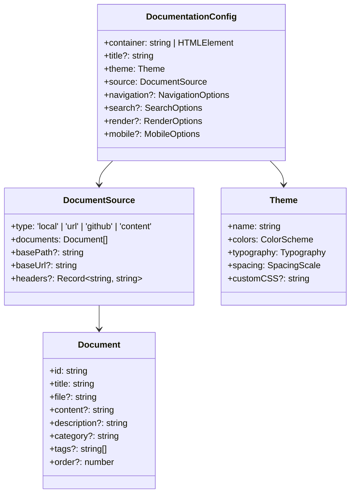

# Component: Type System

## Overview

The types module defines the comprehensive TypeScript interfaces and type definitions that provide type safety and IDE support throughout the entire markdown documentation viewer system. It serves as the contract for all component interactions.

## Architecture



## Core Types

### DocumentationConfig

The main configuration interface that defines all options for the viewer.

```typescript
interface DocumentationConfig {
  // Required: Container element
  container: string | HTMLElement;

  // Optional: Display title
  title?: string;

  // Required: Visual theme
  theme: Theme;

  // Required: Document source configuration
  source: DocumentSource;

  // Optional: Navigation behavior
  navigation?: NavigationOptions;

  // Optional: Search functionality
  search?: SearchOptions;

  // Optional: Rendering options
  render?: RenderOptions;

  // Optional: Mobile responsiveness
  mobile?: MobileOptions;

  // Optional: Event callbacks
  onDocumentLoad?: (document: Document) => void;
  onError?: (error: Error) => void;
  onThemeChange?: (theme: Theme) => void;
}
```

### DocumentSource

Defines how documents are loaded and from where.

```typescript
type DocumentSource =
  | LocalDocumentSource
  | UrlDocumentSource
  | GitHubDocumentSource
  | ContentDocumentSource;

interface LocalDocumentSource {
  type: 'local';
  documents: Document[];
  basePath?: string;
}

interface UrlDocumentSource {
  type: 'url';
  documents: Document[];
  baseUrl?: string;
  headers?: Record<string, string>;
}

interface GitHubDocumentSource {
  type: 'github';
  documents: Document[];
}

interface ContentDocumentSource {
  type: 'content';
  documents: Document[];
}
```

### Document

Represents a single documentation page with metadata.

```typescript
interface Document {
  // Required: Unique identifier
  id: string;

  // Required: Display title
  title: string;

  // Source file path (for external sources)
  file?: string;

  // Inline markdown content
  content?: string;

  // Optional: Short description
  description?: string;

  // Optional: Category for grouping
  category?: string;

  // Optional: Tags for filtering
  tags?: string[];

  // Optional: Sort order
  order?: number;

  // Optional: Metadata
  metadata?: Record<string, unknown>;
}
```

## Theme System Types

### Theme

Complete theme definition with all visual properties.

```typescript
interface Theme {
  name: string;
  colors: ColorScheme;
  typography: Typography;
  spacing: SpacingScale;
  borderRadius?: BorderRadiusScale;
  shadows?: ShadowScale;
  customCSS?: string;
}

interface ColorScheme {
  // Brand colors
  primary: string;
  secondary?: string;

  // Background colors
  background: string;
  surface: string;

  // Text colors
  text: string;
  textSecondary: string;
  textMuted: string;

  // Semantic colors
  success: string;
  warning: string;
  error: string;
  info: string;

  // Interactive colors
  link: string;
  linkHover: string;

  // Border colors
  border: string;
  borderLight: string;
}

interface Typography {
  bodyFont: string;
  headingFont: string;
  codeFont: string;
  fontSize: {
    xs: string;
    sm: string;
    base: string;
    lg: string;
    xl: string;
    '2xl': string;
    '3xl': string;
  };
  lineHeight: {
    tight: number;
    normal: number;
    relaxed: number;
  };
}
```

## Configuration Options Types

### NavigationOptions

Controls sidebar navigation behavior.

```typescript
interface NavigationOptions {
  showCategories?: boolean;
  showTags?: boolean;
  collapsible?: boolean;
  showDescription?: boolean;
  sortBy?: 'title' | 'order' | 'date';
  expandAll?: boolean;
  enableSearch?: boolean;
}
```

### SearchOptions

Configures search functionality.

```typescript
interface SearchOptions {
  enabled?: boolean;
  placeholder?: string;
  caseSensitive?: boolean;
  fuzzySearch?: boolean;
  searchInTags?: boolean;
  searchInContent?: boolean;
  maxResults?: number;
  highlightResults?: boolean;
  debounceMs?: number;
}
```

### RenderOptions

Controls markdown rendering behavior.

```typescript
interface RenderOptions {
  syntaxHighlighting?: boolean;
  highlightTheme?: string;
  copyCodeButton?: boolean;
  linkTarget?: '_blank' | '_self';
  sanitizeHtml?: boolean;
  renderMath?: boolean;
  enableTables?: boolean;
  enableFootnotes?: boolean;
}
```

## State Management Types

### ViewerState

Represents the current state of the viewer.

```typescript
interface ViewerState {
  currentDocument: string | null;
  isLoading: boolean;
  searchQuery: string;
  expandedCategories: Set<string>;
  theme: Theme;
  isMobile: boolean;
  sidebarCollapsed: boolean;
}
```

### NavigationState

Tracks navigation-related state.

```typescript
interface NavigationState {
  currentPath: string;
  history: string[];
  historyIndex: number;
  breadcrumbs: Breadcrumb[];
}

interface Breadcrumb {
  id: string;
  title: string;
  path: string;
}
```

## Event Types

### ViewerEvents

Type-safe event definitions for the viewer.

```typescript
interface ViewerEvents {
  'document:load': { document: Document; content: string };
  'document:error': { documentId: string; error: Error };
  'navigation:change': { from: string | null; to: string };
  'search:query': { query: string; results: SearchResult[] };
  'theme:change': { from: Theme; to: Theme };
  'mobile:toggle': { isMobile: boolean };
  'sidebar:toggle': { collapsed: boolean };
}

// Event emitter interface
interface ViewerEventEmitter {
  on<K extends keyof ViewerEvents>(event: K, listener: (data: ViewerEvents[K]) => void): void;

  off<K extends keyof ViewerEvents>(event: K, listener: (data: ViewerEvents[K]) => void): void;

  emit<K extends keyof ViewerEvents>(event: K, data: ViewerEvents[K]): void;
}
```

## Utility Types

### Generic Helper Types

Common utility types used throughout the system.

```typescript
// Make specific properties optional
type PartialBy<T, K extends keyof T> = Omit<T, K> & Partial<Pick<T, K>>;

// Make specific properties required
type RequiredBy<T, K extends keyof T> = T & Required<Pick<T, K>>;

// Deep partial type
type DeepPartial<T> = {
  [P in keyof T]?: T[P] extends object ? DeepPartial<T[P]> : T[P];
};

// Extract configuration for specific source type
type ConfigForSource<T extends DocumentSource['type']> = DocumentationConfig & {
  source: Extract<DocumentSource, { type: T }>;
};
```

### Search Types

Types specific to search functionality.

```typescript
interface SearchResult {
  document: Document;
  matches: SearchMatch[];
  score: number;
}

interface SearchMatch {
  type: 'title' | 'content' | 'tag' | 'description';
  text: string;
  highlights: TextHighlight[];
}

interface TextHighlight {
  start: number;
  end: number;
  snippet: string;
}
```

## Validation Types

### Configuration Validation

Types for configuration validation results.

```typescript
interface ValidationResult {
  valid: boolean;
  errors: ValidationError[];
  warnings: ValidationWarning[];
}

interface ValidationError {
  path: string;
  message: string;
  value?: unknown;
}

interface ValidationWarning {
  path: string;
  message: string;
  suggestion?: string;
}
```

## Integration Examples

### Type-Safe Configuration

```typescript
import type { DocumentationConfig, Theme } from '@austinorphan/markdown-docs-viewer';

const config: DocumentationConfig = {
  container: '#docs',
  theme: customTheme,
  source: {
    type: 'local',
    documents: [
      {
        id: 'intro',
        title: 'Introduction',
        file: 'intro.md',
        category: 'Getting Started',
        tags: ['beginner', 'overview'],
        order: 1,
      },
    ],
  },
  navigation: {
    showCategories: true,
    collapsible: true,
    sortBy: 'order',
  },
};
```

### Event Handling

```typescript
import type { ViewerEventEmitter, ViewerEvents } from '@austinorphan/markdown-docs-viewer';

const viewer = createViewer(config) as ViewerEventEmitter;

viewer.on('document:load', (data: ViewerEvents['document:load']) => {
  console.log(`Loaded document: ${data.document.title}`);
});

viewer.on('navigation:change', (data: ViewerEvents['navigation:change']) => {
  console.log(`Navigated from ${data.from} to ${data.to}`);
});
```

## Testing Considerations

- **Type Coverage**: Ensure all public APIs have proper type definitions
- **Interface Contracts**: Verify that implementations match interface definitions
- **Generic Constraints**: Test that generic types work with various inputs
- **Union Type Discrimination**: Test that discriminated unions work correctly

## Future Enhancements

- **Runtime Type Validation**: Add runtime validation using libraries like Zod
- **Schema Generation**: Generate JSON schemas from TypeScript interfaces
- **API Documentation**: Auto-generate API docs from type definitions
- **Migration Types**: Types for handling configuration migrations between versions
