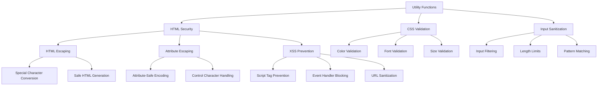

# Utility Functions

## Overview

The utility module provides essential security and validation functions for the Markdown Docs Viewer, focusing on preventing XSS vulnerabilities and ensuring safe handling of user-provided content and CSS values.

## Architecture



## Core Functions

### 1. HTML Escaping Functions

**Basic HTML Escaping:**

```typescript
export function escapeHtml(text: string | number | undefined | null): string {
  if (text == null) return '';

  const str = String(text);
  const map: { [key: string]: string } = {
    '&': '&amp;',
    '<': '&lt;',
    '>': '&gt;',
    '"': '&quot;',
    "'": '&#039;',
  };

  return str.replace(/[&<>"']/g, (m: string) => map[m]);
}
```

**Features:**

- **Null Safety**: Handles null/undefined inputs gracefully
- **Type Flexibility**: Accepts strings, numbers, or null/undefined
- **Complete Coverage**: Escapes all HTML-significant characters
- **XSS Prevention**: Prevents script injection through content

**HTML Attribute Escaping:**

```typescript
export function escapeHtmlAttribute(text: string | number | undefined | null): string {
  if (text == null) return '';

  const str = String(text);
  const map: { [key: string]: string } = {
    '&': '&amp;',
    '<': '&lt;',
    '>': '&gt;',
    '"': '&quot;',
    "'": '&#039;',
    '\n': '&#10;',
    '\r': '&#13;',
    '\t': '&#9;',
  };

  return str.replace(/[&<>"'\n\r\t]/g, (m: string) => map[m]);
}
```

**Attribute-Specific Features:**

- **Control Character Handling**: Escapes newlines, carriage returns, tabs
- **Attribute Context**: Designed specifically for HTML attribute values
- **Injection Prevention**: Prevents attribute-based XSS attacks
- **Whitespace Safety**: Handles problematic whitespace characters

### 2. CSS Validation Functions

**Color Value Validation:**

```typescript
export function sanitizeCssColor(color: string | undefined | null): string {
  if (!color) return '';

  const colorStr = String(color).trim();

  // Allow hex colors, rgb/rgba, hsl/hsla, and named colors with strict validation
  const colorPattern =
    /^(#[0-9a-fA-F]{3,8}|rgb\(\s*\d{1,3}\s*,\s*\d{1,3}\s*,\s*\d{1,3}\s*\)|rgba\(\s*\d{1,3}\s*,\s*\d{1,3}\s*,\s*\d{1,3}\s*,\s*[01]?\.?\d*\s*\)|hsl\(\s*\d{1,3}\s*,\s*\d{1,3}%\s*,\s*\d{1,3}%\s*\)|hsla\(\s*\d{1,3}\s*,\s*\d{1,3}%\s*,\s*\d{1,3}%\s*,\s*[01]?\.?\d*\s*\)|[a-zA-Z]+)$/;

  if (colorPattern.test(colorStr)) {
    return colorStr;
  }

  return '';
}
```

**Color Validation Features:**

- **Hex Colors**: Supports 3, 4, 6, and 8 digit hex colors
- **RGB/RGBA**: Validates rgb() and rgba() function syntax
- **HSL/HSLA**: Validates hsl() and hsla() function syntax
- **Named Colors**: Allows standard CSS color names
- **Injection Prevention**: Prevents CSS injection attacks

**Font Family Validation:**

```typescript
export function sanitizeFontFamily(fontFamily: string | undefined | null): string {
  if (!fontFamily) return '';

  const fontStr = String(fontFamily).trim();

  // Validate each font in the comma-separated list individually
  const fontPattern = /^(?:"[^"]+"|'[^']+'|[\w\s-]+)$/;

  // Split by comma and validate each font
  const fonts = fontStr.split(',').map(font => font.trim());
  const validFonts = fonts.filter(font => fontPattern.test(font));

  // Only return if all fonts are valid and total length is reasonable
  if (validFonts.length === fonts.length && fontStr.length < 200) {
    return fontStr;
  }

  return '';
}
```

**Font Validation Features:**

- **Character Allowlist**: Only permits safe font name characters
- **Length Limits**: Prevents excessively long font names
- **Quote Support**: Allows quoted font family names
- **Comma Separation**: Supports font family fallback lists

**CSS Size/Spacing Validation:**

```typescript
export function sanitizeCssValue(value: string | number | undefined | null): string {
  if (value == null) return '';

  const valueStr = String(value).trim();

  // Allow numbers, percentages, and common CSS units
  const sizePattern = /^-?(?:\d+(?:\.\d+)?)(px|em|rem|%|vh|vw|ex|ch|vmin|vmax|cm|mm|in|pt|pc)?$/;

  if (sizePattern.test(valueStr) && valueStr.length < 20) {
    return valueStr;
  }

  return '';
}
```

**Size Validation Features:**

- **Unit Support**: Validates common CSS length units
- **Negative Values**: Allows negative numbers where appropriate
- **Decimal Support**: Handles floating-point values
- **Percentage Support**: Validates percentage values
- **Viewport Units**: Supports modern viewport-relative units

## Security Considerations

### 1. XSS Prevention

**Input Context Awareness:**

```typescript
// Different contexts require different escaping
const htmlContext = escapeHtml(userInput); // For HTML content
const attributeContext = escapeHtmlAttribute(userInput); // For HTML attributes
const cssContext = sanitizeCssColor(userInput); // For CSS values
```

**Attack Vector Prevention:**

- **Script Injection**: Prevents `<script>` tag insertion
- **Event Handler Injection**: Blocks `onclick`, `onload`, etc.
- **CSS Injection**: Validates CSS values to prevent style-based attacks
- **Attribute Injection**: Prevents attribute boundary escaping

### 2. Validation Strategies

**Allowlist Approach:**

```typescript
// Uses allowlist patterns rather than blocklist
const colorPattern = /^(#[0-9a-fA-F]{3,8}|rgb\([^)]*\)|...)$/;
const fontPattern = /^[\w\s\-,'"]+$/;
const sizePattern = /^-?(?:\d+(?:\.\d+)?)(px|em|rem|...)$/;
```

**Benefits:**

- **Explicit Permission**: Only allows known-safe patterns
- **Future-Proof**: Resistant to new attack vectors
- **Clear Intent**: Makes security boundaries explicit
- **Maintenance**: Easier to audit and update

### 3. Edge Case Handling

**Robust Input Handling:**

```typescript
// Null/undefined safety
if (text == null) return '';

// Type coercion safety
const str = String(text);

// Length validation
if (fontStr.length < 200) {
  return fontStr;
}
```

**Edge Cases Covered:**

- **Null/Undefined**: Safe handling of missing values
- **Type Coercion**: Consistent string conversion
- **Empty Strings**: Appropriate handling of empty input
- **Extremely Long Strings**: Prevention of DoS attacks

## Usage Examples

### Basic HTML Escaping

```typescript
import { escapeHtml, escapeHtmlAttribute } from './utils';

// Escape user content for HTML
const userName = '<script>alert("xss")</script>';
const safeUserName = escapeHtml(userName);
// Result: "&lt;script&gt;alert(&quot;xss&quot;)&lt;/script&gt;"

// Escape for HTML attributes
const userTitle = 'My "Special" Title\nWith Newlines';
const safeTitle = escapeHtmlAttribute(userTitle);
// Result: "My &quot;Special&quot; Title&#10;With Newlines"

// Generate safe HTML
const html = `
  <div class="user-content" title="${escapeHtmlAttribute(userTitle)}">
    ${escapeHtml(userContent)}
  </div>
`;
```

### CSS Value Validation

```typescript
import { sanitizeCssColor, sanitizeFontFamily, sanitizeCssValue } from './utils';

// Validate user-provided theme colors
const userColor = '#ff0000'; // or "rgb(255, 0, 0)" or "red"
const safeColor = sanitizeCssColor(userColor);
// Result: "#ff0000" (if valid) or "" (if invalid)

// Validate font families
const userFont = "Arial, 'Helvetica Neue', sans-serif";
const safeFont = sanitizeFontFamily(userFont);
// Result: "Arial, 'Helvetica Neue', sans-serif" (if valid)

// Validate size values
const userSize = '1.5rem';
const safeSize = sanitizeCssValue(userSize);
// Result: "1.5rem" (if valid) or "" (if invalid)

// Apply to CSS
const css = `
  .user-theme {
    color: ${safeColor};
    font-family: ${safeFont};
    font-size: ${safeSize};
  }
`;
```

### Theme System Integration

```typescript
// Safe theme application
class ThemeManager {
  applyUserTheme(theme: UserTheme): void {
    const root = document.documentElement;

    // Safely apply colors
    if (theme.primaryColor) {
      const safeColor = sanitizeCssColor(theme.primaryColor);
      if (safeColor) {
        root.style.setProperty('--primary-color', safeColor);
      }
    }

    // Safely apply fonts
    if (theme.fontFamily) {
      const safeFont = sanitizeFontFamily(theme.fontFamily);
      if (safeFont) {
        root.style.setProperty('--font-family', safeFont);
      }
    }

    // Safely apply sizes
    if (theme.fontSize) {
      const safeSize = sanitizeCssValue(theme.fontSize);
      if (safeSize) {
        root.style.setProperty('--font-size', safeSize);
      }
    }
  }
}
```

### Document Content Processing

```typescript
// Safe document metadata rendering
class DocumentRenderer {
  renderDocumentMeta(document: Document): string {
    return `
      <div class="document-meta">
        <h1>${escapeHtml(document.title)}</h1>
        <p class="description">${escapeHtml(document.description)}</p>
        <div class="tags">
          ${document.tags
            ?.map(
              tag =>
                `<span class="tag" title="${escapeHtmlAttribute(tag)}">${escapeHtml(tag)}</span>`
            )
            .join('')}
        </div>
      </div>
    `;
  }

  renderDocumentLink(document: Document): string {
    return `
      <a href="#${escapeHtmlAttribute(document.id)}" 
         class="document-link" 
         data-doc-id="${escapeHtmlAttribute(document.id)}"
         title="${escapeHtmlAttribute(document.description || document.title)}">
        ${escapeHtml(document.title)}
      </a>
    `;
  }
}
```

### Search Result Highlighting

```typescript
// Safe search result rendering
class SearchRenderer {
  renderSearchResult(result: SearchResult): string {
    return `
      <div class="search-result" data-doc-id="${escapeHtmlAttribute(result.document.id)}">
        <h3>${escapeHtml(result.document.title)}</h3>
        <p>${escapeHtml(result.excerpt)}</p>
        <div class="metadata">
          ${
            result.document.category
              ? `<span class="category">${escapeHtml(result.document.category)}</span>`
              : ''
          }
          ${
            result.document.tags
              ?.map(tag => `<span class="tag">${escapeHtml(tag)}</span>`)
              .join('') || ''
          }
        </div>
      </div>
    `;
  }
}
```

## Integration with Export System

### Safe Export Generation

```typescript
// Export system using utilities for safety
class ExportManager {
  generateExportHTML(documents: Document[]): string {
    const title = escapeHtml(this.exportOptions.title || 'Documentation');

    let html = `<!DOCTYPE html>
<html lang="${escapeHtmlAttribute(this.exportOptions.locale || 'en')}">
<head>
  <meta charset="UTF-8">
  <title>${title}</title>
  <style>
    ${this.generateSafeCSS()}
  </style>
</head>
<body>`;

    for (const doc of documents) {
      html += `
        <article id="${escapeHtmlAttribute(doc.id)}">
          <h1>${escapeHtml(doc.title)}</h1>
          ${doc.description ? `<p class="description">${escapeHtml(doc.description)}</p>` : ''}
          <div class="content">
            ${this.sanitizeContent(doc.content)}
          </div>
        </article>
      `;
    }

    html += `</body></html>`;
    return html;
  }

  private generateSafeCSS(): string {
    const theme = this.getTheme();

    return `
      body {
        font-family: ${sanitizeFontFamily(theme.fonts.body)};
        color: ${sanitizeCssColor(theme.colors.text)};
        background: ${sanitizeCssColor(theme.colors.background)};
        font-size: ${sanitizeCssValue(theme.fontSize)};
      }
      
      h1 { 
        color: ${sanitizeCssColor(theme.colors.primary)};
        font-family: ${sanitizeFontFamily(theme.fonts.heading)};
      }
    `;
  }
}
```

## Error Handling

### Validation Error Handling

```typescript
// Graceful handling of validation failures
function safeApplyCssProperty(element: HTMLElement, property: string, value: string): boolean {
  let safeValue: string;

  // Determine validation function based on property
  switch (property) {
    case 'color':
    case 'background-color':
    case 'border-color':
      safeValue = sanitizeCssColor(value);
      break;
    case 'font-family':
      safeValue = sanitizeFontFamily(value);
      break;
    case 'font-size':
    case 'width':
    case 'height':
    case 'margin':
    case 'padding':
      safeValue = sanitizeCssValue(value);
      break;
    default:
      console.warn(`Unknown CSS property: ${property}`);
      return false;
  }

  if (safeValue) {
    element.style.setProperty(property, safeValue);
    return true;
  } else {
    console.warn(`Invalid CSS value for ${property}: ${value}`);
    return false;
  }
}
```

### Fallback Strategies

```typescript
// Safe content rendering with fallbacks
function renderSafeContent(content: string, fallback: string = ''): string {
  const safeContent = escapeHtml(content);

  if (!safeContent && fallback) {
    return escapeHtml(fallback);
  }

  return safeContent || '<em>No content available</em>';
}

// Safe attribute setting with fallbacks
function setSafeAttribute(
  element: HTMLElement,
  name: string,
  value: string,
  fallback?: string
): void {
  const safeValue = escapeHtmlAttribute(value);

  if (safeValue) {
    element.setAttribute(name, safeValue);
  } else if (fallback) {
    element.setAttribute(name, escapeHtmlAttribute(fallback));
  }
}
```

## Performance Considerations

### Optimization Strategies

```typescript
// Memoization for repeated validations
const colorCache = new Map<string, string>();

function memoizedSanitizeCssColor(color: string): string {
  if (colorCache.has(color)) {
    return colorCache.get(color)!;
  }

  const result = sanitizeCssColor(color);
  colorCache.set(color, result);
  return result;
}

// Batch validation for multiple values
function validateCssValues(values: Record<string, string>): Record<string, string> {
  const result: Record<string, string> = {};

  for (const [key, value] of Object.entries(values)) {
    let safeValue: string;

    if (key.includes('color')) {
      safeValue = sanitizeCssColor(value);
    } else if (key.includes('font')) {
      safeValue = sanitizeFontFamily(value);
    } else {
      safeValue = sanitizeCssValue(value);
    }

    if (safeValue) {
      result[key] = safeValue;
    }
  }

  return result;
}
```

## Testing Utilities

### Security Test Cases

```typescript
describe('Security Utilities', () => {
  describe('escapeHtml', () => {
    it('should escape HTML special characters', () => {
      expect(escapeHtml('<script>alert("xss")</script>')).toBe(
        '&lt;script&gt;alert(&quot;xss&quot;)&lt;/script&gt;'
      );
    });

    it('should handle null/undefined safely', () => {
      expect(escapeHtml(null)).toBe('');
      expect(escapeHtml(undefined)).toBe('');
    });

    it('should convert numbers to strings', () => {
      expect(escapeHtml(123)).toBe('123');
    });
  });

  describe('sanitizeCssColor', () => {
    it('should allow valid hex colors', () => {
      expect(sanitizeCssColor('#ff0000')).toBe('#ff0000');
      expect(sanitizeCssColor('#f00')).toBe('#f00');
    });

    it('should allow valid rgb colors', () => {
      expect(sanitizeCssColor('rgb(255, 0, 0)')).toBe('rgb(255, 0, 0)');
    });

    it('should reject invalid colors', () => {
      expect(sanitizeCssColor('javascript:alert(1)')).toBe('');
      expect(sanitizeCssColor('expression(alert(1))')).toBe('');
    });
  });
});
```

## Browser Compatibility

### Cross-Browser Support

- **String Methods**: Uses standard JavaScript string methods
- **RegExp**: Uses widely supported regex features
- **Type Checking**: Compatible with all modern browsers
- **Performance**: Optimized for common validation scenarios

### Polyfill Requirements

- **None Required**: Uses only standard JavaScript features
- **ES5 Compatible**: Works in older browsers with basic ES5 support
- **No Dependencies**: Self-contained utility functions
