# Viewer Component

## Overview

The Viewer component (MarkdownDocsViewer) is the core orchestrating class that manages all aspects of the Markdown Documentation Viewer. It coordinates themes, documents, navigation, search, mobile responsiveness, and error handling to provide a complete documentation viewing experience.

## Architecture

```mermaid
graph TB
    MDV[MarkdownDocsViewer] --> CFG[Configuration Management]
    MDV --> DL[Document Loading]
    MDV --> TM[Theme Management]
    MDV --> RT[Routing System]
    MDV --> UI[UI Rendering]
    MDV --> MO[Mobile Optimization]
    MDV --> EH[Error Handling]

    CFG --> VC[Validation & Config]
    CFG --> DC[Dependency Checking]

    DL --> LR[Document Loader]
    DL --> ST[State Management]

    TM --> TMS[Theme Manager]
    TM --> TS[Theme Switcher]
    TM --> DMT[Dark Mode Toggle]

    RT --> RR[Router Integration]
    RT --> NV[Navigation Handling]

    UI --> HD[Header Rendering]
    UI --> SB[Sidebar Rendering]
    UI --> CT[Content Rendering]
    UI --> EL[Event Listeners]

    MO --> RD[Responsive Design]
    MO --> GT[Gesture Handling]
    MO --> TO[Touch Optimization]

    EH --> EB[Error Boundary]
    EH --> LG[Error Logging]
    EH --> GD[Graceful Degradation]
```



## Class Structure

### MarkdownDocsViewer Class

**Purpose**: Main orchestrating class for the entire documentation viewer

**Constructor**:

```typescript
constructor(config: DocumentationConfig)
```

**Key Properties**:

- `config: DocumentationConfig` - Merged configuration
- `state: ViewerState` - Current application state
- `container: HTMLElement` - Target DOM container
- `loader: DocumentLoader` - Document loading manager
- `router: Router` - URL routing system
- `themeManager: ThemeManager` - Theme management
- `themeSwitcher: ThemeSwitcher` - Theme switching UI
- `darkModeToggle: DarkModeToggle` - Dark mode toggle
- `errorBoundary: ErrorBoundary` - Error handling wrapper
- `logger: ErrorLogger` - Error logging system

## Core Features

### 1. Initialization & Configuration

**Configuration Validation**:

```typescript
private validateAndMergeConfig(config: DocumentationConfig): DocumentationConfig {
  // Validate required fields
  if (!config.container) {
    throw new MarkdownDocsError('Container is required');
  }

  if (!config.source) {
    throw new MarkdownDocsError('Document source is required');
  }

  // Merge with comprehensive defaults
  return {
    theme: defaultTheme,
    search: { enabled: true },
    navigation: { showCategories: true, collapsible: true },
    render: { syntaxHighlighting: true, copyCodeButton: true },
    errorHandling: { gracefulDegradation: true },
    responsive: true,
    mobile: { enabled: true, breakpoints: BREAKPOINTS },
    routing: 'hash',
    ...config,
  };
}
```

**Dependency Validation**:

```typescript
private validateDependencies(): void {
  const missing: string[] = [];
  const warnings: string[] = [];

  // Check for marked
  if (typeof marked === 'undefined') {
    missing.push('marked - Markdown parser is required');
  }

  // Check for highlight.js (optional)
  if (typeof hljs === 'undefined') {
    warnings.push('highlight.js - Syntax highlighting will be disabled');
  }

  // Check browser environment
  if (typeof document === 'undefined') {
    missing.push('DOM environment - Browser environment required');
  }
}
```

### 2. Theme System Integration

**Theme Manager Setup**:

```typescript
this.themeManager = new ThemeManager({
  enablePersistence: this.config.theme?.enablePersistence !== false,
  storageKey: this.config.theme?.storageKey || 'mdv-theme',
  onThemeChange: theme => {
    this.applyTheme(theme);
    if (this.config.onThemeChange) {
      this.config.onThemeChange(theme);
    }
  },
});
```

**Theme Application**:

```typescript
private applyTheme(theme: Theme): void {
  // Apply CSS variables through theme manager
  this.themeManager.applyCSSVariables(theme);

  // Generate and apply styles
  let cssContent = generateStyles(theme, this.config);

  // Add mobile-responsive styles if enabled
  if (this.config.responsive && this.config.mobile?.enabled !== false) {
    cssContent += generateMobileCSS(this.config);
  }

  // Add component styles
  cssContent += this.themeSwitcher.getStyles();
  cssContent += this.darkModeToggle.getStyles();

  this.styles.textContent = cssContent;
  document.head.appendChild(this.styles);
}
```

### 3. Document Management

**Document Loading**:

```typescript
private async loadDocuments(): Promise<void> {
  await this.errorBoundary.execute(
    async () => {
      const documents = await this.loader.loadAll();
      this.state.documents = documents;

      if (documents.length === 0) {
        this.logger.warn('No documents loaded');
      }
    },
    () => {
      this.state.documents = [];
      this.logger.error('Failed to load documents, using empty list');
    },
    { operation: 'loadDocuments' }
  );
}
```

**Individual Document Loading**:

```typescript
private async loadDocument(docId: string): Promise<void> {
  const doc = this.state.documents.find(d => d.id === docId);
  if (!doc) {
    throw ErrorFactory.documentNotFound(docId);
  }

  // Load content if not already loaded
  if (!doc.content && doc.file) {
    doc.content = await this.loader.loadDocument(doc);
  }

  this.state.currentDocument = doc;

  if (this.router) {
    this.router.setRoute(docId);
  }

  // Auto-close mobile sidebar
  if (isMobileViewport()) {
    this.state.sidebarOpen = false;
    this.updateSidebar();
  }
}
```

### 4. UI Rendering System

**Main Render Method**:

```typescript
private render(): void {
  this.container.innerHTML = `
    <div class="mdv-app">
      ${this.renderHeader()}
      <div class="mdv-layout">
        ${this.renderSidebar()}
        ${this.renderContent()}
      </div>
      ${this.config.footer ? this.renderFooter() : ''}
    </div>
  `;

  this.attachEventListeners();
}
```

**Header Rendering**:

```typescript
private renderHeader(): string {
  const showThemeSwitcher = (this.config.theme?.switcherPosition || 'header') === 'header';
  const showDarkToggle = (this.config.theme?.darkTogglePosition || 'header') === 'header';

  const headerActions = [];
  if (showDarkToggle) headerActions.push(this.darkModeToggle.render());
  if (showThemeSwitcher) headerActions.push(this.themeSwitcher.render());

  return `
    <header class="mdv-header">
      <button class="mdv-mobile-toggle" aria-label="Toggle navigation"></button>
      ${this.config.logo ? `` : ''}
      <h1 class="mdv-title">${this.config.title || 'Documentation'}</h1>
      ${headerActions.length > 0 ? `<div class="mdv-header-actions">${headerActions.join('')}</div>` : ''}
    </header>
  `;
}
```

**Content Rendering**:

```typescript
private renderContent(): string {
  if (this.state.loading) {
    return `
      <main class="mdv-content">
        <div class="mdv-loading">
          <div class="mdv-loading-spinner"></div>
          <p>Loading documentation...</p>
        </div>
      </main>
    `;
  }

  if (this.state.error) {
    return this.renderError(this.state.error);
  }

  if (!this.state.currentDocument) {
    return `
      <main class="mdv-content">
        <div class="mdv-welcome">
          <h2>Welcome to the Documentation</h2>
          <p>Select a document from the sidebar to begin reading.</p>
        </div>
      </main>
    `;
  }

  return `
    <main class="mdv-content">
      <article class="mdv-document">
        <h1 class="mdv-document-title">${this.state.currentDocument.title}</h1>
        <div class="mdv-document-content">
          ${this.renderMarkdown(this.state.currentDocument.content || '')}
        </div>
      </article>
    </main>
  `;
}
```

### 5. Mobile Optimization

**Mobile Interaction Setup**:

```typescript
private setupMobileInteractions(): void {
  if (!this.config.mobile?.enabled) return;

  // Add mobile backdrop for sidebar overlay
  this.setupSidebarBackdrop();

  // Setup swipe gestures if enabled
  if (this.config.mobile?.gestures?.swipeToNavigate) {
    this.setupSwipeGestures();
  }

  // Setup touch optimizations
  if (this.config.mobile?.performance?.enableTouchOptimizations) {
    this.setupTouchOptimizations();
  }

  // Handle window resize for responsive behavior
  this.setupResponsiveHandlers();
}
```

**Swipe Gesture Handling**:

```typescript
private setupSwipeGestures(): void {
  let startX = 0;
  let isSwipe = false;
  const threshold = this.config.mobile?.gestures?.swipeThreshold || 50;

  const handleTouchEnd = (e: TouchEvent) => {
    if (isSwipe && e.changedTouches.length === 1) {
      const deltaX = e.changedTouches[0].clientX - startX;

      if (isMobileViewport()) {
        // Swipe right to open sidebar (from left edge)
        if (deltaX > threshold && startX < 50 && !this.state.sidebarOpen) {
          this.state.sidebarOpen = true;
          this.updateSidebar();
        }
        // Swipe left to close sidebar
        else if (deltaX < -threshold && this.state.sidebarOpen) {
          this.state.sidebarOpen = false;
          this.updateSidebar();
        }
      }
    }
  };
}
```

**Responsive Handler Setup**:

```typescript
private setupResponsiveHandlers(): void {
  const handleResize = () => {
    const currentBreakpoint = getCurrentBreakpoint();

    // Auto-close sidebar on larger screens
    if (currentBreakpoint !== 'xs' && currentBreakpoint !== 'sm' && this.state.sidebarOpen) {
      this.state.sidebarOpen = false;
      this.updateSidebar();
    }

    this.updateResponsiveUI();
  };

  // Throttle resize events for performance
  let resizeTimeout: number;
  window.addEventListener('resize', () => {
    clearTimeout(resizeTimeout);
    resizeTimeout = window.setTimeout(handleResize, 150);
  });
}
```

### 6. Error Handling System

**Error Boundary Integration**:

```typescript
private async init(): Promise<void> {
  await this.errorBoundary.execute(
    async () => {
      this.state.loading = true;
      this.configureMarked();
      await this.loadDocuments();
      this.setupRouting();
      this.render();
      await this.loadInitialDocument();
      this.state.loading = false;
    },
    () => {
      this.state.loading = false;
      this.render();
    },
    { operation: 'init' }
  );
}
```

**Error Rendering**:

```typescript
private renderError(error: Error): string {
  const isMarkdownError = error instanceof MarkdownDocsError;
  const showDetails = this.config.errorHandling?.showErrorDetails;

  let errorMessage = 'An unexpected error occurred.';
  let retryButton = '';

  if (isMarkdownError) {
    errorMessage = error.userMessage;

    if (error.isRetryable) {
      retryButton = '<button class="mdv-retry-button">Try Again</button>';
    }
  }

  return `
    <main class="mdv-content">
      <div class="mdv-error">
        <div class="mdv-error-icon">⚠️</div>
        <h2>Oops! Something went wrong</h2>
        <p class="mdv-error-message">${errorMessage}</p>
        ${retryButton}
      </div>
    </main>
  `;
}
```

**Comprehensive Error Handler**:

```typescript
private handleError(error: MarkdownDocsError): void {
  if (this.state) {
    this.state.error = error;
    this.state.loading = false;
  }

  if (this.logger) {
    this.logger.log(error);
  }

  // Call user-provided error handler
  if (this.config?.onError) {
    try {
      this.config.onError(error);
    } catch (handlerError) {
      this.logger?.error('Error in user error handler', { handlerError });
    }
  }

  if (this.state && this.container) {
    this.render();
  }
}
```

### 7. Search System

**Search Implementation**:

```typescript
private handleSearch(query: string): void {
  this.state.searchQuery = query;

  if (!query.trim()) {
    this.state.searchResults = [];
    this.render();
    return;
  }

  try {
    const results = this.state.documents.filter(doc => {
      try {
        const searchIn = [
          doc.title,
          doc.description || '',
          doc.content || '',
          ...(doc.tags || []),
        ].join(' ').toLowerCase();

        return searchIn.includes(query.toLowerCase());
      } catch (error) {
        this.logger.warn('Error during document search', { docId: doc.id, error });
        return false;
      }
    });

    this.state.searchResults = results.slice(0, this.config.search?.maxResults || 10);
    this.render();
  } catch (error) {
    this.logger.error('Search operation failed', { query, error });
    this.state.searchResults = [];
  }
}
```

## Public API Methods

### Theme Management

```typescript
public setTheme(theme: Theme | string): void {
  if (typeof theme === 'string') {
    const themeObj = this.themeManager.setTheme(theme);
    if (themeObj) {
      this.config.theme = themeObj;
    }
  } else {
    // Handle theme objects through ThemeManager
    const tempThemeName = `temp-${Date.now()}`;
    this.themeManager.registerTheme({ ...theme, name: tempThemeName });
    this.themeManager.setTheme(tempThemeName);
    this.config.theme = theme;
  }
}

public getAvailableThemes(): Theme[] {
  return this.themeManager.getAvailableThemes();
}

public registerTheme(theme: Theme): void {
  this.themeManager.registerTheme(theme as any);
}

public createCustomTheme(name: string, overrides: Partial<Theme>): Theme {
  return this.themeManager.createCustomTheme(name, overrides);
}
```

### Document Access

```typescript
public getDocument(id: string): Document | null {
  return this.state.documents.find(doc => doc.id === id) || null;
}

public getAllDocuments(): Document[] {
  return [...this.state.documents];
}

public async search(query: string): Promise<Document[]> {
  return new Promise(resolve => {
    this.handleSearch(query);
    resolve([...this.state.searchResults]);
  });
}
```

### Utility Methods

```typescript
public async refresh(): Promise<void> {
  await this.errorBoundary.execute(
    async () => {
      this.loader.clearCache();
      await this.loadDocuments();
      this.render();
    },
    () => {
      this.logger.error('Failed to refresh documents');
    },
    { operation: 'refresh' }
  );
}

public destroy(): void {
  try {
    if (this.styles) {
      this.styles.remove();
    }
    if (this.router) {
      this.router.destroy();
    }
    this.container.innerHTML = '';
    this.logger.debug('MarkdownDocsViewer destroyed');
  } catch (error) {
    this.logger.warn('Error during cleanup', { error });
  }
}

public getState(): ViewerState {
  return { ...this.state };
}

public getConfig(): DocumentationConfig {
  return { ...this.config };
}
```

## Integration Patterns

### Basic Setup

```typescript
import { MarkdownDocsViewer } from './viewer';

const viewer = new MarkdownDocsViewer({
  container: '#docs-container',
  title: 'My Documentation',
  source: {
    type: 'local',
    basePath: '/docs',
    files: ['intro.md', 'guide.md'],
  },
  theme: 'default',
  search: { enabled: true },
  mobile: { enabled: true },
});
```

### Advanced Configuration

```typescript
const viewer = new MarkdownDocsViewer({
  container: document.getElementById('docs'),
  title: 'Advanced Documentation',
  logo: '/assets/logo.svg',
  source: {
    type: 'github',
    owner: 'user',
    repo: 'docs',
    branch: 'main',
    path: 'documentation',
  },
  theme: {
    name: 'custom',
    colors: { primary: '#007acc' },
  },
  search: {
    enabled: true,
    maxResults: 20,
    placeholder: 'Search documentation...',
  },
  navigation: {
    showCategories: true,
    showTags: true,
    collapsible: true,
  },
  mobile: {
    enabled: true,
    gestures: {
      swipeToNavigate: true,
      swipeThreshold: 30,
    },
  },
  onDocumentLoad: doc => {
    console.log(`Loaded: ${doc.title}`);
  },
  onThemeChange: theme => {
    console.log(`Theme changed to: ${theme.name}`);
  },
  onError: error => {
    console.error('Viewer error:', error);
  },
});
```

## State Management

### ViewerState Interface

```typescript
interface ViewerState {
  currentDocument: Document | null;
  documents: Document[];
  searchQuery: string;
  searchResults: Document[];
  loading: boolean;
  error: Error | null;
  sidebarOpen: boolean;
}
```

### State Updates

**Loading State**:

```typescript
this.state.loading = true;
this.state.error = null;
this.render(); // Show loading UI
```

**Error State**:

```typescript
this.state.error = error;
this.state.loading = false;
this.render(); // Show error UI
```

**Document State**:

```typescript
this.state.currentDocument = doc;
this.state.loading = false;
this.render(); // Show document content
```

## Performance Considerations

### Efficient Rendering

**Selective Updates**:

- Sidebar-only updates for navigation changes
- Content-only updates for document changes
- Minimal DOM manipulation

**Event Handling Optimization**:

- Debounced search input
- Throttled resize handlers
- Passive event listeners where appropriate

### Memory Management

**Cleanup on Destroy**:

- Remove event listeners
- Clear DOM references
- Dispose of component instances
- Remove injected styles

## Testing Considerations

### Unit Testing

**Component Testing**:

- Configuration validation
- State management
- Error handling
- Theme application
- Document loading

**Mock Requirements**:

- DocumentLoader mock
- Router mock
- Theme components mock
- DOM environment setup

### Integration Testing

**Full Workflow Testing**:

- Complete initialization process
- Document loading and navigation
- Theme switching functionality
- Mobile responsive behavior
- Error recovery scenarios

### End-to-End Testing

**User Interaction Testing**:

- Navigation workflows
- Search functionality
- Theme switching
- Mobile gestures
- Error scenarios
