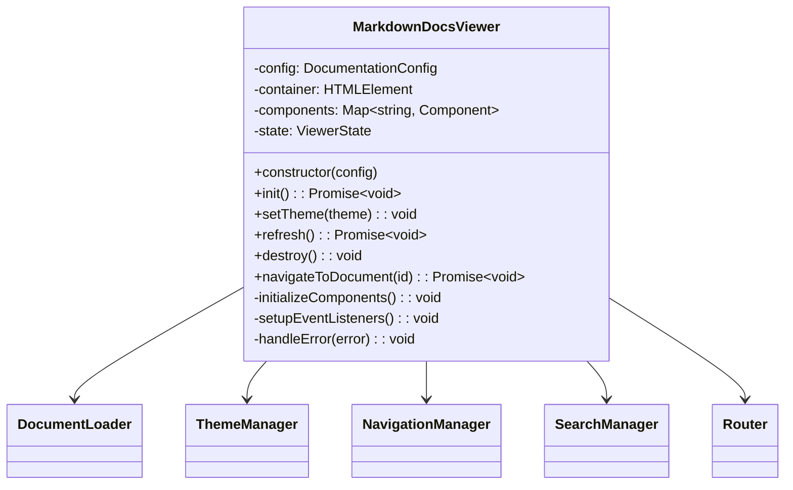
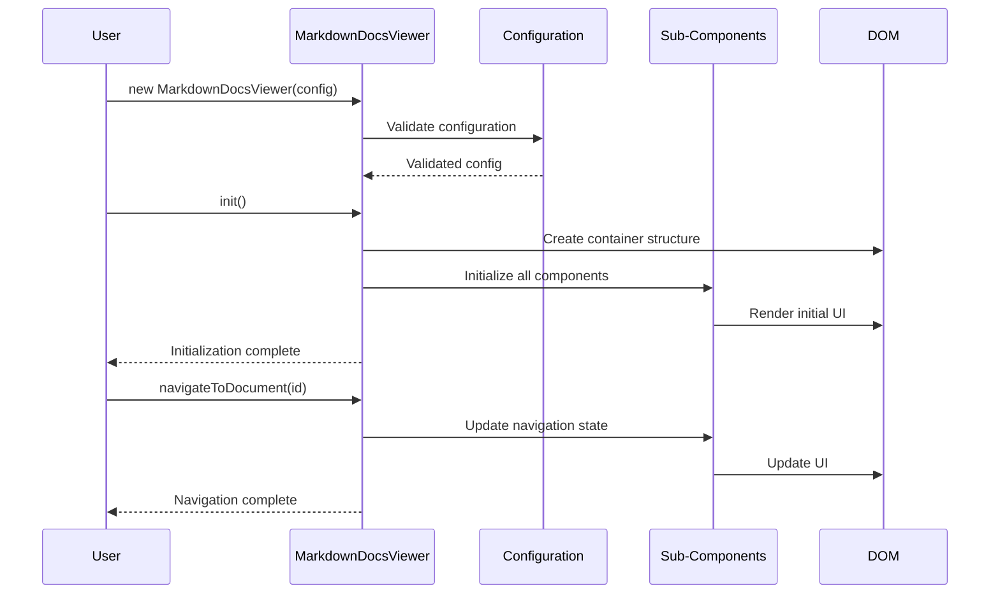

# Component: MarkdownDocsViewer

## Overview

The `MarkdownDocsViewer` is the main orchestrator class that coordinates all functionality of the markdown documentation viewer. It serves as the primary entry point and manages the lifecycle of all other components.

## Architecture



## Responsibilities

- **Component Orchestration**: Initializes and coordinates all sub-components
- **Configuration Management**: Processes and validates user configuration
- **Lifecycle Management**: Handles initialization, updates, and cleanup
- **Event Coordination**: Routes events between components
- **Error Handling**: Centralized error management and recovery
- **DOM Management**: Creates and manages the main container structure
- **State Management**: Maintains global application state

## Key Methods

### Constructor

```typescript
constructor(config: DocumentationConfig)
```

Initializes the viewer with user configuration, validates settings, and prepares for initialization.

### init()

```typescript
async init(): Promise<void>
```

Performs the main initialization sequence:

1. Creates DOM structure
2. Initializes all components
3. Loads initial document
4. Sets up event listeners

### setTheme()

```typescript
setTheme(theme: Theme): void
```

Dynamically changes the active theme, updating all visual components.

### refresh()

```typescript
async refresh(): Promise<void>
```

Reloads all documents and refreshes the entire interface, useful for content updates.

### destroy()

```typescript
destroy(): void
```

Performs cleanup:

1. Removes event listeners
2. Destroys all components
3. Clears DOM elements
4. Releases memory references

## Data Flow



## Integration Example

```typescript
import { MarkdownDocsViewer, defaultTheme } from '@austinorphan/markdown-docs-viewer';

// Basic usage
const viewer = new MarkdownDocsViewer({
  container: '#docs-container',
  theme: defaultTheme,
  source: {
    type: 'local',
    documents: [
      { id: 'intro', title: 'Introduction', file: 'intro.md' },
      { id: 'guide', title: 'User Guide', file: 'guide.md' },
    ],
  },
  navigation: {
    showCategories: true,
    collapsible: true,
  },
  search: {
    enabled: true,
    fuzzySearch: true,
  },
});

// Initialize and handle errors
try {
  await viewer.init();
  console.log('Documentation viewer initialized successfully');
} catch (error) {
  console.error('Failed to initialize viewer:', error);
}

// Dynamic theme switching
viewer.setTheme(darkTheme);

// Refresh content
await viewer.refresh();

// Cleanup when done
viewer.destroy();
```

## Testing Considerations

- **Component Integration**: Test that all sub-components are properly initialized and coordinated
- **Configuration Validation**: Verify that invalid configurations are rejected with helpful error messages
- **Error Recovery**: Test error handling and recovery scenarios
- **Memory Management**: Ensure proper cleanup to prevent memory leaks
- **Event Handling**: Verify that events are properly routed between components
- **Theme Switching**: Test dynamic theme changes don't break functionality

## Performance Optimizations

- **Lazy Component Loading**: Components are only initialized when needed
- **Event Delegation**: Uses event delegation to minimize event listener overhead
- **Memory Pooling**: Reuses DOM elements where possible to reduce garbage collection
- **Debounced Updates**: User interactions are debounced to prevent excessive updates
- **Component Caching**: Component instances are cached and reused when possible

## Error Handling Strategy

```typescript
// Centralized error handling
private handleError(error: Error, context: string): void {
  // Log error with context
  console.error(`[MarkdownDocsViewer] ${context}:`, error);

  // Attempt recovery based on error type
  if (error instanceof NetworkError) {
    this.showRetryMessage();
  } else if (error instanceof ConfigurationError) {
    this.showConfigurationHelp();
  } else {
    this.showGenericError(error.message);
  }

  // Emit error event for external handling
  this.emit('error', { error, context });
}
```

## Future Enhancements

- **Plugin System**: Support for external plugins to extend functionality
- **Web Components**: Migrate to web components for better encapsulation
- **Server-Side Rendering**: Support for SSR in meta-frameworks
- **Progressive Enhancement**: Graceful degradation for users without JavaScript
- **Accessibility Improvements**: Enhanced ARIA support and keyboard navigation
- **Performance Monitoring**: Built-in performance metrics and reporting
