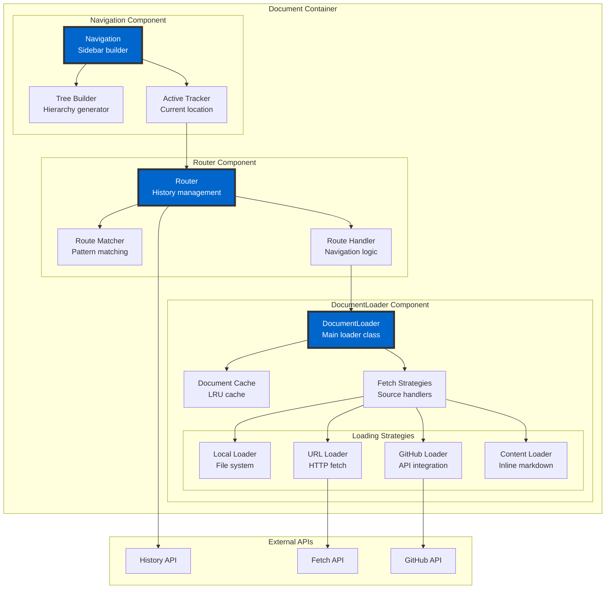
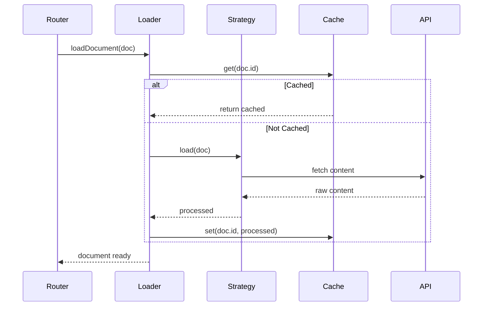
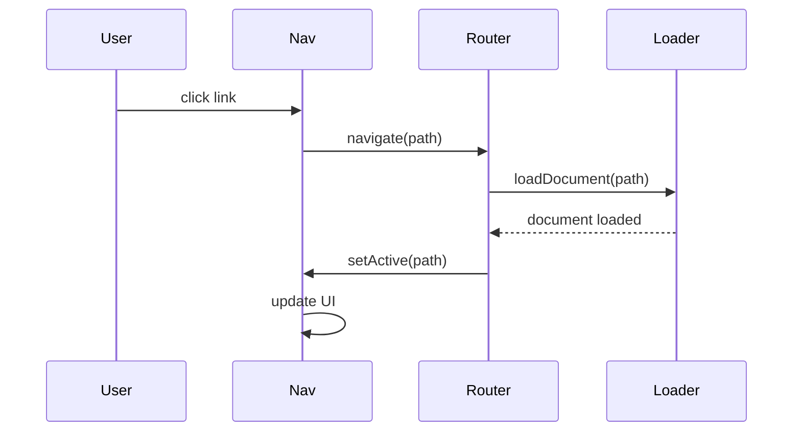

# C4 Model - Component Diagram: Document Container

## Level 3: Component View - Document Management

This diagram shows the internal structure of the Document Container.



## Component Interactions

### DocumentLoader

```typescript
class DocumentLoader {
  private cache: LRUCache<string, ProcessedDocument>;
  private strategies: Map<SourceType, LoadStrategy>;
  private loadingPromises: Map<string, Promise<Document>>;

  async loadDocument(doc: Document): Promise<ProcessedDocument>;
  async loadAll(): Promise<Document[]>;
  private checkMemoryUsage(): void;
}
```

### Loading Strategies

Each strategy implements the `LoadStrategy` interface:

- **LocalLoader**: Fetches from relative paths
- **URLLoader**: HTTP/HTTPS with retry logic
- **GitHubLoader**: GitHub API with rate limiting
- **ContentLoader**: Processes inline markdown

### Router

```typescript
class Router {
  private history: History;
  private routes: Map<string, RouteHandler>;
  private currentRoute: string;

  navigate(path: string): void;
  back(): void;
  forward(): void;
  on(pattern: string, handler: RouteHandler): void;
}
```

### Navigation

```typescript
class Navigation {
  private documents: Document[];
  private activeDocument: string;
  private expandedNodes: Set<string>;

  render(): string;
  setActive(docId: string): void;
  toggle(nodeId: string): void;
  private buildTree(): TreeNode[];
}
```

## Data Flow Sequences

### Document Loading



### Navigation Update



## Key Design Decisions

1. **Strategy Pattern**: Different loading strategies for different sources
2. **Caching**: LRU cache prevents redundant fetches
3. **Promise Deduplication**: Multiple requests for same document share promise
4. **Memory Management**: Automatic cache eviction on memory pressure
5. **Error Recovery**: Retry logic with exponential backoff
