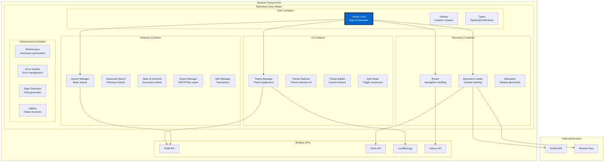

# C4 Model - Container Diagram

## Level 2: Container View

This diagram shows the high-level containers/modules within the Markdown Docs Viewer system.

## Container Descriptions

### Core Container

- **Viewer Core**: Main class that orchestrates all functionality
- **Factory**: Provides `createViewer()` and `quickStart()` functions
- **Types**: TypeScript interfaces and type definitions

### Document Container

- **Document Loader**: Handles fetching from multiple sources (local, URL, GitHub, inline)
- **Router**: Client-side routing with History API integration
- **Navigation**: Generates and manages sidebar navigation

### UI Container

- **Theme Manager**: Applies themes and manages CSS custom properties
- **Theme Switcher**: Dropdown UI for theme selection
- **Theme Builder**: Interactive UI for creating custom themes
- **Dark Mode**: Simple toggle for dark/light themes

### Features Container

- **Search Manager**: Basic search with debouncing and highlighting
- **Advanced Search**: Faceted search with filters and sorting
- **Table of Contents**: Auto-generated document outline
- **Export Manager**: Export to PDF (with html2pdf) or HTML
- **I18n Manager**: Internationalization support

### Infrastructure Container

- **Performance**: LRU caching, lazy loading, memory management
- **Error Handler**: Comprehensive error handling with retry logic
- **Style Generator**: Dynamic CSS generation for themes
- **Utilities**: Shared helper functions

## Technology Stack

| Container | Technology | Purpose                      |
| --------- | ---------- | ---------------------------- |
| All       | TypeScript | Type safety and IDE support  |
| All       | ES Modules | Modern module system         |
| Build     | Vite 4.5   | Fast build and development   |
| Test      | Vitest 1.6 | Unit and integration testing |
| Lint      | ESLint 9   | Code quality enforcement     |
| Format    | Prettier   | Code formatting              |

## Data Flow

1. **Document Loading**: Loader → Cache → Parser → Renderer
2. **Theme Changes**: Manager → CSS Variables → DOM Update
3. **Search**: Index → Query → Results → Highlighting
4. **Navigation**: Router → History → UI Update
