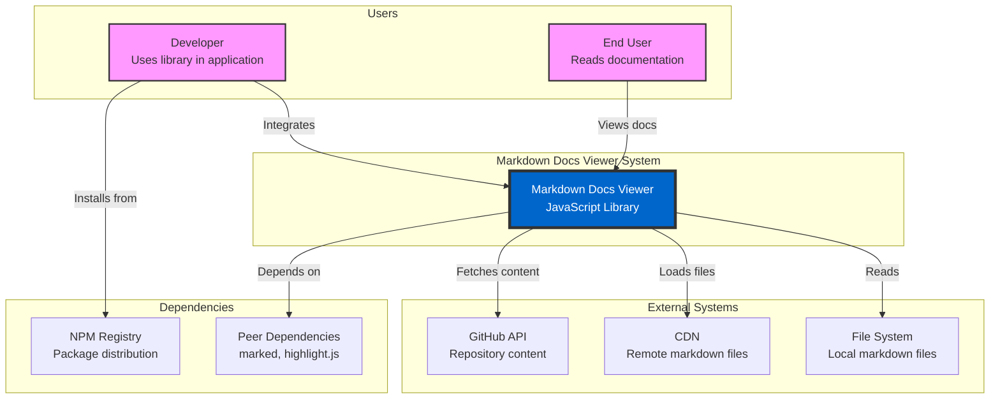

# C4 Model - System Context Diagram

## Level 1: System Context

This diagram shows the Markdown Docs Viewer in the context of its users and external systems.

## Key Relationships

### Users

- **Developers**: Integrate the library into their web applications
- **End Users**: Read documentation through the rendered interface

### External Systems

- **GitHub API**: Fetch documentation directly from repositories
- **CDN**: Load remote markdown files via HTTP/HTTPS
- **File System**: Read local markdown files (in development)

### Dependencies

- **NPM Registry**: Distribution and versioning
- **Peer Dependencies**: Core markdown parsing and syntax highlighting

## System Boundaries

The Markdown Docs Viewer is a self-contained JavaScript library that:

- Runs entirely in the browser (no server required)
- Handles all markdown parsing and rendering
- Manages themes, navigation, and search internally
- Provides a complete documentation viewing experience
