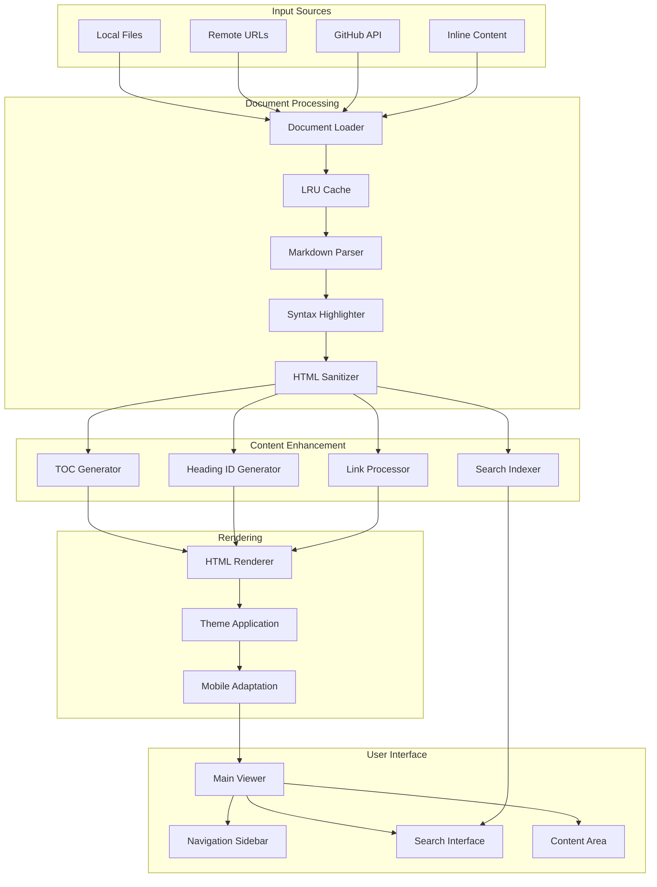
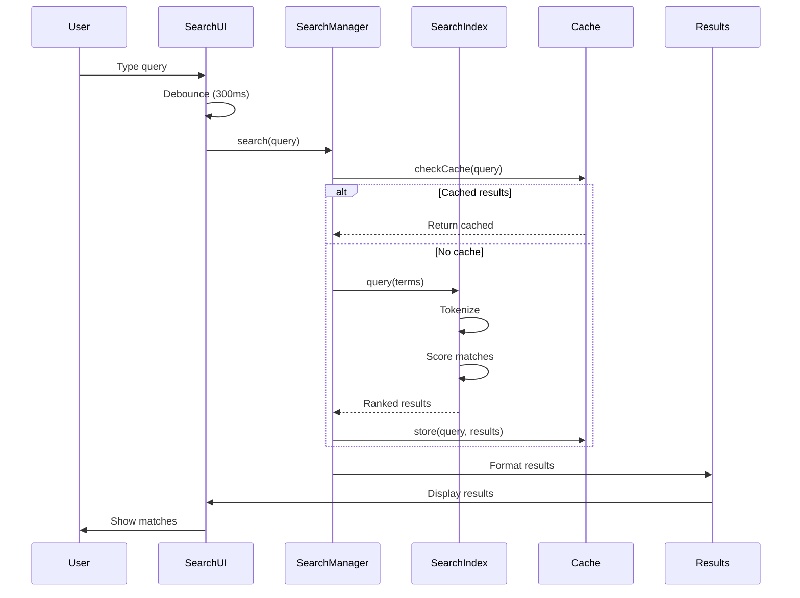
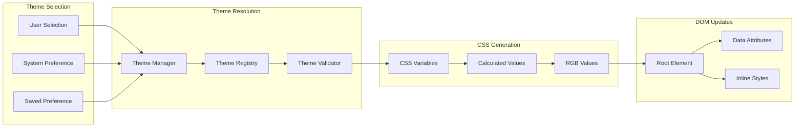
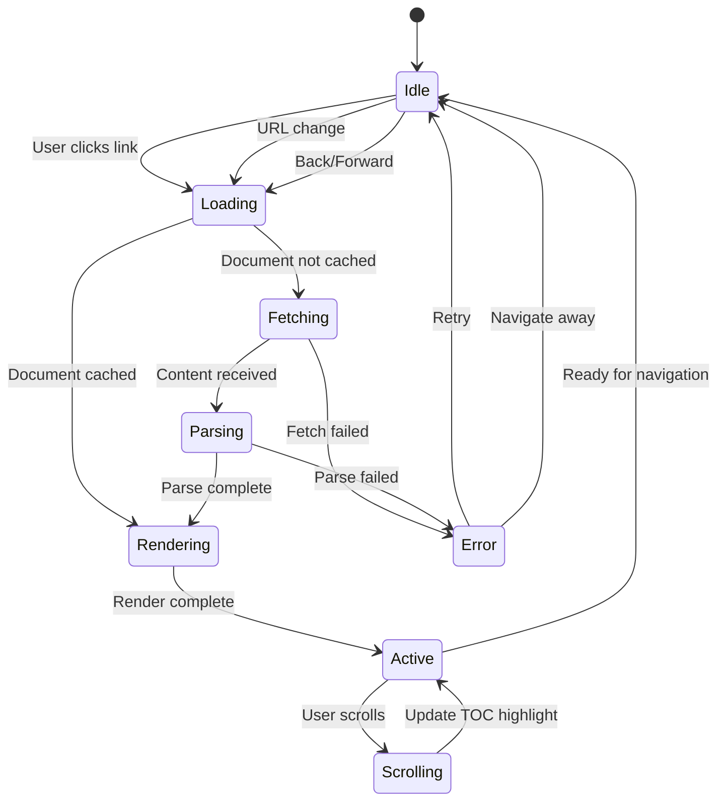
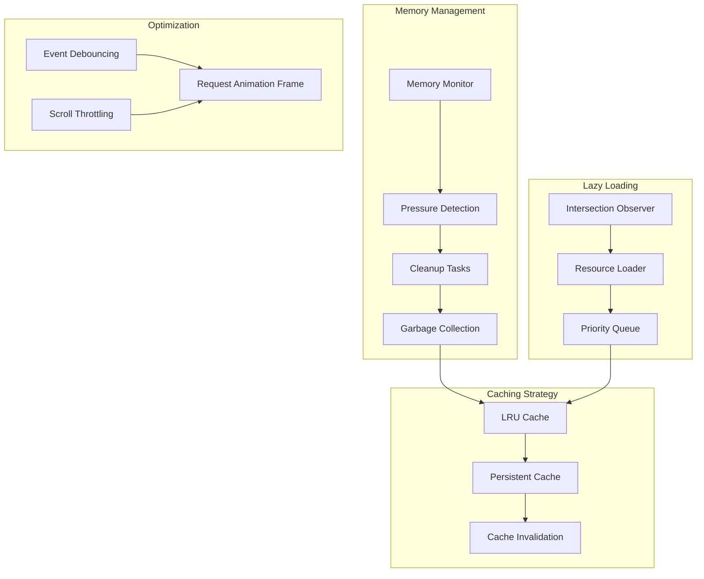
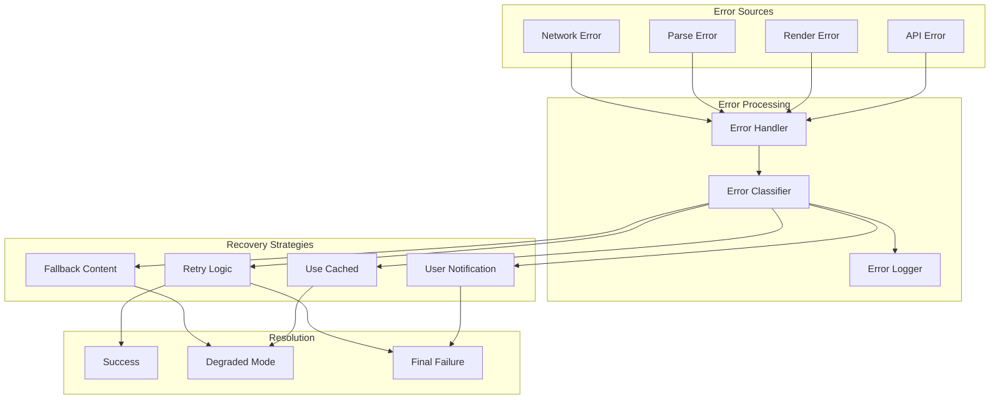
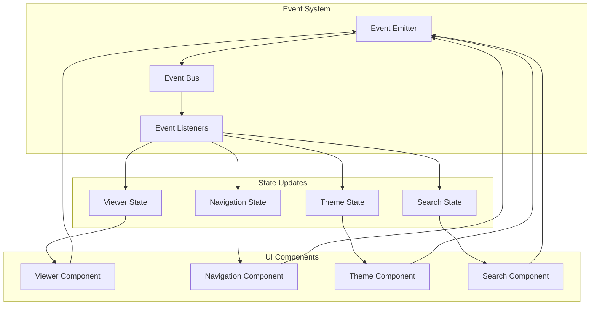

# Data Flow Diagrams

## Document Loading and Rendering Flow

## Search Flow

## Theme Application Flow

## Navigation State Management

## Performance Optimization Flow

## Error Handling and Recovery Flow

## Component Communication Flow

