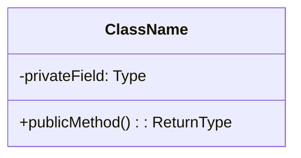
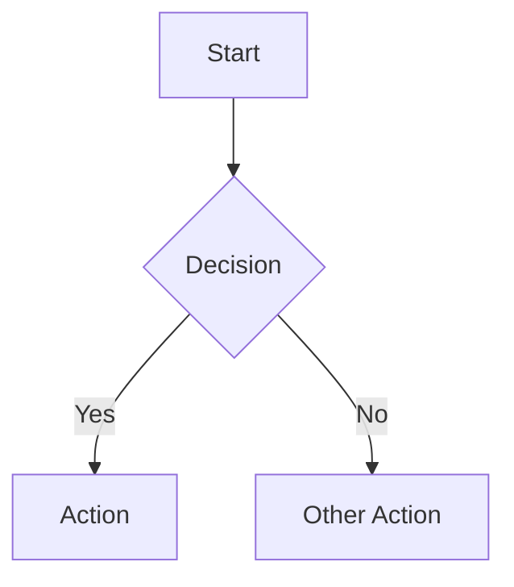

# Architecture Documentation Guide

## Overview

This guide explains how to maintain and extend the architecture documentation for the Markdown Docs Viewer project.

## Documentation Structure

```
docs/architecture/
├── README.md                 # Main architecture overview
├── diagrams/                 # Architecture diagrams
│   ├── c4-context.md        # C4 Level 1: System Context
│   ├── c4-container.md      # C4 Level 2: Container View
│   ├── c4-component-*.md    # C4 Level 3: Component Views
│   └── data-flow.md         # Data flow diagrams
├── adr/                      # Architecture Decision Records
│   ├── 001-use-typescript.md
│   ├── 002-multiple-document-sources.md
│   ├── 003-css-custom-properties.md
│   ├── 004-client-side-only.md
│   └── 005-marked-version.md
├── components/               # Component documentation
│   └── theme-manager.md     # Example component doc
└── documentation-guide.md    # This file
```

## Documentation Standards

### Architecture Decision Records (ADRs)

Use this template for new ADRs:

```markdown
# ADR-XXX: [Title]

## Status

[Proposed | Accepted | Deprecated | Superseded]

## Context

[Describe the issue or decision that needs to be made]

## Decision

[Describe the decision and rationale]

## Consequences

### Positive

- [Positive outcomes]

### Negative

- [Negative outcomes]

### Neutral

- [Neutral observations]

## Implementation

[Implementation details if applicable]

## References

- [Related links]
```

### Component Documentation

Use this template for component docs:

```markdown
# Component: [Name]

## Overview

[Brief description of the component's purpose]

## Architecture

[Architecture diagram using Mermaid]

## Responsibilities

[List of key responsibilities]

## Key Methods

[Important methods with code examples]

## Data Flow

[How data flows through the component]

## Integration Example

[Code example showing usage]

## Testing Considerations

[How to test this component]

## Performance Optimizations

[Any performance considerations]

## Future Enhancements

[Planned improvements]
```

## Diagram Standards

### Mermaid Diagrams

We use Mermaid for all architecture diagrams. Common types:

1. **Class Diagrams**



2. **Sequence Diagrams**

```mermaid
sequenceDiagram
    Actor->>System: Request
    System-->>Actor: Response
```

3. **Flow Charts**



### C4 Model Levels

1. **Level 1 - System Context**: Shows the system and its relationships with users and external systems
2. **Level 2 - Container**: Shows the high-level technology choices and how containers communicate
3. **Level 3 - Component**: Shows how a container is made up of components
4. **Level 4 - Code**: (Optional) Shows how a component is implemented

## Keeping Documentation Updated

### When to Update

Update architecture documentation when:

- Adding new components or features
- Making architectural decisions
- Changing component relationships
- Modifying data flows
- Deprecating features

### Review Process

1. Architecture changes should include documentation updates
2. Major changes require new or updated ADRs
3. Component documentation should be updated with code changes
4. Diagrams should reflect current architecture

## Tools and Automation

### Recommended Tools

1. **Mermaid Live Editor**: https://mermaid.live/
2. **PlantUML**: For complex UML diagrams
3. **Draw.io**: For visual diagram editing
4. **TypeDoc**: For API documentation generation

### Documentation Generation

To generate API documentation from TypeScript:

```bash
npx typedoc --out docs/api src/index.ts
```

### Diagram Generation

To render Mermaid diagrams:

```bash
# Install mermaid CLI
npm install -g @mermaid-js/mermaid-cli

# Generate SVG from Mermaid file
mmdc -i diagram.mmd -o diagram.svg
```

## Best Practices

1. **Keep It Current**: Update docs with code changes
2. **Be Concise**: Focus on key information
3. **Use Examples**: Code examples clarify concepts
4. **Visual First**: Diagrams before long descriptions
5. **Link Related**: Cross-reference related docs
6. **Version ADRs**: Number them sequentially
7. **Review Regularly**: Audit docs quarterly

## Documentation Checklist

For new features:

- [ ] Update architecture overview if needed
- [ ] Create/update component documentation
- [ ] Add sequence diagrams for complex flows
- [ ] Write ADR for significant decisions
- [ ] Update data flow diagrams
- [ ] Add integration examples
- [ ] Document configuration options
- [ ] Include testing guidelines

## References

- [C4 Model](https://c4model.com/)
- [Arc42](https://arc42.org/)
- [ADR GitHub Organization](https://adr.github.io/)
- [Mermaid Documentation](https://mermaid-js.github.io/)
- [TypeDoc](https://typedoc.org/)
